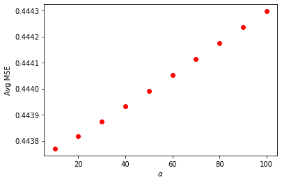
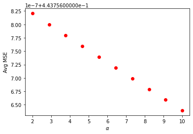
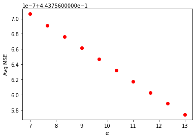
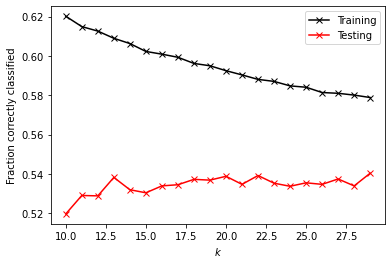
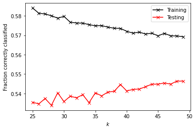
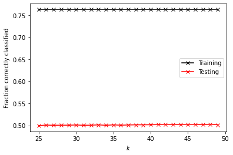

# Project 5, Part 2
## Lucy Greenman

## Question 1
### Download the anonymized dataset describing city_persons.csv from a larger city in a West African county and import it into your PyCharm project workspace (right click and download from the above link or you can also find the data pinned to the slack channel). This time we will only use the variable wealthC as your target. It is not necessary to set a seed.


```python
import numpy as np
import pandas as pd
df = pd.read_csv('city_persons.csv')
df.head()
```


<div>
<style scoped>
    .dataframe tbody tr th:only-of-type {
        vertical-align: middle;
    }

    .dataframe tbody tr th {
        vertical-align: top;
    }

    .dataframe thead th {
        text-align: right;
    }
</style>
<table border="1" class="dataframe">
  <thead>
    <tr style="text-align: right;">
      <th></th>
      <th>size</th>
      <th>gender</th>
      <th>age</th>
      <th>edu</th>
      <th>wealthC</th>
    </tr>
  </thead>
  <tbody>
    <tr>
      <th>0</th>
      <td>1</td>
      <td>2</td>
      <td>19.0</td>
      <td>2.0</td>
      <td>4</td>
    </tr>
    <tr>
      <th>1</th>
      <td>6</td>
      <td>2</td>
      <td>44.0</td>
      <td>0.0</td>
      <td>4</td>
    </tr>
    <tr>
      <th>2</th>
      <td>6</td>
      <td>1</td>
      <td>36.0</td>
      <td>0.0</td>
      <td>4</td>
    </tr>
    <tr>
      <th>3</th>
      <td>6</td>
      <td>1</td>
      <td>12.0</td>
      <td>1.0</td>
      <td>4</td>
    </tr>
    <tr>
      <th>4</th>
      <td>6</td>
      <td>1</td>
      <td>7.0</td>
      <td>1.0</td>
      <td>4</td>
    </tr>
  </tbody>
</table>
</div>


```python
check_nan = df['age'].isnull().values.any()
df.dropna(inplace=True)
```


```python
display(df.dtypes)
```


    size         int64
    gender       int64
    age        float64
    edu        float64
    wealthC      int64
    dtype: object


```python
df['age'] = df['age'].astype(int)
df['edu'] = df['edu'].astype(int)
```


```python
X = np.array(df.drop(["wealthC"],axis=1))
y = np.array(df.wealthC)
X_df = pd.DataFrame(X)
X.shape
```


    (5121, 4)


## Question 2
### Import your libraries, functions and create the commands DoKFold, GetData and CompareClasses as we have previously done in class. Import the data and then complete the following steps.


```python
from sklearn.model_selection import KFold
from sklearn.preprocessing import StandardScaler
from matplotlib import pyplot as plt
from sklearn.neighbors import KNeighborsClassifier
KNN = KNeighborsClassifier
from sklearn.linear_model import LogisticRegression
import seaborn as sns
from sklearn.model_selection import train_test_split as tts
from sklearn.ensemble import RandomForestClassifier as RFC
```


```python
def DoKFold(model, X, y, k=20, standardize = False, random_state = 146, reshape = False):
    from sklearn.model_selection import KFold
    kf = KFold(n_splits=k, shuffle=True, random_state=random_state)

    if standardize:
        from sklearn.preprocessing import StandardScaler as SS
        ss = SS()

    train_scores = []
    test_scores = []

    train_mse = []
    test_mse = []

    for idxTrain, idxTest in kf.split(X):
        
        ytrain = y[idxTrain]
        ytest = y[idxTest]
            
        if reshape:
            Xtrain = X[idxTrain]
            Xtest = X[idxTest]
            Xtrain = np.reshape(Xtrain,(-1, 1))
            Xtest = np.reshape(Xtest,(-1, 1))
        else:
            Xtrain = X[idxTrain,:]
            Xtest = X[idxTest,:]

        if standardize:
            Xtrain = ss.fit_transform(Xtrain)
            Xtest = ss.transform(Xtest)

        model.fit(Xtrain, ytrain)

        train_scores.append(model.score(Xtrain, ytrain))
        test_scores.append(model.score(Xtest, ytest))

        ytrain_pred = model.predict(Xtrain)
        ytest_pred = model.predict(Xtest)

        train_mse.append(np.mean((ytrain - ytrain_pred)**2))
        test_mse.append(np.mean((ytest - ytest_pred)**2))

    return train_scores,test_scores,train_mse,test_mse
```


```python
def GetData(scale=False):
    Xtrain, Xtest, ytrain, ytest = tts(X, y, test_size=0.4)
    ss = StandardScaler()
    if scale:
        Xtrain = ss.fit_transform(Xtrain)
        Xtest = ss.transform(Xtest)
    return Xtrain, Xtest, ytrain, ytest
```


```python
def CompareClasses(actual, predicted, names=None):
    accuracy = sum(actual == predicted) / actual.shape[0]
    classes = pd.DataFrame(columns=['Actual', 'Predicted'])
    classes['Actual'] = actual
    classes['Predicted'] = predicted
    conf_mat = pd.crosstab(classes['Predicted'], classes['Actual'])
    # Relabel the rows/columns if names was provided
    if type(names) != type(None):
        conf_mat.index = y_names
        conf_mat.index.name = 'Predicted'
        conf_mat.columns = y_names
        conf_mat.columns.name = 'Actual'
    print('Accuracy = ' + format(accuracy, '.2f'))
    return conf_mat, accuracy
```

## Question 3
### Execute a K-nearest neighbors classification method on the data. What model specification returned the most accurate results? Did adding a distance weight help?

I first ran the KNN with a range of 10 to 30, but the training and testing values seemed to approach each other as the values got higher. The training score was 0.595, and the testing score was 0.535, so the model was a little overfit. I then tried again with a range of 25 to 50, which gave very similar scores: a training score of 0.57469 and a testing score of 0.54075. I tried adding a distance weight, but the scores did not change.

## Question 4
### Execute a logistic regression method on the data. How did this model fare in terms of accuracy compared to K-nearest neighbors?

The code is shown below under "Question 4 -- Work," but the logistic regression returned a trainings core of 0.54460 and a testing score of 0.55246. These are comparable to the results from the KNN classification method, with a slightly lower training score but slightly higher testing score. This model is actually slightly underfit.

## Question 5
### Next execute a random forest model and produce the results. See the number of estimators (trees) to 100, 500, 1000 and 5000 and determine which specification is most likely to return the best model. Also test the minimum number of samples required to split an internal node with a range of values. Also produce results for your four different estimator values by both comparing both standardized and non-standardized (raw) results.

The work is shown below under "Question 5 -- Work." When a random forest model was run with 100, 500, 1000, and 5000 estimators, all models returned a training score of 0.79232. 1000 trees had the best testing score, at 0.49829, followed by 5000 trees at 0.49732, 500 trees at 0.49634, and 100 trees in last at 0.49488. These testing scores are all far lower than their corresponding training scores, indicating overfit models. Changing the minimum number of samples to split an internal node brought the training and testing scores closer together, with training scores between 0.65820 and 0.64193 and corresponding testing scores between 0.54856 and 0.55002 for minimum number of samples to split between 20 and 30. When standardized, the training score for all models decreased to 0.78646. This time, 500 trees had the highest testing score at 0.43582, followed by 5000 trees at 0.43485, 1000 trees at 0.42801, and 100 trees at 0.42753.

## Question 6
### Repeat the previous steps after recoding the wealth classes 2 and 3 into a single outcome. Do any of your models improve? Are you able to explain why your results have changed?

After recoding the wealth classes 2 and 3 into a single outcome, some models improved more than others. KNN with a window of 10 to 30 did not change noticeably, with its training score remaining at 0.595 and its testing score decreasing from 0.535 to 0.534. KNN with a range of 25 to 50 also gave the same results (to three decimal points) as it did before combining the two wealth classes: training score of 0.575 and testing score of 0.540. The distance-weighted KNN showed strong improvement this time, with a training score of 0.76259 and a testing score of 0.50117. The logistic regression did not perform better or worse, with its training score decreasing to 0.54167 from 0.54460 and its testing score increasing to 0.56418 from 0.55246. The random forest model did not change much either, with testing scores for all numbers of trees (100, 500, 1000, and 5000) decreasing slightly from 0.79232 to 0.79004. Testing scores for all numbers of trees increased slightly, to around 0.508 rather htan 0.498. These models were all still overfit. Changing the minimum number of samples to split an internal node again brought the training and testing scores closer together, with training scores between 0.64486 and 0.66569 and corresponding testing scores between 0.55002 and 0.55051. When standardized, the training score for all models were 0.78743, with testing scores around 0.444 -- still quite overfit. Overall, the model that improved the most was the distance-weighted KNN. This makes sense since combining the wealth classes resulted in fewer groups total. With fewer, bigger groups to choose from in classification, more reliance on the nearest groups (a.k.a. the impact of a distance weight) should improve accuracy.

## Question 7
### Which of the models produced the best results in predicting wealth of all persons throughout the large West African capital city being described? Support your results with plots, graphs and descriptions of your code and its implementation. You are welcome to incorporate snippets to illustrate an important step, but please do not paste verbose amounts of code within your project report. Avoiding setting a seed essentially guarantees the authenticity of your results. You are welcome to provide a link in your references at the end of your (part 2) Project 5 report.

Overall, the best model was the logistic regression after combining wealth classes 2 and 3, with a testing score of 0.56418 and a training score of 0.54176. This model is also very well fit, only slightly underfit. Other models were comparable though, such as the random forest models with the minimum number of samples required to split an internal node adjusted to between 20 and 30. All graphs and work are below.

## Work Below

## Question 3 Work


```python
k_range = np.arange(10, 30, 1)

train = []
test = []

for k in k_range:
    knn = KNN(n_neighbors=k)

    tr, te, trmse, temse = DoKFold(knn, X, y, 10, standardize=True)

    train.append(np.mean(tr))
    test.append(np.mean(te))
```


```python
print('Training Score: ' + format(np.mean(train), '.5f'))
print('Testing Score: ' + format(np.mean(test), '.5f'))
idx = np.argmax(test)
```

    Training Score: 0.59529
    Testing Score: 0.53499


```python
plt.plot(k_range,train,'-xk', label='Training')
plt.plot(k_range,test,'-xr', label='Testing')
plt.xlabel('$k$')
plt.ylabel('Fraction correctly classified')
plt.legend()
plt.show()
```


    

    


```python
k_range = np.arange(25, 50, 1)

train = []
test = []

for k in k_range:
    knn = KNN(n_neighbors=k)

    tr, te, trmse, temse = DoKFold(knn, X, y, 10, standardize=True)

    train.append(np.mean(tr))
    test.append(np.mean(te))
```


```python
print('Training Score: ' + format(np.mean(train), '.5f'))
print('Testing Score: ' + format(np.mean(test), '.5f'))
```

    Training Score: 0.57469
    Testing Score: 0.54075


```python
plt.plot(k_range,train,'-xk', label='Training')
plt.plot(k_range,test,'-xr', label='Testing')
plt.xlabel('$k$')
plt.ylabel('Fraction correctly classified')
plt.legend()
plt.show()
```


    

    


```python
k_range = np.arange(25, 50, 1)

train = []
test = []

for k in k_range:
    knn = KNN(n_neighbors=k,weights='distance')

    tr, te, trmse, temse = DoKFold(knn, X, y, 10, standardize=True)

    train.append(np.mean(tr))
    test.append(np.mean(te))
```


```python
print('Training Score: ' + format(np.mean(train), '.5f'))
print('Testing Score: ' + format(np.mean(test), '.5f'))
```

    Training Score: 0.57469
    Testing Score: 0.54075


```python
plt.plot(k_range,train,'-xk', label='Training')
plt.plot(k_range,test,'-xr', label='Testing')
plt.xlabel('$k$')
plt.ylabel('Fraction correctly classified')
plt.legend()
plt.show()
```


    

    


## Question 4 Work


```python
log_reg = LogisticRegression(max_iter=1000)
Xtrain, Xtest, ytrain, ytest = GetData(True)
log_reg.fit(Xtrain, ytrain)
print('Training Score: ' + format(log_reg.score(Xtrain, ytrain), '.5f'))
print('Testing Score: ' + format(log_reg.score(Xtest, ytest), '.5f'))
```

    Training Score: 0.54460
    Testing Score: 0.55246


## Question 5 Work


```python
Xtrain,Xtest,ytrain,ytest = GetData(False)

n_range = [100, 500, 1000, 5000]
for n in n_range:
    rfc = RFC(n_estimators= n)
    rfc.fit(Xtrain,ytrain)
    print([rfc.score(Xtrain,ytrain), rfc.score(Xtest,ytest)])
```

    [0.7923177083333334, 0.49487554904831627]
    [0.7923177083333334, 0.49633967789165445]
    [0.7923177083333334, 0.49829184968277207]
    [0.7923177083333334, 0.49731576378721326]


```python
Xtrain,Xtest,ytrain,ytest = GetData(False)

n_range = np.arange(20,30,2)
for n in n_range:
    rfc = RFC(n_estimators = 100, min_samples_split = n)
    rfc.fit(Xtrain,ytrain)
    print([rfc.score(Xtrain,ytrain), rfc.score(Xtest,ytest)])
```

    [0.658203125, 0.5485602733040508]
    [0.65234375, 0.5480722303562714]
    [0.6507161458333334, 0.5490483162518301]
    [0.6455078125, 0.5485602733040508]
    [0.6419270833333334, 0.550024402147389]


```python
Xtrain_s,Xtest_s,ytrain,ytest = GetData(True)

n_range = [100, 500, 1000, 5000]
for n in n_range:
    rfc = RFC(n_estimators= n)
    rfc.fit(Xtrain,ytrain)
    print([rfc.score(Xtrain,ytrain), rfc.score(Xtest,ytest)])
```

    [0.7864583333333334, 0.42752562225475843]
    [0.7864583333333334, 0.4358223523670083]
    [0.7864583333333334, 0.4280136652025378]
    [0.7864583333333334, 0.43484626647144947]


## Question 6 Work


```python
df['wealthC_adjust'] = np.where((df['wealthC'] == 2)|(df['wealthC'] == 3), 2.5, df['wealthC'])
df.tail()
```


<div>
<style scoped>
    .dataframe tbody tr th:only-of-type {
        vertical-align: middle;
    }

    .dataframe tbody tr th {
        vertical-align: top;
    }

    .dataframe thead th {
        text-align: right;
    }
</style>
<table border="1" class="dataframe">
  <thead>
    <tr style="text-align: right;">
      <th></th>
      <th>size</th>
      <th>gender</th>
      <th>age</th>
      <th>edu</th>
      <th>wealthC</th>
      <th>wealthC_adjust</th>
    </tr>
  </thead>
  <tbody>
    <tr>
      <th>5118</th>
      <td>6</td>
      <td>1</td>
      <td>4</td>
      <td>0</td>
      <td>3</td>
      <td>2.5</td>
    </tr>
    <tr>
      <th>5119</th>
      <td>6</td>
      <td>1</td>
      <td>1</td>
      <td>0</td>
      <td>3</td>
      <td>2.5</td>
    </tr>
    <tr>
      <th>5120</th>
      <td>2</td>
      <td>1</td>
      <td>86</td>
      <td>1</td>
      <td>3</td>
      <td>2.5</td>
    </tr>
    <tr>
      <th>5121</th>
      <td>2</td>
      <td>2</td>
      <td>52</td>
      <td>1</td>
      <td>3</td>
      <td>2.5</td>
    </tr>
    <tr>
      <th>5122</th>
      <td>1</td>
      <td>2</td>
      <td>29</td>
      <td>2</td>
      <td>4</td>
      <td>4.0</td>
    </tr>
  </tbody>
</table>
</div>


```python
check_nan = df['age'].isnull().values.any()
df.dropna(inplace=True)
```


```python
display(df.dtypes)
```


    size                int64
    gender              int64
    age                 int64
    edu                 int64
    wealthC             int64
    wealthC_adjust    float64
    dtype: object


```python
df['wealthC_adjust'] = df['wealthC_adjust'].astype(int)
```


```python
X = np.array(df.drop(["wealthC"],axis=1).drop(["wealthC_adjust"],axis=1))
y = np.array(df.wealthC_adjust)
X_df = pd.DataFrame(X)
X.shape
```


    (5121, 4)


```python
k_range = np.arange(10, 30, 1)

train = []
test = []

for k in k_range:
    knn = KNN(n_neighbors=k)

    tr, te, trmse, temse = DoKFold(knn, X, y, 10, standardize=True)

    train.append(np.mean(tr))
    test.append(np.mean(te))
```


```python
print('Training Score: ' + format(np.mean(train), '.5f'))
print('Testing Score: ' + format(np.mean(test), '.5f'))
idx = np.argmax(test)
```

    Training Score: 0.59520
    Testing Score: 0.53417


```python
plt.plot(k_range,train,'-xk', label='Training')
plt.plot(k_range,test,'-xr', label='Testing')
plt.xlabel('$k$')
plt.ylabel('Fraction correctly classified')
plt.legend()
plt.show()
```


    

    


```python
k_range = np.arange(25, 50, 1)

train = []
test = []

for k in k_range:
    knn = KNN(n_neighbors=k)

    tr, te, trmse, temse = DoKFold(knn, X, y, 10, standardize=True)

    train.append(np.mean(tr))
    test.append(np.mean(te))
```


```python
print('Training Score: ' + format(np.mean(train), '.5f'))
print('Testing Score: ' + format(np.mean(test), '.5f'))
```

    Training Score: 0.57466
    Testing Score: 0.54063


```python
plt.plot(k_range,train,'-xk', label='Training')
plt.plot(k_range,test,'-xr', label='Testing')
plt.xlabel('$k$')
plt.ylabel('Fraction correctly classified')
plt.legend()
plt.show()
```


    

    


```python
k_range = np.arange(25, 50, 1)

train = []
test = []

for k in k_range:
    knn = KNN(n_neighbors=k,weights='distance')

    tr, te, trmse, temse = DoKFold(knn, X, y, 10, standardize=True)

    train.append(np.mean(tr))
    test.append(np.mean(te))
```


```python
print('Training Score: ' + format(np.mean(train), '.5f'))
print('Testing Score: ' + format(np.mean(test), '.5f'))
```

    Training Score: 0.76259
    Testing Score: 0.50117


```python
plt.plot(k_range,train,'-xk', label='Training')
plt.plot(k_range,test,'-xr', label='Testing')
plt.xlabel('$k$')
plt.ylabel('Fraction correctly classified')
plt.legend()
plt.show()
```


    

    


```python
#Logistic Regression
log_reg = LogisticRegression(max_iter=1000)
Xtrain, Xtest, ytrain, ytest = GetData(True)
log_reg.fit(Xtrain, ytrain)
print('Training Score: ' + format(log_reg.score(Xtrain, ytrain), '.5f'))
print('Testing Score: ' + format(log_reg.score(Xtest, ytest), '.5f'))
```

    Training Score: 0.54167
    Testing Score: 0.56418


```python
#Random Forest
Xtrain,Xtest,ytrain,ytest = GetData(False)

n_range = [100, 500, 1000, 5000]
for n in n_range:
    rfc = RFC(n_estimators= n)
    rfc.fit(Xtrain,ytrain)
    print([rfc.score(Xtrain,ytrain), rfc.score(Xtest,ytest)])
```

    [0.7900390625, 0.5070766227428014]
    [0.7900390625, 0.5085407515861395]
    [0.7900390625, 0.5061005368472425]
    [0.7900390625, 0.5143972669594924]


```python
Xtrain,Xtest,ytrain,ytest = GetData(False)

n_range = np.arange(20,30,2)
for n in n_range:
    rfc = RFC(n_estimators = 100, min_samples_split = n)
    rfc.fit(Xtrain,ytrain)
    print([rfc.score(Xtrain,ytrain), rfc.score(Xtest,ytest)])
```

    [0.6656901041666666, 0.5505124450951684]
    [0.658203125, 0.5510004880429478]
    [0.6565755208333334, 0.552464616886286]
    [0.6516927083333334, 0.5470961444607125]
    [0.6448567708333334, 0.550024402147389]


```python
Xtrain_s,Xtest_s,ytrain,ytest = GetData(True)

n_range = [100, 500, 1000, 5000]
for n in n_range:
    rfc = RFC(n_estimators= n)
    rfc.fit(Xtrain,ytrain)
    print([rfc.score(Xtrain,ytrain), rfc.score(Xtest,ytest)])
```

    [0.7874348958333334, 0.447535383113714]
    [0.7874348958333334, 0.4465592972181552]
    [0.7874348958333334, 0.4455832113225964]
    [0.7874348958333334, 0.4441190824792582]

