# Project 5
## Lucy Greenman

## Question 1
### Download the anonymized dataset describing persons.csv from a West African country and import it into your PyCharm project workspace (right click and download from the above link or you can also find the data pinned to the slack channel). First set the variable wealthC as your target. It is not necessary to set a seed.


```python
import pandas as pd
import numpy as np
from sklearn.linear_model import LinearRegression
from sklearn.preprocessing import StandardScaler as SS
from sklearn.linear_model import Ridge, Lasso
from matplotlib import pyplot as plt

lin_reg = LinearRegression()
rid_reg = Ridge()
las_reg = Lasso()
```


```python
df = pd.read_csv('persons.csv')
df.head()
```


<div>
<style scoped>
    .dataframe tbody tr th:only-of-type {
        vertical-align: middle;
    }

    .dataframe tbody tr th {
        vertical-align: top;
    }

    .dataframe thead th {
        text-align: right;
    }
</style>
<table border="1" class="dataframe">
  <thead>
    <tr style="text-align: right;">
      <th></th>
      <th>size</th>
      <th>gender</th>
      <th>age</th>
      <th>edu</th>
      <th>wealthC</th>
      <th>wealthI</th>
      <th>county..data_1</th>
      <th>county..data_2</th>
      <th>county..data_3</th>
      <th>county..data_4</th>
      <th>...</th>
      <th>has_car..data_No</th>
      <th>has_car..data_Yes</th>
      <th>cooking_type..data_Electricity</th>
      <th>cooking_type..data_LPG</th>
      <th>cooking_type..data_Kerosene</th>
      <th>cooking_type..data_Charcoal</th>
      <th>cooking_type..data_Wood</th>
      <th>cooking_type..data_No food cooked in house</th>
      <th>has_bank..data_No</th>
      <th>has_bank..data_Yes</th>
    </tr>
  </thead>
  <tbody>
    <tr>
      <th>0</th>
      <td>11</td>
      <td>1</td>
      <td>54.0</td>
      <td>2.0</td>
      <td>1</td>
      <td>-94762</td>
      <td>0</td>
      <td>0</td>
      <td>0</td>
      <td>0</td>
      <td>...</td>
      <td>1</td>
      <td>0</td>
      <td>0</td>
      <td>0</td>
      <td>0</td>
      <td>0</td>
      <td>1</td>
      <td>0</td>
      <td>1</td>
      <td>0</td>
    </tr>
    <tr>
      <th>1</th>
      <td>11</td>
      <td>1</td>
      <td>21.0</td>
      <td>2.0</td>
      <td>1</td>
      <td>-94762</td>
      <td>0</td>
      <td>0</td>
      <td>0</td>
      <td>0</td>
      <td>...</td>
      <td>1</td>
      <td>0</td>
      <td>0</td>
      <td>0</td>
      <td>0</td>
      <td>0</td>
      <td>1</td>
      <td>0</td>
      <td>1</td>
      <td>0</td>
    </tr>
    <tr>
      <th>2</th>
      <td>11</td>
      <td>1</td>
      <td>17.0</td>
      <td>2.0</td>
      <td>1</td>
      <td>-94762</td>
      <td>0</td>
      <td>0</td>
      <td>0</td>
      <td>0</td>
      <td>...</td>
      <td>1</td>
      <td>0</td>
      <td>0</td>
      <td>0</td>
      <td>0</td>
      <td>0</td>
      <td>1</td>
      <td>0</td>
      <td>1</td>
      <td>0</td>
    </tr>
    <tr>
      <th>3</th>
      <td>11</td>
      <td>1</td>
      <td>15.0</td>
      <td>1.0</td>
      <td>1</td>
      <td>-94762</td>
      <td>0</td>
      <td>0</td>
      <td>0</td>
      <td>0</td>
      <td>...</td>
      <td>1</td>
      <td>0</td>
      <td>0</td>
      <td>0</td>
      <td>0</td>
      <td>0</td>
      <td>1</td>
      <td>0</td>
      <td>1</td>
      <td>0</td>
    </tr>
    <tr>
      <th>4</th>
      <td>11</td>
      <td>1</td>
      <td>12.0</td>
      <td>1.0</td>
      <td>1</td>
      <td>-94762</td>
      <td>0</td>
      <td>0</td>
      <td>0</td>
      <td>0</td>
      <td>...</td>
      <td>1</td>
      <td>0</td>
      <td>0</td>
      <td>0</td>
      <td>0</td>
      <td>0</td>
      <td>1</td>
      <td>0</td>
      <td>1</td>
      <td>0</td>
    </tr>
  </tbody>
</table>
<p>5 rows × 62 columns</p>
</div>


```python
check_nan = df['age'].isnull().values.any()
df.dropna(inplace=True)
```


```python
display(df.dtypes)
```


    size                                            int64
    gender                                          int64
    age                                           float64
    edu                                           float64
    wealthC                                         int64
                                                   ...   
    cooking_type..data_Charcoal                     int64
    cooking_type..data_Wood                         int64
    cooking_type..data_No food cooked in house      int64
    has_bank..data_No                               int64
    has_bank..data_Yes                              int64
    Length: 62, dtype: object


```python
df['age'] = df['age'].astype(int)
df['edu'] = df['edu'].astype(int)
```


```python
X = np.array(df.drop(["wealthC","wealthI"],axis=1))
y = np.array(df.wealthC)
X.shape
```


    (47891, 60)


```python
X_df = pd.DataFrame(X, columns = ["size","gender","age","edu","county..data_1","county..data_2","county..data_3","county..data_4","county..data_5","county..data_6","county..data_7","county..data_8","county..data_9","county..data_10","county..data_11","county..data_12","county..data_13","county..data_14","county..data_15","settle_density..data_2","settle_density..data_3","settle_density..data_4","potable_water..data_Piped into dwelling","potable_water..data_Piped to yard/plot","potable_water..data_Public tap/standpipe","potable_water..data_Tube well or borehole","potable_water..data_Protected well","potable_water..data_Unprotected well","potable_water..data_Protected spring","potable_water..data_Unprotected spring","potable_water..data_River/dam/lake/ponds/stream/canal/irrigation channel","potable_water..data_Rainwater","potable_water..data_Tanker truck","potable_water..data_Cart with small tank","potable_water..data_Bottled water","toilet_type..data_Flush to piped sewer system","toilet_type..data_Flush to septic tank","toilet_type..data_Flush to pit latrine","toilet_type..data_Flush to somewhere else","toilet_type..data_Flush, don't know where","toilet_type..data_Ventilated Improved Pit latrine (VIP)","toilet_type..data_Pit latrine with slab","toilet_type..data_Pit latrine without slab/open pit","toilet_type..data_No facility/bush/field","toilet_type..data_Composting toilet","toilet_type..data_Bucket toilet","toilet_type..data_Hanging toilet/latrine","toilet_type..data_Other","has_electricity..data_No","has_electricity..data_Yes","has_car..data_No","has_car..data_Yes","cooking_type..data_Electricity","cooking_type..data_LPG","cooking_type..data_Kerosene","cooking_type..data_Charcoal","cooking_type..data_Wood","cooking_type..data_No food cooked in house","has_bank..data_No","has_bank..data_Yes"])
```


```python
def DoKFold(model, X, y, k=20, standardize = False, random_state = 146, reshape = False):
    from sklearn.model_selection import KFold
    kf = KFold(n_splits=k, shuffle=True, random_state=random_state)

    if standardize:
        from sklearn.preprocessing import StandardScaler as SS
        ss = SS()

    train_scores = []
    test_scores = []

    train_mse = []
    test_mse = []

    for idxTrain, idxTest in kf.split(X):
        
        ytrain = y[idxTrain]
        ytest = y[idxTest]
            
        if reshape:
            Xtrain = X[idxTrain]
            Xtest = X[idxTest]
            Xtrain = np.reshape(Xtrain,(-1, 1))
            Xtest = np.reshape(Xtest,(-1, 1))
        else:
            Xtrain = X[idxTrain,:]
            Xtest = X[idxTest,:]

        if standardize:
            Xtrain = ss.fit_transform(Xtrain)
            Xtest = ss.transform(Xtest)

        model.fit(Xtrain, ytrain)

        train_scores.append(model.score(Xtrain, ytrain))
        test_scores.append(model.score(Xtest, ytest))

        ytrain_pred = model.predict(Xtrain)
        ytest_pred = model.predict(Xtest)

        train_mse.append(np.mean((ytrain - ytrain_pred)**2))
        test_mse.append(np.mean((ytest - ytest_pred)**2))

    return train_scores,test_scores,train_mse,test_mse
```

## Question 2
### Perform a linear regression and compute the MSE. Standardize the features and again compute the MSE. Compare the coefficients from each of the two models and describe how they have changed.

After standardizing the features, both the training and testing MSE values increased minimally, from 0.44279 to 0.44299 for training MSE and from 0.44375 to 0.44393 for testing MSE. The coefficients seem to have increased by an order of magnitude or two after standardization, with most coefficients for the unstandardized regression being on the order of 10 to the 8th or 9th power, while most coefficients for the standardized regression are on the order of 10 to the 10th or 11th power. More details are shown in "Question 2 -- Work" below.

## Question 3
### Run a Ridge regression and report your best results.

I ran the Ridge regression several times with various windows for the alpha value, eventually narrowing it down. I started with a broad window of 10 to 100, then visualized both the MSE and R-squared testing value as a function of the alpha value. The highest testing score that I achieved was 0.73505, which was associated with a testing mean squared error of 0.44376. This occurred with the standardized data and an alpha value of 77. The training score was 0.73584, suggesting that the model is overfit, but only slightly. The training MSE was 0.44279, very similar to the testing MSE. These are also comparable to the MSE values from the linear regression above, both standardized and unstandardized. Standardization did not make a difference for the Ridge regression. The details of the attempts at various alpha values are detailed under "Question 3 -- Work" below.

## Question 4
### Run a Lasso regression and report your best results.

Using a range from 0.001 to 0.003, the Lasso regression gave a testing score of 0.73377 and a testing MSE of 0.44591, both quite good values. Changing the range did not improve these values. The training score was 0.73444, indicating that the model is only very slightly overfit, basically not overfit at all. When standardized, the testing score improved slightly to 0.73504. The training score was 0.73581, showing that the model was still hardly overfit at all. The MSE decreased slightly with standardization, to 0.44378 from 0.44591. The various trials and graphs are shown in "Question 4 -- Work" below.

## Question 5
### Repeat the previous steps using the variable wealthI as your target.

Code is shown in "Question 5 -- Work" below.

## Question 6
### Which of the models produced the best results in predicting wealth of all persons throughout the smaller West African country being described? Support your results with plots, graphs and descriptions of your code and its implementation. You are welcome to incorporate snippets to illustrate an important step, but please do not paste verbose amounts of code within your project report. Alternatively, you are welcome to provide a link in your references at the end of your (part 1) Project 5 report.

Overall, the target variable wealthI seemed to be much better correlated with the features than wealthC was. Most of the wealthI testing scores were about 0.8, while the wealthC scores were closer to 0.7. The linear regression performed slightly better unstandardized, with a testing score of 0.82502, than standardized, with a testing score of 0.83490. The unstandardized Ridge was comparable to the unstandardized linear regression, with a testing score of 0.82500. The standardized Ridge tied the unstandardized linear regression with a testing score of 0.82502. Changing the range of the Ridge also did not improve upon the score, decreasing the testing score to 0.73477. Both the standardized and unstandardized Lasso regression also achieved a testing score of 0.82502, making a four-way tie for best-performing model.

All graphs and code are shown below under "Question 5 -- Work," but basically I started by running each regression twice, unstandardized and then standardized. For the Ridge and Lasso, I viewed two plots associated with each: one with the testing R-squared value on the y-axis, and one with the testing MSE on the y-axis. These plots helped me visualize where the ideal alpha value might lie, and I then repeated the regressions trying to hone in on that alpha value. Most of the time this did not do much to improve the score, nor did standardization. The Ridge and linear regressions tended to produce similar results, especially when both were unstandardized, and the Lasso tended to produce similar results to both of these whether standardized or unstandardized. Running the Ridge and Lasso with a narrow, more optimized alpha range, did not seem to make much difference compared with a broader alpha range.

# Work Below

## Question 2 -- Work


```python
train_scores,test_scores,train_mse,test_mse = DoKFold(lin_reg,X,y,20,standardize=False)

print('Training Score: ' + format(np.mean(train_scores), '.5f'))
print('Testing Score: ' + format(np.mean(test_scores), '.5f'))
print('Training MSE: ' + format(np.mean(train_mse), '.5f'))
print('Testing MSE: ' + format(np.mean(test_mse), '.5f'))
lin_reg.coef_
```

    Training Score: 0.73584
    Testing Score: 0.73506
    Training MSE: 0.44279
    Testing MSE: 0.44375


    array([ 3.00795707e-02,  9.52439198e-03, -6.38227899e-04,  8.42277579e-02,
           -9.57505915e+08, -9.57505915e+08, -9.57505915e+08, -9.57505915e+08,
           -9.57505915e+08, -9.57505916e+08, -9.57505916e+08, -9.57505915e+08,
           -9.57505915e+08, -9.57505915e+08, -9.57505915e+08, -9.57505915e+08,
           -9.57505915e+08, -9.57505916e+08, -9.57505915e+08, -9.94205139e+09,
           -9.94205139e+09, -9.94205139e+09,  3.75527037e+09,  3.75527037e+09,
            3.75527037e+09,  3.75527037e+09,  3.75527037e+09,  3.75527037e+09,
            3.75527037e+09,  3.75527037e+09,  3.75527037e+09,  3.75527037e+09,
            3.75527037e+09,  3.75527037e+09,  3.75527037e+09,  1.94837463e+09,
            1.94837463e+09,  1.94837463e+09,  1.94837463e+09,  1.94837463e+09,
            1.94837463e+09,  1.94837463e+09,  1.94837463e+09,  1.94837463e+09,
            1.94837463e+09,  1.94837463e+09,  1.94837463e+09,  1.94837463e+09,
            6.22516456e+08,  6.22516456e+08, -1.21330235e+08, -1.21330235e+08,
           -3.94743430e+10, -3.94743430e+10, -3.94743430e+10, -3.94743430e+10,
           -3.94743430e+10, -3.94743430e+10,  3.42657477e+08,  3.42657478e+08])


```python
train_scores,test_scores,train_mse,test_mse = DoKFold(lin_reg,X,y,20,standardize=True)

print('Training Score: ' + format(np.mean(train_scores), '.5f'))
print('Testing Score: ' + format(np.mean(test_scores), '.5f'))
print('Training MSE: ' + format(np.mean(train_mse), '.5f'))
print('Testing MSE: ' + format(np.mean(test_mse), '.5f'))
lin_reg.coef_
```

    Training Score: 0.73571
    Testing Score: 0.73495
    Training MSE: 0.44299
    Testing MSE: 0.44393


    array([ 1.17379126e-01,  4.80807884e-03, -1.26794479e-02,  7.26816753e-02,
            2.82891568e+11,  3.32255098e+11,  2.94148383e+11,  3.03171055e+11,
            3.23913363e+11,  3.02166656e+11,  3.02613578e+11,  3.35836148e+11,
            3.31760487e+11,  3.27717223e+11,  4.46220589e+11,  3.87704233e+11,
            2.93453245e+11,  2.88410179e+11,  3.13790741e+11,  4.97163133e+10,
            7.51064136e+10,  8.13724261e+10, -3.59425046e+10, -3.57426598e+10,
           -6.51438047e+10, -7.54207360e+10, -3.90201377e+11, -1.92969034e+11,
           -8.22214013e+10, -1.19812301e+11, -3.42406101e+11, -2.42724276e+10,
           -4.21730749e+10, -6.61168823e+10, -8.62297803e+10,  8.42144795e+10,
            3.62867349e+11,  1.39646853e+11,  6.69394079e+10,  2.68335880e+10,
            5.46787034e+11,  3.30536489e+11,  3.56774846e+11,  6.91145251e+11,
            2.83675310e+10,  4.11504359e+10,  2.60477415e+11,  5.36370771e+10,
            2.95913649e+11,  2.95913649e+11,  9.85967379e+10,  9.85967379e+10,
            2.04061506e+10,  9.73006878e+09,  1.89644771e+10,  4.00057263e+11,
            4.02663047e+11,  5.72924430e+10, -5.35538676e+11, -5.35538676e+11])


## Question 3 -- Work


```python
rid_a_range = np.linspace(10, 100, 10)

k = 20

rid_tr=[]
rid_te=[]
rid_tr_mse=[]
rid_te_mse=[]

for a in rid_a_range:
    mdl = Ridge(alpha=a)
    train, test, train_mse, test_mse = DoKFold(mdl,X,y,k,standardize=False)
    
    rid_tr.append(np.mean(train))
    rid_te.append(np.mean(test))
    rid_tr_mse.append(np.mean(train_mse))
    rid_te_mse.append(np.mean(test_mse))

idx = np.argmax(rid_te)
optarid = rid_a_range[idx]
print('Optimal alpha value: ' + format(rid_a_range[idx], '.5f'))
print('Training Score: ' + format(rid_tr[idx], '.5f'))
print('Testing Score: ' + format(rid_te[idx], '.5f'))
print('Training MSE for this value: ' + format(rid_tr_mse[idx],'.5f'))
print('Testing MSE for this value: ' + format(rid_te_mse[idx], '.5f'))
```

    Optimal alpha value: 10.00000
    Training Score: 0.73581
    Testing Score: 0.73505
    Training MSE for this value: 0.44283
    Testing MSE for this value: 0.44377


```python
plt.plot(rid_a_range, rid_te_mse,'or')
plt.xlabel('$\\alpha$')
plt.ylabel('Avg MSE')
plt.show()
```


    
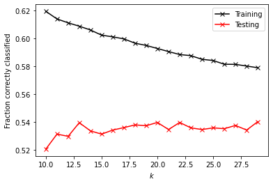
    


```python
plt.plot(rid_a_range, rid_te,'or')
plt.xlabel('$\\alpha$')
plt.ylabel('Avg $R^2$')
plt.show()
```


    
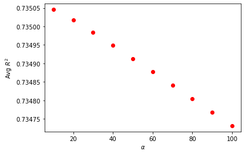
    


```python
rid_a_range = np.linspace(2, 10, 10)

k = 20

rid_tr=[]
rid_te=[]
rid_tr_mse=[]
rid_te_mse=[]

for a in rid_a_range:
    mdl = Ridge(alpha=a)
    train, test, train_mse, test_mse = DoKFold(mdl,X,y,k,standardize=True)
    
    rid_tr.append(np.mean(train))
    rid_te.append(np.mean(test))
    rid_tr_mse.append(np.mean(train_mse))
    rid_te_mse.append(np.mean(test_mse))

idx = np.argmax(rid_te)
optarid = rid_a_range[idx]
print('Optimal alpha value: ' + format(rid_a_range[idx], '.5f'))
print('Training Score: ' + format(rid_tr[idx], '.5f'))
print('Testing Score: ' + format(rid_te[idx], '.5f'))
print('Training MSE for this value: ' + format(rid_tr_mse[idx],'.5f'))
print('Testing MSE for this value: ' + format(rid_te_mse[idx], '.5f'))
```

    Optimal alpha value: 10.00000
    Training Score: 0.73584
    Testing Score: 0.73505
    Training MSE for this value: 0.44279
    Testing MSE for this value: 0.44376


```python
plt.plot(rid_a_range, rid_te_mse,'or')
plt.xlabel('$\\alpha$')
plt.ylabel('Avg MSE')
plt.show()
```


    

    


```python
plt.plot(rid_a_range, rid_te,'or')
plt.xlabel('$\\alpha$')
plt.ylabel('Avg $R^2$')
plt.show()
```


    
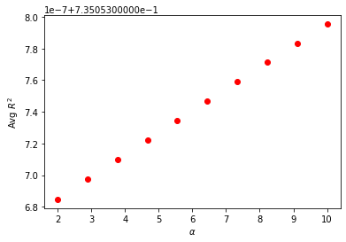
    


```python
rid_a_range = np.linspace(7, 13, 10)

k = 20

rid_tr=[]
rid_te=[]
rid_tr_mse=[]
rid_te_mse=[]

for a in rid_a_range:
    mdl = Ridge(alpha=a)
    train, test, train_mse, test_mse = DoKFold(mdl,X,y,k,standardize=True)
    
    rid_tr.append(np.mean(train))
    rid_te.append(np.mean(test))
    rid_tr_mse.append(np.mean(train_mse))
    rid_te_mse.append(np.mean(test_mse))

idx = np.argmax(rid_te)
optarid = rid_a_range[idx]
print('Optimal alpha value: ' + format(rid_a_range[idx], '.5f'))
print('Training Score: ' + format(rid_tr[idx], '.5f'))
print('Testing Score: ' + format(rid_te[idx], '.5f'))
print('Training MSE for this value: ' + format(rid_tr_mse[idx],'.5f'))
print('Testing MSE for this value: ' + format(rid_te_mse[idx], '.5f'))
```

    Optimal alpha value: 13.00000
    Training Score: 0.73584
    Testing Score: 0.73505
    Training MSE for this value: 0.44279
    Testing MSE for this value: 0.44376


```python
plt.plot(rid_a_range, rid_te_mse,'or')
plt.xlabel('$\\alpha$')
plt.ylabel('Avg MSE')
plt.show()
```


    
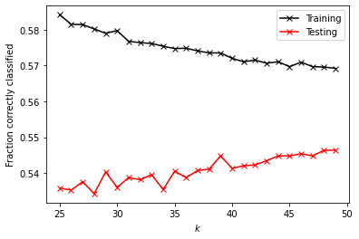
    


```python
plt.plot(rid_a_range, rid_te,'or')
plt.xlabel('$\\alpha$')
plt.ylabel('Avg $R^2$')
plt.show()
```


    
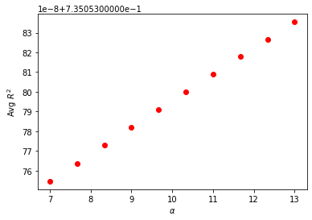
    


```python
rid_a_range = np.linspace(12, 22, 10)

k = 20

rid_tr=[]
rid_te=[]
rid_tr_mse=[]
rid_te_mse=[]

for a in rid_a_range:
    mdl = Ridge(alpha=a)
    train, test, train_mse, test_mse = DoKFold(mdl,X,y,k,standardize=True)
    
    rid_tr.append(np.mean(train))
    rid_te.append(np.mean(test))
    rid_tr_mse.append(np.mean(train_mse))
    rid_te_mse.append(np.mean(test_mse))

idx = np.argmax(rid_te)
optarid = rid_a_range[idx]
print('Optimal alpha value: ' + format(rid_a_range[idx], '.5f'))
print('Training Score: ' + format(rid_tr[idx], '.5f'))
print('Testing Score: ' + format(rid_te[idx], '.5f'))
print('Training MSE for this value: ' + format(rid_tr_mse[idx],'.5f'))
print('Testing MSE for this value: ' + format(rid_te_mse[idx], '.5f'))
```

    Optimal alpha value: 22.00000
    Training Score: 0.73584
    Testing Score: 0.73505
    Training MSE for this value: 0.44279
    Testing MSE for this value: 0.44376


```python
plt.plot(rid_a_range, rid_te_mse,'or')
plt.xlabel('$\\alpha$')
plt.ylabel('Avg MSE')
plt.show()
```


    
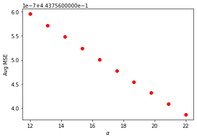
    


```python
plt.plot(rid_a_range, rid_te,'or')
plt.xlabel('$\\alpha$')
plt.ylabel('Avg $R^2$')
plt.show()
```


    
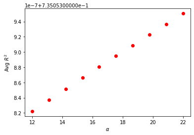
    


```python
rid_a_range = np.linspace(74, 77, 10)

k = 20

rid_tr=[]
rid_te=[]
rid_tr_mse=[]
rid_te_mse=[]

for a in rid_a_range:
    mdl = Ridge(alpha=a)
    train, test, train_mse, test_mse = DoKFold(mdl,X,y,k,standardize=True)
    
    rid_tr.append(np.mean(train))
    rid_te.append(np.mean(test))
    rid_tr_mse.append(np.mean(train_mse))
    rid_te_mse.append(np.mean(test_mse))

idx = np.argmax(rid_te)
optarid = rid_a_range[idx]
print('Optimal alpha value: ' + format(rid_a_range[idx], '.5f'))
print('Training Score: ' + format(rid_tr[idx], '.5f'))
print('Testing Score: ' + format(rid_te[idx], '.5f'))
print('Training MSE for this value: ' + format(rid_tr_mse[idx],'.5f'))
print('Testing MSE for this value: ' + format(rid_te_mse[idx], '.5f'))
```

    Optimal alpha value: 77.00000
    Training Score: 0.73584
    Testing Score: 0.73505
    Training MSE for this value: 0.44279
    Testing MSE for this value: 0.44376


```python
plt.plot(rid_a_range, rid_te_mse,'or')
plt.xlabel('$\\alpha$')
plt.ylabel('Avg MSE')
plt.show()
```


    
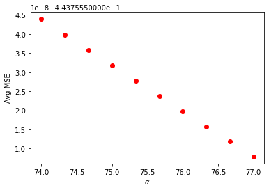
    


```python
plt.plot(rid_a_range, rid_te,'or')
plt.xlabel('$\\alpha$')
plt.ylabel('Avg $R^2$')
plt.show()
```


    
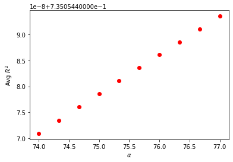
    


## Question 4 -- Work


```python
las_a_range = np.linspace(0.001, 0.003,10)

k = 20

las_tr=[]
las_te=[]
las_tr_mse=[]
las_te_mse=[]

for a in las_a_range:
    mdl = Lasso(alpha=a)
    train,test,train_mse,test_mse = DoKFold(mdl,X,y,k,standardize=False)
    
    las_tr.append(np.mean(train))
    las_te.append(np.mean(test))
    las_tr_mse.append(np.mean(train_mse))
    las_te_mse.append(np.mean(test_mse))
    
idx = np.argmax(las_te)
print('Optimal alpha value: ' + format(las_a_range[idx], '.5f'))
print('Training Score: ' + format(las_tr[idx], '.5f'))
print('Testing Score: ' + format(las_te[idx], '.5f'))
print('Training MSE for this value: ' + format(las_tr_mse[idx],'.5f'))
print('Testing MSE for this value: ' + format(las_te_mse[idx], '.5f'))
```

    Optimal alpha value: 0.00100
    Training Score: 0.73444
    Testing Score: 0.73377
    Training MSE for this value: 0.44512
    Testing MSE for this value: 0.44591


```python
plt.plot(las_a_range, las_te_mse,'or')
plt.xlabel('$\\alpha$')
plt.ylabel('Avg MSE')
plt.show()
```


    
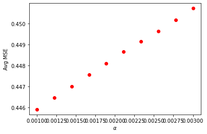
    


```python
plt.plot(las_a_range, las_te,'or')
plt.xlabel('$\\alpha$')
plt.ylabel('Avg $R^2$')
plt.show()
```


    
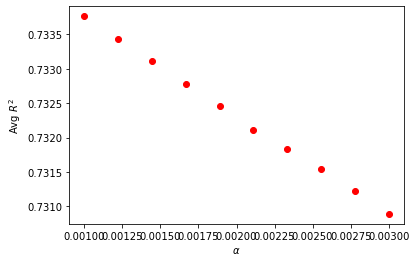
    


```python
las_a_range = np.linspace(0.001, 0.003,10)

k = 20

las_tr=[]
las_te=[]
las_tr_mse=[]
las_te_mse=[]

for a in las_a_range:
    mdl = Lasso(alpha=a)
    train,test,train_mse,test_mse = DoKFold(mdl,X,y,k,standardize=True)
    
    las_tr.append(np.mean(train))
    las_te.append(np.mean(test))
    las_tr_mse.append(np.mean(train_mse))
    las_te_mse.append(np.mean(test_mse))
    
idx = np.argmax(las_te)
print('Optimal alpha value: ' + format(las_a_range[idx], '.5f'))
print('Training Score: ' + format(las_tr[idx], '.5f'))
print('Testing Score: ' + format(las_te[idx], '.5f'))
print('Training MSE for this value: ' + format(las_tr_mse[idx],'.5f'))
print('Testing MSE for this value: ' + format(las_te_mse[idx], '.5f'))
```

    /opt/conda/lib/python3.8/site-packages/sklearn/linear_model/_coordinate_descent.py:530: ConvergenceWarning: Objective did not converge. You might want to increase the number of iterations. Duality gap: 8.732094878778298, tolerance: 7.608976540794798
      model = cd_fast.enet_coordinate_descent(
    /opt/conda/lib/python3.8/site-packages/sklearn/linear_model/_coordinate_descent.py:530: ConvergenceWarning: Objective did not converge. You might want to increase the number of iterations. Duality gap: 8.299244858390011, tolerance: 7.617321461227354
      model = cd_fast.enet_coordinate_descent(
    /opt/conda/lib/python3.8/site-packages/sklearn/linear_model/_coordinate_descent.py:530: ConvergenceWarning: Objective did not converge. You might want to increase the number of iterations. Duality gap: 7.923763514143502, tolerance: 7.630300263759477
      model = cd_fast.enet_coordinate_descent(
    /opt/conda/lib/python3.8/site-packages/sklearn/linear_model/_coordinate_descent.py:530: ConvergenceWarning: Objective did not converge. You might want to increase the number of iterations. Duality gap: 7.7470998101562145, tolerance: 7.627618850008748
      model = cd_fast.enet_coordinate_descent(
    /opt/conda/lib/python3.8/site-packages/sklearn/linear_model/_coordinate_descent.py:530: ConvergenceWarning: Objective did not converge. You might want to increase the number of iterations. Duality gap: 7.909572471638967, tolerance: 7.626230094953312
      model = cd_fast.enet_coordinate_descent(
    /opt/conda/lib/python3.8/site-packages/sklearn/linear_model/_coordinate_descent.py:530: ConvergenceWarning: Objective did not converge. You might want to increase the number of iterations. Duality gap: 7.81985306142451, tolerance: 7.638433515034221
      model = cd_fast.enet_coordinate_descent(
    /opt/conda/lib/python3.8/site-packages/sklearn/linear_model/_coordinate_descent.py:530: ConvergenceWarning: Objective did not converge. You might want to increase the number of iterations. Duality gap: 8.141961474619166, tolerance: 7.643424756022456
      model = cd_fast.enet_coordinate_descent(
    /opt/conda/lib/python3.8/site-packages/sklearn/linear_model/_coordinate_descent.py:530: ConvergenceWarning: Objective did not converge. You might want to increase the number of iterations. Duality gap: 7.737955214110116, tolerance: 7.615430094953315
      model = cd_fast.enet_coordinate_descent(
    /opt/conda/lib/python3.8/site-packages/sklearn/linear_model/_coordinate_descent.py:530: ConvergenceWarning: Objective did not converge. You might want to increase the number of iterations. Duality gap: 7.846319398984633, tolerance: 7.628636160626016
      model = cd_fast.enet_coordinate_descent(
    /opt/conda/lib/python3.8/site-packages/sklearn/linear_model/_coordinate_descent.py:530: ConvergenceWarning: Objective did not converge. You might want to increase the number of iterations. Duality gap: 7.881237337409402, tolerance: 7.616031988922356
      model = cd_fast.enet_coordinate_descent(
    /opt/conda/lib/python3.8/site-packages/sklearn/linear_model/_coordinate_descent.py:530: ConvergenceWarning: Objective did not converge. You might want to increase the number of iterations. Duality gap: 8.222661612668162, tolerance: 7.623973070751894
      model = cd_fast.enet_coordinate_descent(
    /opt/conda/lib/python3.8/site-packages/sklearn/linear_model/_coordinate_descent.py:530: ConvergenceWarning: Objective did not converge. You might want to increase the number of iterations. Duality gap: 8.37199287200201, tolerance: 7.623610660043496
      model = cd_fast.enet_coordinate_descent(
    /opt/conda/lib/python3.8/site-packages/sklearn/linear_model/_coordinate_descent.py:530: ConvergenceWarning: Objective did not converge. You might want to increase the number of iterations. Duality gap: 8.47033543069847, tolerance: 7.626758924764243
      model = cd_fast.enet_coordinate_descent(
    /opt/conda/lib/python3.8/site-packages/sklearn/linear_model/_coordinate_descent.py:530: ConvergenceWarning: Objective did not converge. You might want to increase the number of iterations. Duality gap: 8.407779258381197, tolerance: 7.630300263759477
      model = cd_fast.enet_coordinate_descent(
    /opt/conda/lib/python3.8/site-packages/sklearn/linear_model/_coordinate_descent.py:530: ConvergenceWarning: Objective did not converge. You might want to increase the number of iterations. Duality gap: 8.290157427327358, tolerance: 7.638433515034221
      model = cd_fast.enet_coordinate_descent(
    /opt/conda/lib/python3.8/site-packages/sklearn/linear_model/_coordinate_descent.py:530: ConvergenceWarning: Objective did not converge. You might want to increase the number of iterations. Duality gap: 8.22330572955616, tolerance: 7.615430094953315
      model = cd_fast.enet_coordinate_descent(
    /opt/conda/lib/python3.8/site-packages/sklearn/linear_model/_coordinate_descent.py:530: ConvergenceWarning: Objective did not converge. You might want to increase the number of iterations. Duality gap: 7.7233782636831165, tolerance: 7.623225975339054
      model = cd_fast.enet_coordinate_descent(
    /opt/conda/lib/python3.8/site-packages/sklearn/linear_model/_coordinate_descent.py:530: ConvergenceWarning: Objective did not converge. You might want to increase the number of iterations. Duality gap: 7.707826315614511, tolerance: 7.628588614633984
      model = cd_fast.enet_coordinate_descent(
    /opt/conda/lib/python3.8/site-packages/sklearn/linear_model/_coordinate_descent.py:530: ConvergenceWarning: Objective did not converge. You might want to increase the number of iterations. Duality gap: 8.035731577474508, tolerance: 7.621785300129687
      model = cd_fast.enet_coordinate_descent(
    /opt/conda/lib/python3.8/site-packages/sklearn/linear_model/_coordinate_descent.py:530: ConvergenceWarning: Objective did not converge. You might want to increase the number of iterations. Duality gap: 7.983869561037864, tolerance: 7.633559197309692
      model = cd_fast.enet_coordinate_descent(


    Optimal alpha value: 0.00100
    Training Score: 0.73581
    Testing Score: 0.73504
    Training MSE for this value: 0.44283
    Testing MSE for this value: 0.44378


```python
plt.plot(las_a_range, las_te_mse,'or')
plt.xlabel('$\\alpha$')
plt.ylabel('Avg MSE')
plt.show()
```


    
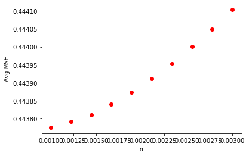
    


```python
plt.plot(las_a_range, las_te,'or')
plt.xlabel('$\\alpha$')
plt.ylabel('Avg $R^2$')
plt.show()
```


    
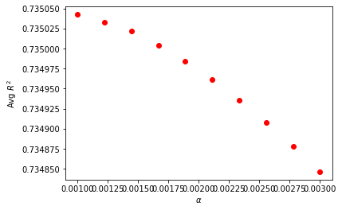
    


```python
las_a_range = np.linspace(0.00025, 0.00027,10)

k = 20

las_tr=[]
las_te=[]
las_tr_mse=[]
las_te_mse=[]

for a in las_a_range:
    mdl = Lasso(alpha=a)
    train,test,train_mse,test_mse = DoKFold(mdl,X,y,k,standardize=False)
    
    las_tr.append(np.mean(train))
    las_te.append(np.mean(test))
    las_tr_mse.append(np.mean(train_mse))
    las_te_mse.append(np.mean(test_mse))
    
idx = np.argmax(las_te)
print('Optimal alpha value: ' + format(las_a_range[idx], '.5f'))
print('Training Score: ' + format(las_tr[idx], '.5f'))
print('Testing Score: ' + format(las_te[idx], '.5f'))
print('Training MSE for this value: ' + format(las_tr_mse[idx],'.5f'))
print('Testing MSE for this value: ' + format(las_te_mse[idx], '.5f'))
```

    /opt/conda/lib/python3.8/site-packages/sklearn/linear_model/_coordinate_descent.py:530: ConvergenceWarning: Objective did not converge. You might want to increase the number of iterations. Duality gap: 24688053461216.195, tolerance: 45555805537.81596
      model = cd_fast.enet_coordinate_descent(
    /opt/conda/lib/python3.8/site-packages/sklearn/linear_model/_coordinate_descent.py:530: ConvergenceWarning: Objective did not converge. You might want to increase the number of iterations. Duality gap: 24638700083766.67, tolerance: 45621375550.697655
      model = cd_fast.enet_coordinate_descent(
    /opt/conda/lib/python3.8/site-packages/sklearn/linear_model/_coordinate_descent.py:530: ConvergenceWarning: Objective did not converge. You might want to increase the number of iterations. Duality gap: 24719869938166.617, tolerance: 45734991350.56118
      model = cd_fast.enet_coordinate_descent(
    /opt/conda/lib/python3.8/site-packages/sklearn/linear_model/_coordinate_descent.py:530: ConvergenceWarning: Objective did not converge. You might want to increase the number of iterations. Duality gap: 24669838400655.97, tolerance: 45766502409.48462
      model = cd_fast.enet_coordinate_descent(
    /opt/conda/lib/python3.8/site-packages/sklearn/linear_model/_coordinate_descent.py:530: ConvergenceWarning: Objective did not converge. You might want to increase the number of iterations. Duality gap: 24738385765689.086, tolerance: 45692341521.50093
      model = cd_fast.enet_coordinate_descent(
    /opt/conda/lib/python3.8/site-packages/sklearn/linear_model/_coordinate_descent.py:530: ConvergenceWarning: Objective did not converge. You might want to increase the number of iterations. Duality gap: 24564813045020.42, tolerance: 45675949302.555756
      model = cd_fast.enet_coordinate_descent(
    /opt/conda/lib/python3.8/site-packages/sklearn/linear_model/_coordinate_descent.py:530: ConvergenceWarning: Objective did not converge. You might want to increase the number of iterations. Duality gap: 24683244839657.35, tolerance: 45830727852.362236
      model = cd_fast.enet_coordinate_descent(
    /opt/conda/lib/python3.8/site-packages/sklearn/linear_model/_coordinate_descent.py:530: ConvergenceWarning: Objective did not converge. You might want to increase the number of iterations. Duality gap: 24635008992980.633, tolerance: 45944116568.45733
      model = cd_fast.enet_coordinate_descent(
    /opt/conda/lib/python3.8/site-packages/sklearn/linear_model/_coordinate_descent.py:530: ConvergenceWarning: Objective did not converge. You might want to increase the number of iterations. Duality gap: 24678289973246.93, tolerance: 45904937946.93008
      model = cd_fast.enet_coordinate_descent(
    /opt/conda/lib/python3.8/site-packages/sklearn/linear_model/_coordinate_descent.py:530: ConvergenceWarning: Objective did not converge. You might want to increase the number of iterations. Duality gap: 24679039431107.508, tolerance: 45676109342.14525
      model = cd_fast.enet_coordinate_descent(
    /opt/conda/lib/python3.8/site-packages/sklearn/linear_model/_coordinate_descent.py:530: ConvergenceWarning: Objective did not converge. You might want to increase the number of iterations. Duality gap: 24698812895397.223, tolerance: 45704409856.010506
      model = cd_fast.enet_coordinate_descent(
    /opt/conda/lib/python3.8/site-packages/sklearn/linear_model/_coordinate_descent.py:530: ConvergenceWarning: Objective did not converge. You might want to increase the number of iterations. Duality gap: 24675795463178.28, tolerance: 45731974376.07833
      model = cd_fast.enet_coordinate_descent(
    /opt/conda/lib/python3.8/site-packages/sklearn/linear_model/_coordinate_descent.py:530: ConvergenceWarning: Objective did not converge. You might want to increase the number of iterations. Duality gap: 24689868083246.508, tolerance: 45716685158.90544
      model = cd_fast.enet_coordinate_descent(
    /opt/conda/lib/python3.8/site-packages/sklearn/linear_model/_coordinate_descent.py:530: ConvergenceWarning: Objective did not converge. You might want to increase the number of iterations. Duality gap: 24772764921660.574, tolerance: 45642938641.02516
      model = cd_fast.enet_coordinate_descent(
    /opt/conda/lib/python3.8/site-packages/sklearn/linear_model/_coordinate_descent.py:530: ConvergenceWarning: Objective did not converge. You might want to increase the number of iterations. Duality gap: 24633081081756.33, tolerance: 45683500601.17986
      model = cd_fast.enet_coordinate_descent(
    /opt/conda/lib/python3.8/site-packages/sklearn/linear_model/_coordinate_descent.py:530: ConvergenceWarning: Objective did not converge. You might want to increase the number of iterations. Duality gap: 24622211531055.79, tolerance: 45703352697.91433
      model = cd_fast.enet_coordinate_descent(
    /opt/conda/lib/python3.8/site-packages/sklearn/linear_model/_coordinate_descent.py:530: ConvergenceWarning: Objective did not converge. You might want to increase the number of iterations. Duality gap: 24598787575981.184, tolerance: 45771166402.52732
      model = cd_fast.enet_coordinate_descent(
    /opt/conda/lib/python3.8/site-packages/sklearn/linear_model/_coordinate_descent.py:530: ConvergenceWarning: Objective did not converge. You might want to increase the number of iterations. Duality gap: 24726654424445.344, tolerance: 45655724582.9038
      model = cd_fast.enet_coordinate_descent(
    /opt/conda/lib/python3.8/site-packages/sklearn/linear_model/_coordinate_descent.py:530: ConvergenceWarning: Objective did not converge. You might want to increase the number of iterations. Duality gap: 24727204485190.367, tolerance: 45608175185.4906
      model = cd_fast.enet_coordinate_descent(
    /opt/conda/lib/python3.8/site-packages/sklearn/linear_model/_coordinate_descent.py:530: ConvergenceWarning: Objective did not converge. You might want to increase the number of iterations. Duality gap: 24697449466388.742, tolerance: 45773552292.46148
      model = cd_fast.enet_coordinate_descent(
    /opt/conda/lib/python3.8/site-packages/sklearn/linear_model/_coordinate_descent.py:530: ConvergenceWarning: Objective did not converge. You might want to increase the number of iterations. Duality gap: 24688053589794.51, tolerance: 45555805537.81596
      model = cd_fast.enet_coordinate_descent(
    /opt/conda/lib/python3.8/site-packages/sklearn/linear_model/_coordinate_descent.py:530: ConvergenceWarning: Objective did not converge. You might want to increase the number of iterations. Duality gap: 24638700234532.227, tolerance: 45621375550.697655
      model = cd_fast.enet_coordinate_descent(
    /opt/conda/lib/python3.8/site-packages/sklearn/linear_model/_coordinate_descent.py:530: ConvergenceWarning: Objective did not converge. You might want to increase the number of iterations. Duality gap: 24719870099554.203, tolerance: 45734991350.56118
      model = cd_fast.enet_coordinate_descent(
    /opt/conda/lib/python3.8/site-packages/sklearn/linear_model/_coordinate_descent.py:530: ConvergenceWarning: Objective did not converge. You might want to increase the number of iterations. Duality gap: 24669838546079.996, tolerance: 45766502409.48462
      model = cd_fast.enet_coordinate_descent(
    /opt/conda/lib/python3.8/site-packages/sklearn/linear_model/_coordinate_descent.py:530: ConvergenceWarning: Objective did not converge. You might want to increase the number of iterations. Duality gap: 24738385908098.984, tolerance: 45692341521.50093
      model = cd_fast.enet_coordinate_descent(
    /opt/conda/lib/python3.8/site-packages/sklearn/linear_model/_coordinate_descent.py:530: ConvergenceWarning: Objective did not converge. You might want to increase the number of iterations. Duality gap: 24564813181931.953, tolerance: 45675949302.555756
      model = cd_fast.enet_coordinate_descent(
    /opt/conda/lib/python3.8/site-packages/sklearn/linear_model/_coordinate_descent.py:530: ConvergenceWarning: Objective did not converge. You might want to increase the number of iterations. Duality gap: 24683244993557.72, tolerance: 45830727852.362236
      model = cd_fast.enet_coordinate_descent(
    /opt/conda/lib/python3.8/site-packages/sklearn/linear_model/_coordinate_descent.py:530: ConvergenceWarning: Objective did not converge. You might want to increase the number of iterations. Duality gap: 24635009151305.867, tolerance: 45944116568.45733
      model = cd_fast.enet_coordinate_descent(
    /opt/conda/lib/python3.8/site-packages/sklearn/linear_model/_coordinate_descent.py:530: ConvergenceWarning: Objective did not converge. You might want to increase the number of iterations. Duality gap: 24678290124713.67, tolerance: 45904937946.93008
      model = cd_fast.enet_coordinate_descent(
    /opt/conda/lib/python3.8/site-packages/sklearn/linear_model/_coordinate_descent.py:530: ConvergenceWarning: Objective did not converge. You might want to increase the number of iterations. Duality gap: 24679039594373.02, tolerance: 45676109342.14525
      model = cd_fast.enet_coordinate_descent(
    /opt/conda/lib/python3.8/site-packages/sklearn/linear_model/_coordinate_descent.py:530: ConvergenceWarning: Objective did not converge. You might want to increase the number of iterations. Duality gap: 24698813040084.59, tolerance: 45704409856.010506
      model = cd_fast.enet_coordinate_descent(
    /opt/conda/lib/python3.8/site-packages/sklearn/linear_model/_coordinate_descent.py:530: ConvergenceWarning: Objective did not converge. You might want to increase the number of iterations. Duality gap: 24675795619680.594, tolerance: 45731974376.07833
      model = cd_fast.enet_coordinate_descent(
    /opt/conda/lib/python3.8/site-packages/sklearn/linear_model/_coordinate_descent.py:530: ConvergenceWarning: Objective did not converge. You might want to increase the number of iterations. Duality gap: 24689868234201.56, tolerance: 45716685158.90544
      model = cd_fast.enet_coordinate_descent(
    /opt/conda/lib/python3.8/site-packages/sklearn/linear_model/_coordinate_descent.py:530: ConvergenceWarning: Objective did not converge. You might want to increase the number of iterations. Duality gap: 24772765060329.125, tolerance: 45642938641.02516
      model = cd_fast.enet_coordinate_descent(
    /opt/conda/lib/python3.8/site-packages/sklearn/linear_model/_coordinate_descent.py:530: ConvergenceWarning: Objective did not converge. You might want to increase the number of iterations. Duality gap: 24633081210861.625, tolerance: 45683500601.17986
      model = cd_fast.enet_coordinate_descent(
    /opt/conda/lib/python3.8/site-packages/sklearn/linear_model/_coordinate_descent.py:530: ConvergenceWarning: Objective did not converge. You might want to increase the number of iterations. Duality gap: 24622211687080.734, tolerance: 45703352697.91433
      model = cd_fast.enet_coordinate_descent(
    /opt/conda/lib/python3.8/site-packages/sklearn/linear_model/_coordinate_descent.py:530: ConvergenceWarning: Objective did not converge. You might want to increase the number of iterations. Duality gap: 24598787736297.473, tolerance: 45771166402.52732
      model = cd_fast.enet_coordinate_descent(
    /opt/conda/lib/python3.8/site-packages/sklearn/linear_model/_coordinate_descent.py:530: ConvergenceWarning: Objective did not converge. You might want to increase the number of iterations. Duality gap: 24726654575037.688, tolerance: 45655724582.9038
      model = cd_fast.enet_coordinate_descent(
    /opt/conda/lib/python3.8/site-packages/sklearn/linear_model/_coordinate_descent.py:530: ConvergenceWarning: Objective did not converge. You might want to increase the number of iterations. Duality gap: 24727204641868.78, tolerance: 45608175185.4906
      model = cd_fast.enet_coordinate_descent(
    /opt/conda/lib/python3.8/site-packages/sklearn/linear_model/_coordinate_descent.py:530: ConvergenceWarning: Objective did not converge. You might want to increase the number of iterations. Duality gap: 24697449607749.18, tolerance: 45773552292.46148
      model = cd_fast.enet_coordinate_descent(
    /opt/conda/lib/python3.8/site-packages/sklearn/linear_model/_coordinate_descent.py:530: ConvergenceWarning: Objective did not converge. You might want to increase the number of iterations. Duality gap: 24688053741711.688, tolerance: 45555805537.81596
      model = cd_fast.enet_coordinate_descent(
    /opt/conda/lib/python3.8/site-packages/sklearn/linear_model/_coordinate_descent.py:530: ConvergenceWarning: Objective did not converge. You might want to increase the number of iterations. Duality gap: 24638700387705.086, tolerance: 45621375550.697655
      model = cd_fast.enet_coordinate_descent(
    /opt/conda/lib/python3.8/site-packages/sklearn/linear_model/_coordinate_descent.py:530: ConvergenceWarning: Objective did not converge. You might want to increase the number of iterations. Duality gap: 24719870255045.887, tolerance: 45734991350.56118
      model = cd_fast.enet_coordinate_descent(
    /opt/conda/lib/python3.8/site-packages/sklearn/linear_model/_coordinate_descent.py:530: ConvergenceWarning: Objective did not converge. You might want to increase the number of iterations. Duality gap: 24669838692075.844, tolerance: 45766502409.48462
      model = cd_fast.enet_coordinate_descent(
    /opt/conda/lib/python3.8/site-packages/sklearn/linear_model/_coordinate_descent.py:530: ConvergenceWarning: Objective did not converge. You might want to increase the number of iterations. Duality gap: 24738386056001.984, tolerance: 45692341521.50093
      model = cd_fast.enet_coordinate_descent(
    /opt/conda/lib/python3.8/site-packages/sklearn/linear_model/_coordinate_descent.py:530: ConvergenceWarning: Objective did not converge. You might want to increase the number of iterations. Duality gap: 24564813337803.86, tolerance: 45675949302.555756
      model = cd_fast.enet_coordinate_descent(
    /opt/conda/lib/python3.8/site-packages/sklearn/linear_model/_coordinate_descent.py:530: ConvergenceWarning: Objective did not converge. You might want to increase the number of iterations. Duality gap: 24683245135339.77, tolerance: 45830727852.362236
      model = cd_fast.enet_coordinate_descent(
    /opt/conda/lib/python3.8/site-packages/sklearn/linear_model/_coordinate_descent.py:530: ConvergenceWarning: Objective did not converge. You might want to increase the number of iterations. Duality gap: 24635009292970.973, tolerance: 45944116568.45733
      model = cd_fast.enet_coordinate_descent(
    /opt/conda/lib/python3.8/site-packages/sklearn/linear_model/_coordinate_descent.py:530: ConvergenceWarning: Objective did not converge. You might want to increase the number of iterations. Duality gap: 24678290276151.617, tolerance: 45904937946.93008
      model = cd_fast.enet_coordinate_descent(
    /opt/conda/lib/python3.8/site-packages/sklearn/linear_model/_coordinate_descent.py:530: ConvergenceWarning: Objective did not converge. You might want to increase the number of iterations. Duality gap: 24679039727933.992, tolerance: 45676109342.14525
      model = cd_fast.enet_coordinate_descent(
    /opt/conda/lib/python3.8/site-packages/sklearn/linear_model/_coordinate_descent.py:530: ConvergenceWarning: Objective did not converge. You might want to increase the number of iterations. Duality gap: 24698813191149.918, tolerance: 45704409856.010506
      model = cd_fast.enet_coordinate_descent(
    /opt/conda/lib/python3.8/site-packages/sklearn/linear_model/_coordinate_descent.py:530: ConvergenceWarning: Objective did not converge. You might want to increase the number of iterations. Duality gap: 24675795769190.43, tolerance: 45731974376.07833
      model = cd_fast.enet_coordinate_descent(
    /opt/conda/lib/python3.8/site-packages/sklearn/linear_model/_coordinate_descent.py:530: ConvergenceWarning: Objective did not converge. You might want to increase the number of iterations. Duality gap: 24689868353914.906, tolerance: 45716685158.90544
      model = cd_fast.enet_coordinate_descent(
    /opt/conda/lib/python3.8/site-packages/sklearn/linear_model/_coordinate_descent.py:530: ConvergenceWarning: Objective did not converge. You might want to increase the number of iterations. Duality gap: 24772765218874.652, tolerance: 45642938641.02516
      model = cd_fast.enet_coordinate_descent(
    /opt/conda/lib/python3.8/site-packages/sklearn/linear_model/_coordinate_descent.py:530: ConvergenceWarning: Objective did not converge. You might want to increase the number of iterations. Duality gap: 24633081382355.26, tolerance: 45683500601.17986
      model = cd_fast.enet_coordinate_descent(
    /opt/conda/lib/python3.8/site-packages/sklearn/linear_model/_coordinate_descent.py:530: ConvergenceWarning: Objective did not converge. You might want to increase the number of iterations. Duality gap: 24622211832820.816, tolerance: 45703352697.91433
      model = cd_fast.enet_coordinate_descent(
    /opt/conda/lib/python3.8/site-packages/sklearn/linear_model/_coordinate_descent.py:530: ConvergenceWarning: Objective did not converge. You might want to increase the number of iterations. Duality gap: 24598787865496.18, tolerance: 45771166402.52732
      model = cd_fast.enet_coordinate_descent(
    /opt/conda/lib/python3.8/site-packages/sklearn/linear_model/_coordinate_descent.py:530: ConvergenceWarning: Objective did not converge. You might want to increase the number of iterations. Duality gap: 24726654721770.066, tolerance: 45655724582.9038
      model = cd_fast.enet_coordinate_descent(
    /opt/conda/lib/python3.8/site-packages/sklearn/linear_model/_coordinate_descent.py:530: ConvergenceWarning: Objective did not converge. You might want to increase the number of iterations. Duality gap: 24727204796414.766, tolerance: 45608175185.4906
      model = cd_fast.enet_coordinate_descent(
    /opt/conda/lib/python3.8/site-packages/sklearn/linear_model/_coordinate_descent.py:530: ConvergenceWarning: Objective did not converge. You might want to increase the number of iterations. Duality gap: 24697449763910.33, tolerance: 45773552292.46148
      model = cd_fast.enet_coordinate_descent(
    /opt/conda/lib/python3.8/site-packages/sklearn/linear_model/_coordinate_descent.py:530: ConvergenceWarning: Objective did not converge. You might want to increase the number of iterations. Duality gap: 24688053904459.05, tolerance: 45555805537.81596
      model = cd_fast.enet_coordinate_descent(
    /opt/conda/lib/python3.8/site-packages/sklearn/linear_model/_coordinate_descent.py:530: ConvergenceWarning: Objective did not converge. You might want to increase the number of iterations. Duality gap: 24638700525124.094, tolerance: 45621375550.697655
      model = cd_fast.enet_coordinate_descent(
    /opt/conda/lib/python3.8/site-packages/sklearn/linear_model/_coordinate_descent.py:530: ConvergenceWarning: Objective did not converge. You might want to increase the number of iterations. Duality gap: 24719870388392.062, tolerance: 45734991350.56118
      model = cd_fast.enet_coordinate_descent(
    /opt/conda/lib/python3.8/site-packages/sklearn/linear_model/_coordinate_descent.py:530: ConvergenceWarning: Objective did not converge. You might want to increase the number of iterations. Duality gap: 24669838839477.586, tolerance: 45766502409.48462
      model = cd_fast.enet_coordinate_descent(
    /opt/conda/lib/python3.8/site-packages/sklearn/linear_model/_coordinate_descent.py:530: ConvergenceWarning: Objective did not converge. You might want to increase the number of iterations. Duality gap: 24738386210191.414, tolerance: 45692341521.50093
      model = cd_fast.enet_coordinate_descent(
    /opt/conda/lib/python3.8/site-packages/sklearn/linear_model/_coordinate_descent.py:530: ConvergenceWarning: Objective did not converge. You might want to increase the number of iterations. Duality gap: 24564813488849.848, tolerance: 45675949302.555756
      model = cd_fast.enet_coordinate_descent(
    /opt/conda/lib/python3.8/site-packages/sklearn/linear_model/_coordinate_descent.py:530: ConvergenceWarning: Objective did not converge. You might want to increase the number of iterations. Duality gap: 24683245282200.55, tolerance: 45830727852.362236
      model = cd_fast.enet_coordinate_descent(
    /opt/conda/lib/python3.8/site-packages/sklearn/linear_model/_coordinate_descent.py:530: ConvergenceWarning: Objective did not converge. You might want to increase the number of iterations. Duality gap: 24635009440291.953, tolerance: 45944116568.45733
      model = cd_fast.enet_coordinate_descent(


```python
plt.plot(las_a_range, las_te_mse,'or')
plt.xlabel('$\\alpha$')
plt.ylabel('Avg MSE')
plt.show()
```


```python
plt.plot(las_a_range, las_te,'or')
plt.xlabel('$\\alpha$')
plt.ylabel('Avg $R^2$')
plt.show()
```

## Question 5 -- Work


```python
y = np.array(df.wealthI)
```


```python
train_scores,test_scores,train_mse,test_mse = DoKFold(lin_reg,X,y,20,standardize=False)

print('Training Score: ' + format(np.mean(train_scores), '.5f'))
print('Testing Score: ' + format(np.mean(test_scores), '.5f'))
print('Training MSE: ' + format(np.mean(train_mse), '.5f'))
print('Testing MSE: ' + format(np.mean(test_mse), '.5f'))
lin_reg.coef_
```

    Training Score: 0.82584
    Testing Score: 0.82502
    Training MSE: 1750165639.78992
    Testing MSE: 1754642088.30058


    array([ 2.30123282e+03,  9.94929395e+02, -5.49723912e+01,  6.55782229e+03,
            2.90223788e+03,  4.02921426e+03, -1.01608378e+04,  1.13805316e+04,
            1.03287330e+04, -1.66626913e+04, -1.66864255e+04, -6.07653121e+03,
            2.10853142e+04, -9.24979039e+03,  2.36188773e+04,  1.37782705e+04,
           -6.66870781e+03, -1.25497374e+04, -9.06845745e+03,  5.81899128e+03,
            7.76087738e+03, -1.35798687e+04,  1.72835773e+04,  3.18416826e+04,
            5.63318477e+03, -2.51061686e+02,  2.52682523e+03, -1.32874294e+04,
           -1.24507897e+04, -2.80897543e+04, -2.96514478e+04, -2.26838835e+04,
            2.21049382e+04, -4.52846449e+03,  3.15526227e+04,  3.97095496e+04,
            3.70112796e+04,  1.02333085e+04,  4.80420177e+04,  9.99393423e+03,
           -1.06891032e+04, -8.67400906e+03, -1.85590353e+04, -4.59677401e+04,
           -3.22690281e+04, -6.98984403e+03, -1.56866970e+04, -6.15463285e+03,
           -3.45652523e+04,  3.45652523e+04, -3.19741180e+04,  3.19741180e+04,
            3.02606945e+03,  5.89630741e+04,  2.31766126e+04,  8.87916911e+03,
           -6.88870165e+04, -2.51579087e+04, -2.24429956e+04,  2.24429956e+04])


```python
train_scores,test_scores,train_mse,test_mse = DoKFold(lin_reg,X,y,20,standardize=True)

print('Training Score: ' + format(np.mean(train_scores), '.5f'))
print('Testing Score: ' + format(np.mean(test_scores), '.5f'))
print('Training MSE: ' + format(np.mean(train_mse), '.5f'))
print('Testing MSE: ' + format(np.mean(test_mse), '.5f'))
lin_reg.coef_
```

    Training Score: 0.82583
    Testing Score: 0.82501
    Training MSE: 1750190354.53693
    Testing MSE: 1754711169.99101


    array([ 8.57788479e+03,  4.75487584e+02, -1.06637763e+03,  5.42026038e+03,
           -3.69353921e+15, -4.33804811e+15, -3.84051244e+15, -3.95831586e+15,
           -4.22913527e+15, -3.94520205e+15, -3.95103722e+15, -4.38480366e+15,
           -4.33159028e+15, -4.27879990e+15, -5.82602464e+15, -5.06201297e+15,
           -3.83143645e+15, -3.76559229e+15, -4.09697050e+15,  1.30542941e+16,
            1.97211166e+16,  2.13664191e+16,  7.13257745e+13,  7.09291944e+13,
            1.29274027e+14,  1.49667990e+14,  7.74331555e+14,  3.82935635e+14,
            1.63163508e+14,  2.37760425e+14,  6.79484656e+14,  4.81671969e+13,
            8.36899729e+13,  1.31205042e+14,  1.71117899e+14, -4.15764254e+15,
           -1.79146477e+16, -6.89432150e+15, -3.30477766e+15, -1.32476586e+15,
           -2.69947050e+16, -1.63184832e+16, -1.76138627e+16, -3.41216251e+16,
           -1.40049614e+15, -2.03158416e+15, -1.28596886e+16, -2.64804574e+15,
           -4.31983383e+15, -4.31983383e+15,  5.31940470e+15,  5.31940470e+15,
           -1.60152421e+14, -7.63639407e+13, -1.48837818e+14, -3.13974647e+15,
           -3.16019729e+15, -4.49644994e+14,  4.24480170e+15,  4.24480170e+15])


```python
rid_a_range = np.linspace(10, 100, 10)

k = 20

rid_tr=[]
rid_te=[]
rid_tr_mse=[]
rid_te_mse=[]

for a in rid_a_range:
    mdl = Ridge(alpha=a)
    train, test, train_mse, test_mse = DoKFold(mdl,X,y,k,standardize=False)
    
    rid_tr.append(np.mean(train))
    rid_te.append(np.mean(test))
    rid_tr_mse.append(np.mean(train_mse))
    rid_te_mse.append(np.mean(test_mse))

idx = np.argmax(rid_te)
optarid = rid_a_range[idx]
print('Optimal alpha value: ' + format(rid_a_range[idx], '.5f'))
print('Training Score: ' + format(rid_tr[idx], '.5f'))
print('Testing Score: ' + format(rid_te[idx], '.5f'))
print('Training MSE for this value: ' + format(rid_tr_mse[idx],'.5f'))
print('Testing MSE for this value: ' + format(rid_te_mse[idx], '.5f'))
```

    Optimal alpha value: 10.00000
    Training Score: 0.82579
    Testing Score: 0.82500
    Training MSE for this value: 1750639611.77379
    Testing MSE for this value: 1754888769.46156


```python
rid_a_range = np.linspace(10, 100, 10)

k = 20

rid_tr=[]
rid_te=[]
rid_tr_mse=[]
rid_te_mse=[]

for a in rid_a_range:
    mdl = Ridge(alpha=a)
    train, test, train_mse, test_mse = DoKFold(mdl,X,y,k,standardize=True)
    
    rid_tr.append(np.mean(train))
    rid_te.append(np.mean(test))
    rid_tr_mse.append(np.mean(train_mse))
    rid_te_mse.append(np.mean(test_mse))

idx = np.argmax(rid_te)
optarid = rid_a_range[idx]
print('Optimal alpha value: ' + format(rid_a_range[idx], '.5f'))
print('Training Score: ' + format(rid_tr[idx], '.5f'))
print('Testing Score: ' + format(rid_te[idx], '.5f'))
print('Training MSE for this value: ' + format(rid_tr_mse[idx],'.5f'))
print('Testing MSE for this value: ' + format(rid_te_mse[idx], '.5f'))
```

    Optimal alpha value: 100.00000
    Training Score: 0.82584
    Testing Score: 0.82502
    Training MSE for this value: 1750169674.14504
    Testing MSE for this value: 1754636027.92909


```python
rid_a_range = np.linspace(90, 110, 10)

k = 20

rid_tr=[]
rid_te=[]
rid_tr_mse=[]
rid_te_mse=[]

for a in rid_a_range:
    mdl = Ridge(alpha=a)
    train, test, train_mse, test_mse = DoKFold(mdl,X,y,k,standardize=True)
    
    rid_tr.append(np.mean(train))
    rid_te.append(np.mean(test))
    rid_tr_mse.append(np.mean(train_mse))
    rid_te_mse.append(np.mean(test_mse))

idx = np.argmax(rid_te)
optarid = rid_a_range[idx]
print('Optimal alpha value: ' + format(rid_a_range[idx], '.5f'))
print('Training Score: ' + format(rid_tr[idx], '.5f'))
print('Testing Score: ' + format(rid_te[idx], '.5f'))
print('Training MSE for this value: ' + format(rid_tr_mse[idx],'.5f'))
print('Testing MSE for this value: ' + format(rid_te_mse[idx], '.5f'))
```

    Optimal alpha value: 110.00000
    Training Score: 0.82584
    Testing Score: 0.82502
    Training MSE for this value: 1750170517.31778
    Testing MSE for this value: 1754635866.02568


```python
plt.plot(rid_a_range, rid_te_mse,'or')
plt.xlabel('$\\alpha$')
plt.ylabel('Avg MSE')
plt.show()
```


    
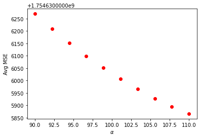
    


```python
plt.plot(rid_a_range, rid_te,'or')
plt.xlabel('$\\alpha$')
plt.ylabel('Avg $R^2$')
plt.show()
```


    
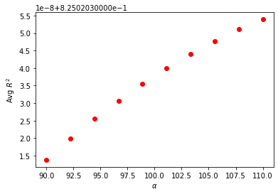
    


```python
las_a_range = np.linspace(0.8,1.2,10)

k = 20

las_tr=[]
las_te=[]
las_tr_mse=[]
las_te_mse=[]

for a in las_a_range:
    mdl = Lasso(alpha=a)
    train,test,train_mse,test_mse = DoKFold(mdl,X,y,k,standardize=False)
    
    las_tr.append(np.mean(train))
    las_te.append(np.mean(test))
    las_tr_mse.append(np.mean(train_mse))
    las_te_mse.append(np.mean(test_mse))
    
idx = np.argmax(las_te)
print('Optimal alpha value: ' + format(las_a_range[idx], '.5f'))
print('Training Score: ' + format(las_tr[idx], '.5f'))
print('Testing Score: ' + format(las_te[idx], '.5f'))
print('Training MSE for this value: ' + format(las_tr_mse[idx],'.5f'))
print('Testing MSE for this value: ' + format(las_te_mse[idx], '.5f'))
```

    /opt/conda/lib/python3.8/site-packages/sklearn/linear_model/_coordinate_descent.py:530: ConvergenceWarning: Objective did not converge. You might want to increase the number of iterations. Duality gap: 17218133342273.004, tolerance: 45555805537.81596
      model = cd_fast.enet_coordinate_descent(
    /opt/conda/lib/python3.8/site-packages/sklearn/linear_model/_coordinate_descent.py:530: ConvergenceWarning: Objective did not converge. You might want to increase the number of iterations. Duality gap: 17191415243207.633, tolerance: 45621375550.697655
      model = cd_fast.enet_coordinate_descent(
    /opt/conda/lib/python3.8/site-packages/sklearn/linear_model/_coordinate_descent.py:530: ConvergenceWarning: Objective did not converge. You might want to increase the number of iterations. Duality gap: 17255052142803.504, tolerance: 45734991350.56118
      model = cd_fast.enet_coordinate_descent(
    /opt/conda/lib/python3.8/site-packages/sklearn/linear_model/_coordinate_descent.py:530: ConvergenceWarning: Objective did not converge. You might want to increase the number of iterations. Duality gap: 17231050362727.64, tolerance: 45766502409.48462
      model = cd_fast.enet_coordinate_descent(
    /opt/conda/lib/python3.8/site-packages/sklearn/linear_model/_coordinate_descent.py:530: ConvergenceWarning: Objective did not converge. You might want to increase the number of iterations. Duality gap: 17259070039175.844, tolerance: 45692341521.50093
      model = cd_fast.enet_coordinate_descent(
    /opt/conda/lib/python3.8/site-packages/sklearn/linear_model/_coordinate_descent.py:530: ConvergenceWarning: Objective did not converge. You might want to increase the number of iterations. Duality gap: 17159052935104.809, tolerance: 45675949302.555756
      model = cd_fast.enet_coordinate_descent(
    /opt/conda/lib/python3.8/site-packages/sklearn/linear_model/_coordinate_descent.py:530: ConvergenceWarning: Objective did not converge. You might want to increase the number of iterations. Duality gap: 17197569586404.547, tolerance: 45830727852.362236
      model = cd_fast.enet_coordinate_descent(
    /opt/conda/lib/python3.8/site-packages/sklearn/linear_model/_coordinate_descent.py:530: ConvergenceWarning: Objective did not converge. You might want to increase the number of iterations. Duality gap: 17192572207906.043, tolerance: 45944116568.45733
      model = cd_fast.enet_coordinate_descent(
    /opt/conda/lib/python3.8/site-packages/sklearn/linear_model/_coordinate_descent.py:530: ConvergenceWarning: Objective did not converge. You might want to increase the number of iterations. Duality gap: 17213217392595.957, tolerance: 45904937946.93008
      model = cd_fast.enet_coordinate_descent(
    /opt/conda/lib/python3.8/site-packages/sklearn/linear_model/_coordinate_descent.py:530: ConvergenceWarning: Objective did not converge. You might want to increase the number of iterations. Duality gap: 17219535960937.477, tolerance: 45676109342.14525
      model = cd_fast.enet_coordinate_descent(
    /opt/conda/lib/python3.8/site-packages/sklearn/linear_model/_coordinate_descent.py:530: ConvergenceWarning: Objective did not converge. You might want to increase the number of iterations. Duality gap: 17229786906527.016, tolerance: 45704409856.010506
      model = cd_fast.enet_coordinate_descent(
    /opt/conda/lib/python3.8/site-packages/sklearn/linear_model/_coordinate_descent.py:530: ConvergenceWarning: Objective did not converge. You might want to increase the number of iterations. Duality gap: 17214977620117.262, tolerance: 45731974376.07833
      model = cd_fast.enet_coordinate_descent(
    /opt/conda/lib/python3.8/site-packages/sklearn/linear_model/_coordinate_descent.py:530: ConvergenceWarning: Objective did not converge. You might want to increase the number of iterations. Duality gap: 17230210853934.652, tolerance: 45716685158.90544
      model = cd_fast.enet_coordinate_descent(
    /opt/conda/lib/python3.8/site-packages/sklearn/linear_model/_coordinate_descent.py:530: ConvergenceWarning: Objective did not converge. You might want to increase the number of iterations. Duality gap: 17274110092750.902, tolerance: 45642938641.02516
      model = cd_fast.enet_coordinate_descent(
    /opt/conda/lib/python3.8/site-packages/sklearn/linear_model/_coordinate_descent.py:530: ConvergenceWarning: Objective did not converge. You might want to increase the number of iterations. Duality gap: 17203828106142.012, tolerance: 45683500601.17986
      model = cd_fast.enet_coordinate_descent(
    /opt/conda/lib/python3.8/site-packages/sklearn/linear_model/_coordinate_descent.py:530: ConvergenceWarning: Objective did not converge. You might want to increase the number of iterations. Duality gap: 17213678249739.004, tolerance: 45703352697.91433
      model = cd_fast.enet_coordinate_descent(
    
    KeyboardInterrupt
    


```python
plt.plot(las_a_range, las_te_mse,'or')
plt.xlabel('$\\alpha$')
plt.ylabel('Avg MSE')
plt.show()
```


```python
plt.plot(las_a_range, las_te,'or')
plt.xlabel('$\\alpha$')
plt.ylabel('Avg $R^2$')
plt.show()
```


```python
las_a_range = np.linspace(0.001,0.003,10)

k = 20

las_tr=[]
las_te=[]
las_tr_mse=[]
las_te_mse=[]

for a in las_a_range:
    mdl = Lasso(alpha=a)
    train,test,train_mse,test_mse = DoKFold(mdl,X,y,k,standardize=False)
    
    las_tr.append(np.mean(train))
    las_te.append(np.mean(test))
    las_tr_mse.append(np.mean(train_mse))
    las_te_mse.append(np.mean(test_mse))
    
idx = np.argmax(las_te)
print('Optimal alpha value: ' + format(las_a_range[idx], '.5f'))
print('Training Score: ' + format(las_tr[idx], '.5f'))
print('Testing Score: ' + format(las_te[idx], '.5f'))
print('Training MSE for this value: ' + format(las_tr_mse[idx],'.5f'))
print('Testing MSE for this value: ' + format(las_te_mse[idx], '.5f'))
```

    /opt/conda/lib/python3.8/site-packages/sklearn/linear_model/_coordinate_descent.py:530: ConvergenceWarning: Objective did not converge. You might want to increase the number of iterations. Duality gap: 24688103092526.656, tolerance: 45555805537.81596
      model = cd_fast.enet_coordinate_descent(
    /opt/conda/lib/python3.8/site-packages/sklearn/linear_model/_coordinate_descent.py:530: ConvergenceWarning: Objective did not converge. You might want to increase the number of iterations. Duality gap: 24638749123529.566, tolerance: 45621375550.697655
      model = cd_fast.enet_coordinate_descent(
    /opt/conda/lib/python3.8/site-packages/sklearn/linear_model/_coordinate_descent.py:530: ConvergenceWarning: Objective did not converge. You might want to increase the number of iterations. Duality gap: 24719920010006.95, tolerance: 45734991350.56118
      model = cd_fast.enet_coordinate_descent(
    /opt/conda/lib/python3.8/site-packages/sklearn/linear_model/_coordinate_descent.py:530: ConvergenceWarning: Objective did not converge. You might want to increase the number of iterations. Duality gap: 24669888005406.18, tolerance: 45766502409.48462
      model = cd_fast.enet_coordinate_descent(
    /opt/conda/lib/python3.8/site-packages/sklearn/linear_model/_coordinate_descent.py:530: ConvergenceWarning: Objective did not converge. You might want to increase the number of iterations. Duality gap: 24738435561444.906, tolerance: 45692341521.50093
      model = cd_fast.enet_coordinate_descent(
    /opt/conda/lib/python3.8/site-packages/sklearn/linear_model/_coordinate_descent.py:530: ConvergenceWarning: Objective did not converge. You might want to increase the number of iterations. Duality gap: 24564862270569.953, tolerance: 45675949302.555756
      model = cd_fast.enet_coordinate_descent(
    /opt/conda/lib/python3.8/site-packages/sklearn/linear_model/_coordinate_descent.py:530: ConvergenceWarning: Objective did not converge. You might want to increase the number of iterations. Duality gap: 24683294436633.14, tolerance: 45830727852.362236
      model = cd_fast.enet_coordinate_descent(
    /opt/conda/lib/python3.8/site-packages/sklearn/linear_model/_coordinate_descent.py:530: ConvergenceWarning: Objective did not converge. You might want to increase the number of iterations. Duality gap: 24635058611795.04, tolerance: 45944116568.45733
      model = cd_fast.enet_coordinate_descent(
    /opt/conda/lib/python3.8/site-packages/sklearn/linear_model/_coordinate_descent.py:530: ConvergenceWarning: Objective did not converge. You might want to increase the number of iterations. Duality gap: 24678339411616.53, tolerance: 45904937946.93008
      model = cd_fast.enet_coordinate_descent(
    /opt/conda/lib/python3.8/site-packages/sklearn/linear_model/_coordinate_descent.py:530: ConvergenceWarning: Objective did not converge. You might want to increase the number of iterations. Duality gap: 24679089109336.336, tolerance: 45676109342.14525
      model = cd_fast.enet_coordinate_descent(
    /opt/conda/lib/python3.8/site-packages/sklearn/linear_model/_coordinate_descent.py:530: ConvergenceWarning: Objective did not converge. You might want to increase the number of iterations. Duality gap: 24698862629405.234, tolerance: 45704409856.010506
      model = cd_fast.enet_coordinate_descent(
    /opt/conda/lib/python3.8/site-packages/sklearn/linear_model/_coordinate_descent.py:530: ConvergenceWarning: Objective did not converge. You might want to increase the number of iterations. Duality gap: 24675845295059.625, tolerance: 45731974376.07833
      model = cd_fast.enet_coordinate_descent(
    /opt/conda/lib/python3.8/site-packages/sklearn/linear_model/_coordinate_descent.py:530: ConvergenceWarning: Objective did not converge. You might want to increase the number of iterations. Duality gap: 24689917533987.613, tolerance: 45716685158.90544
      model = cd_fast.enet_coordinate_descent(
    /opt/conda/lib/python3.8/site-packages/sklearn/linear_model/_coordinate_descent.py:530: ConvergenceWarning: Objective did not converge. You might want to increase the number of iterations. Duality gap: 24772814545605.36, tolerance: 45642938641.02516
      model = cd_fast.enet_coordinate_descent(
    /opt/conda/lib/python3.8/site-packages/sklearn/linear_model/_coordinate_descent.py:530: ConvergenceWarning: Objective did not converge. You might want to increase the number of iterations. Duality gap: 24633130630627.84, tolerance: 45683500601.17986
      model = cd_fast.enet_coordinate_descent(
    /opt/conda/lib/python3.8/site-packages/sklearn/linear_model/_coordinate_descent.py:530: ConvergenceWarning: Objective did not converge. You might want to increase the number of iterations. Duality gap: 24622261394738.52, tolerance: 45703352697.91433
      model = cd_fast.enet_coordinate_descent(
    /opt/conda/lib/python3.8/site-packages/sklearn/linear_model/_coordinate_descent.py:530: ConvergenceWarning: Objective did not converge. You might want to increase the number of iterations. Duality gap: 24598837283618.906, tolerance: 45771166402.52732
      model = cd_fast.enet_coordinate_descent(
    /opt/conda/lib/python3.8/site-packages/sklearn/linear_model/_coordinate_descent.py:530: ConvergenceWarning: Objective did not converge. You might want to increase the number of iterations. Duality gap: 24726704084744.7, tolerance: 45655724582.9038
      model = cd_fast.enet_coordinate_descent(
    /opt/conda/lib/python3.8/site-packages/sklearn/linear_model/_coordinate_descent.py:530: ConvergenceWarning: Objective did not converge. You might want to increase the number of iterations. Duality gap: 24727254079377.234, tolerance: 45608175185.4906
      model = cd_fast.enet_coordinate_descent(
    /opt/conda/lib/python3.8/site-packages/sklearn/linear_model/_coordinate_descent.py:530: ConvergenceWarning: Objective did not converge. You might want to increase the number of iterations. Duality gap: 24697498988951.562, tolerance: 45773552292.46148
      model = cd_fast.enet_coordinate_descent(
    /opt/conda/lib/python3.8/site-packages/sklearn/linear_model/_coordinate_descent.py:530: ConvergenceWarning: Objective did not converge. You might want to increase the number of iterations. Duality gap: 24688117792604.656, tolerance: 45555805537.81596
      model = cd_fast.enet_coordinate_descent(
    /opt/conda/lib/python3.8/site-packages/sklearn/linear_model/_coordinate_descent.py:530: ConvergenceWarning: Objective did not converge. You might want to increase the number of iterations. Duality gap: 24638763646899.145, tolerance: 45621375550.697655
      model = cd_fast.enet_coordinate_descent(
    /opt/conda/lib/python3.8/site-packages/sklearn/linear_model/_coordinate_descent.py:530: ConvergenceWarning: Objective did not converge. You might want to increase the number of iterations. Duality gap: 24719934835235.21, tolerance: 45734991350.56118
      model = cd_fast.enet_coordinate_descent(
    /opt/conda/lib/python3.8/site-packages/sklearn/linear_model/_coordinate_descent.py:530: ConvergenceWarning: Objective did not converge. You might want to increase the number of iterations. Duality gap: 24669902697048.445, tolerance: 45766502409.48462
      model = cd_fast.enet_coordinate_descent(
    /opt/conda/lib/python3.8/site-packages/sklearn/linear_model/_coordinate_descent.py:530: ConvergenceWarning: Objective did not converge. You might want to increase the number of iterations. Duality gap: 24738450308154.754, tolerance: 45692341521.50093
      model = cd_fast.enet_coordinate_descent(
    /opt/conda/lib/python3.8/site-packages/sklearn/linear_model/_coordinate_descent.py:530: ConvergenceWarning: Objective did not converge. You might want to increase the number of iterations. Duality gap: 24564876851646.105, tolerance: 45675949302.555756
      model = cd_fast.enet_coordinate_descent(
    /opt/conda/lib/python3.8/site-packages/sklearn/linear_model/_coordinate_descent.py:530: ConvergenceWarning: Objective did not converge. You might want to increase the number of iterations. Duality gap: 24683309123198.496, tolerance: 45830727852.362236
      model = cd_fast.enet_coordinate_descent(
    /opt/conda/lib/python3.8/site-packages/sklearn/linear_model/_coordinate_descent.py:530: ConvergenceWarning: Objective did not converge. You might want to increase the number of iterations. Duality gap: 24635073309792.9, tolerance: 45944116568.45733
      model = cd_fast.enet_coordinate_descent(
    /opt/conda/lib/python3.8/site-packages/sklearn/linear_model/_coordinate_descent.py:530: ConvergenceWarning: Objective did not converge. You might want to increase the number of iterations. Duality gap: 24678354057849.62, tolerance: 45904937946.93008
      model = cd_fast.enet_coordinate_descent(
    /opt/conda/lib/python3.8/site-packages/sklearn/linear_model/_coordinate_descent.py:530: ConvergenceWarning: Objective did not converge. You might want to increase the number of iterations. Duality gap: 24679103818453.45, tolerance: 45676109342.14525
      model = cd_fast.enet_coordinate_descent(
    /opt/conda/lib/python3.8/site-packages/sklearn/linear_model/_coordinate_descent.py:530: ConvergenceWarning: Objective did not converge. You might want to increase the number of iterations. Duality gap: 24698877355166.055, tolerance: 45704409856.010506
      model = cd_fast.enet_coordinate_descent(
    /opt/conda/lib/python3.8/site-packages/sklearn/linear_model/_coordinate_descent.py:530: ConvergenceWarning: Objective did not converge. You might want to increase the number of iterations. Duality gap: 24675860049106.977, tolerance: 45731974376.07833
      model = cd_fast.enet_coordinate_descent(
    /opt/conda/lib/python3.8/site-packages/sklearn/linear_model/_coordinate_descent.py:530: ConvergenceWarning: Objective did not converge. You might want to increase the number of iterations. Duality gap: 24689932179689.04, tolerance: 45716685158.90544
      model = cd_fast.enet_coordinate_descent(
    /opt/conda/lib/python3.8/site-packages/sklearn/linear_model/_coordinate_descent.py:530: ConvergenceWarning: Objective did not converge. You might want to increase the number of iterations. Duality gap: 24772829243382.38, tolerance: 45642938641.02516
      model = cd_fast.enet_coordinate_descent(
    /opt/conda/lib/python3.8/site-packages/sklearn/linear_model/_coordinate_descent.py:530: ConvergenceWarning: Objective did not converge. You might want to increase the number of iterations. Duality gap: 24633145311665.52, tolerance: 45683500601.17986
      model = cd_fast.enet_coordinate_descent(
    /opt/conda/lib/python3.8/site-packages/sklearn/linear_model/_coordinate_descent.py:530: ConvergenceWarning: Objective did not converge. You might want to increase the number of iterations. Duality gap: 24622276165081.36, tolerance: 45703352697.91433
      model = cd_fast.enet_coordinate_descent(
    /opt/conda/lib/python3.8/site-packages/sklearn/linear_model/_coordinate_descent.py:530: ConvergenceWarning: Objective did not converge. You might want to increase the number of iterations. Duality gap: 24598852006244.5, tolerance: 45771166402.52732
      model = cd_fast.enet_coordinate_descent(
    /opt/conda/lib/python3.8/site-packages/sklearn/linear_model/_coordinate_descent.py:530: ConvergenceWarning: Objective did not converge. You might want to increase the number of iterations. Duality gap: 24726718788201.094, tolerance: 45655724582.9038
      model = cd_fast.enet_coordinate_descent(
    /opt/conda/lib/python3.8/site-packages/sklearn/linear_model/_coordinate_descent.py:530: ConvergenceWarning: Objective did not converge. You might want to increase the number of iterations. Duality gap: 24727268764793.46, tolerance: 45608175185.4906
      model = cd_fast.enet_coordinate_descent(
    /opt/conda/lib/python3.8/site-packages/sklearn/linear_model/_coordinate_descent.py:530: ConvergenceWarning: Objective did not converge. You might want to increase the number of iterations. Duality gap: 24697513649384.156, tolerance: 45773552292.46148
      model = cd_fast.enet_coordinate_descent(
    /opt/conda/lib/python3.8/site-packages/sklearn/linear_model/_coordinate_descent.py:530: ConvergenceWarning: Objective did not converge. You might want to increase the number of iterations. Duality gap: 24688132488499.79, tolerance: 45555805537.81596
      model = cd_fast.enet_coordinate_descent(
    /opt/conda/lib/python3.8/site-packages/sklearn/linear_model/_coordinate_descent.py:530: ConvergenceWarning: Objective did not converge. You might want to increase the number of iterations. Duality gap: 24638778167522.87, tolerance: 45621375550.697655
      model = cd_fast.enet_coordinate_descent(
    /opt/conda/lib/python3.8/site-packages/sklearn/linear_model/_coordinate_descent.py:530: ConvergenceWarning: Objective did not converge. You might want to increase the number of iterations. Duality gap: 24719949659489.11, tolerance: 45734991350.56118
      model = cd_fast.enet_coordinate_descent(
    /opt/conda/lib/python3.8/site-packages/sklearn/linear_model/_coordinate_descent.py:530: ConvergenceWarning: Objective did not converge. You might want to increase the number of iterations. Duality gap: 24669917386846.14, tolerance: 45766502409.48462
      model = cd_fast.enet_coordinate_descent(
    /opt/conda/lib/python3.8/site-packages/sklearn/linear_model/_coordinate_descent.py:530: ConvergenceWarning: Objective did not converge. You might want to increase the number of iterations. Duality gap: 24738465054223.04, tolerance: 45692341521.50093
      model = cd_fast.enet_coordinate_descent(
    /opt/conda/lib/python3.8/site-packages/sklearn/linear_model/_coordinate_descent.py:530: ConvergenceWarning: Objective did not converge. You might want to increase the number of iterations. Duality gap: 24564891429719.164, tolerance: 45675949302.555756
      model = cd_fast.enet_coordinate_descent(
    /opt/conda/lib/python3.8/site-packages/sklearn/linear_model/_coordinate_descent.py:530: ConvergenceWarning: Objective did not converge. You might want to increase the number of iterations. Duality gap: 24683323808991.605, tolerance: 45830727852.362236
      model = cd_fast.enet_coordinate_descent(
    /opt/conda/lib/python3.8/site-packages/sklearn/linear_model/_coordinate_descent.py:530: ConvergenceWarning: Objective did not converge. You might want to increase the number of iterations. Duality gap: 24635087998928.03, tolerance: 45944116568.45733
      model = cd_fast.enet_coordinate_descent(
    /opt/conda/lib/python3.8/site-packages/sklearn/linear_model/_coordinate_descent.py:530: ConvergenceWarning: Objective did not converge. You might want to increase the number of iterations. Duality gap: 24678368696578.016, tolerance: 45904937946.93008
      model = cd_fast.enet_coordinate_descent(
    /opt/conda/lib/python3.8/site-packages/sklearn/linear_model/_coordinate_descent.py:530: ConvergenceWarning: Objective did not converge. You might want to increase the number of iterations. Duality gap: 24679118533725.85, tolerance: 45676109342.14525
      model = cd_fast.enet_coordinate_descent(
    /opt/conda/lib/python3.8/site-packages/sklearn/linear_model/_coordinate_descent.py:530: ConvergenceWarning: Objective did not converge. You might want to increase the number of iterations. Duality gap: 24698892082068.047, tolerance: 45704409856.010506
      model = cd_fast.enet_coordinate_descent(
    /opt/conda/lib/python3.8/site-packages/sklearn/linear_model/_coordinate_descent.py:530: ConvergenceWarning: Objective did not converge. You might want to increase the number of iterations. Duality gap: 24675874801451.52, tolerance: 45731974376.07833
      model = cd_fast.enet_coordinate_descent(
    /opt/conda/lib/python3.8/site-packages/sklearn/linear_model/_coordinate_descent.py:530: ConvergenceWarning: Objective did not converge. You might want to increase the number of iterations. Duality gap: 24689946827959.188, tolerance: 45716685158.90544
      model = cd_fast.enet_coordinate_descent(
    /opt/conda/lib/python3.8/site-packages/sklearn/linear_model/_coordinate_descent.py:530: ConvergenceWarning: Objective did not converge. You might want to increase the number of iterations. Duality gap: 24772843939875.023, tolerance: 45642938641.02516
      model = cd_fast.enet_coordinate_descent(
    /opt/conda/lib/python3.8/site-packages/sklearn/linear_model/_coordinate_descent.py:530: ConvergenceWarning: Objective did not converge. You might want to increase the number of iterations. Duality gap: 24633159982428.414, tolerance: 45683500601.17986
      model = cd_fast.enet_coordinate_descent(
    /opt/conda/lib/python3.8/site-packages/sklearn/linear_model/_coordinate_descent.py:530: ConvergenceWarning: Objective did not converge. You might want to increase the number of iterations. Duality gap: 24622290927201.5, tolerance: 45703352697.91433
      model = cd_fast.enet_coordinate_descent(
    /opt/conda/lib/python3.8/site-packages/sklearn/linear_model/_coordinate_descent.py:530: ConvergenceWarning: Objective did not converge. You might want to increase the number of iterations. Duality gap: 24598866723994.207, tolerance: 45771166402.52732
      model = cd_fast.enet_coordinate_descent(
    /opt/conda/lib/python3.8/site-packages/sklearn/linear_model/_coordinate_descent.py:530: ConvergenceWarning: Objective did not converge. You might want to increase the number of iterations. Duality gap: 24726733493030.75, tolerance: 45655724582.9038
      model = cd_fast.enet_coordinate_descent(
    /opt/conda/lib/python3.8/site-packages/sklearn/linear_model/_coordinate_descent.py:530: ConvergenceWarning: Objective did not converge. You might want to increase the number of iterations. Duality gap: 24727283447863.32, tolerance: 45608175185.4906
      model = cd_fast.enet_coordinate_descent(
    /opt/conda/lib/python3.8/site-packages/sklearn/linear_model/_coordinate_descent.py:530: ConvergenceWarning: Objective did not converge. You might want to increase the number of iterations. Duality gap: 24697528312658.43, tolerance: 45773552292.46148
      model = cd_fast.enet_coordinate_descent(
    /opt/conda/lib/python3.8/site-packages/sklearn/linear_model/_coordinate_descent.py:530: ConvergenceWarning: Objective did not converge. You might want to increase the number of iterations. Duality gap: 24688147180392.35, tolerance: 45555805537.81596
      model = cd_fast.enet_coordinate_descent(
    /opt/conda/lib/python3.8/site-packages/sklearn/linear_model/_coordinate_descent.py:530: ConvergenceWarning: Objective did not converge. You might want to increase the number of iterations. Duality gap: 24638792682148.54, tolerance: 45621375550.697655
      model = cd_fast.enet_coordinate_descent(
    /opt/conda/lib/python3.8/site-packages/sklearn/linear_model/_coordinate_descent.py:530: ConvergenceWarning: Objective did not converge. You might want to increase the number of iterations. Duality gap: 24719964479487.023, tolerance: 45734991350.56118
      model = cd_fast.enet_coordinate_descent(
    /opt/conda/lib/python3.8/site-packages/sklearn/linear_model/_coordinate_descent.py:530: ConvergenceWarning: Objective did not converge. You might want to increase the number of iterations. Duality gap: 24669932073694.445, tolerance: 45766502409.48462
      model = cd_fast.enet_coordinate_descent(
    /opt/conda/lib/python3.8/site-packages/sklearn/linear_model/_coordinate_descent.py:530: ConvergenceWarning: Objective did not converge. You might want to increase the number of iterations. Duality gap: 24738479798649.844, tolerance: 45692341521.50093
      model = cd_fast.enet_coordinate_descent(
    /opt/conda/lib/python3.8/site-packages/sklearn/linear_model/_coordinate_descent.py:530: ConvergenceWarning: Objective did not converge. You might want to increase the number of iterations. Duality gap: 24564906004835.16, tolerance: 45675949302.555756
      model = cd_fast.enet_coordinate_descent(
    /opt/conda/lib/python3.8/site-packages/sklearn/linear_model/_coordinate_descent.py:530: ConvergenceWarning: Objective did not converge. You might want to increase the number of iterations. Duality gap: 24683338492242.72, tolerance: 45830727852.362236
      model = cd_fast.enet_coordinate_descent(
    /opt/conda/lib/python3.8/site-packages/sklearn/linear_model/_coordinate_descent.py:530: ConvergenceWarning: Objective did not converge. You might want to increase the number of iterations. Duality gap: 24635102686456.844, tolerance: 45944116568.45733
      model = cd_fast.enet_coordinate_descent(
    /opt/conda/lib/python3.8/site-packages/sklearn/linear_model/_coordinate_descent.py:530: ConvergenceWarning: Objective did not converge. You might want to increase the number of iterations. Duality gap: 24678383334869.42, tolerance: 45904937946.93008
      model = cd_fast.enet_coordinate_descent(
    /opt/conda/lib/python3.8/site-packages/sklearn/linear_model/_coordinate_descent.py:530: ConvergenceWarning: Objective did not converge. You might want to increase the number of iterations. Duality gap: 24679133241755.18, tolerance: 45676109342.14525
      model = cd_fast.enet_coordinate_descent(
    /opt/conda/lib/python3.8/site-packages/sklearn/linear_model/_coordinate_descent.py:530: ConvergenceWarning: Objective did not converge. You might want to increase the number of iterations. Duality gap: 24698906803464.08, tolerance: 45704409856.010506
      model = cd_fast.enet_coordinate_descent(
    /opt/conda/lib/python3.8/site-packages/sklearn/linear_model/_coordinate_descent.py:530: ConvergenceWarning: Objective did not converge. You might want to increase the number of iterations. Duality gap: 24675889551078.457, tolerance: 45731974376.07833
      model = cd_fast.enet_coordinate_descent(
    /opt/conda/lib/python3.8/site-packages/sklearn/linear_model/_coordinate_descent.py:530: ConvergenceWarning: Objective did not converge. You might want to increase the number of iterations. Duality gap: 24689961469013.188, tolerance: 45716685158.90544
      model = cd_fast.enet_coordinate_descent(
    /opt/conda/lib/python3.8/site-packages/sklearn/linear_model/_coordinate_descent.py:530: ConvergenceWarning: Objective did not converge. You might want to increase the number of iterations. Duality gap: 24772858632784.727, tolerance: 45642938641.02516
      model = cd_fast.enet_coordinate_descent(
    /opt/conda/lib/python3.8/site-packages/sklearn/linear_model/_coordinate_descent.py:530: ConvergenceWarning: Objective did not converge. You might want to increase the number of iterations. Duality gap: 24633174658700.61, tolerance: 45683500601.17986
      model = cd_fast.enet_coordinate_descent(
    /opt/conda/lib/python3.8/site-packages/sklearn/linear_model/_coordinate_descent.py:530: ConvergenceWarning: Objective did not converge. You might want to increase the number of iterations. Duality gap: 24622305686010.89, tolerance: 45703352697.91433
      model = cd_fast.enet_coordinate_descent(
    /opt/conda/lib/python3.8/site-packages/sklearn/linear_model/_coordinate_descent.py:530: ConvergenceWarning: Objective did not converge. You might want to increase the number of iterations. Duality gap: 24598881442342.223, tolerance: 45771166402.52732
      model = cd_fast.enet_coordinate_descent(
    /opt/conda/lib/python3.8/site-packages/sklearn/linear_model/_coordinate_descent.py:530: ConvergenceWarning: Objective did not converge. You might want to increase the number of iterations. Duality gap: 24726748192344.52, tolerance: 45655724582.9038
      model = cd_fast.enet_coordinate_descent(
    /opt/conda/lib/python3.8/site-packages/sklearn/linear_model/_coordinate_descent.py:530: ConvergenceWarning: Objective did not converge. You might want to increase the number of iterations. Duality gap: 24727298130092.094, tolerance: 45608175185.4906
      model = cd_fast.enet_coordinate_descent(
    /opt/conda/lib/python3.8/site-packages/sklearn/linear_model/_coordinate_descent.py:530: ConvergenceWarning: Objective did not converge. You might want to increase the number of iterations. Duality gap: 24697542969696.953, tolerance: 45773552292.46148
      model = cd_fast.enet_coordinate_descent(
    /opt/conda/lib/python3.8/site-packages/sklearn/linear_model/_coordinate_descent.py:530: ConvergenceWarning: Objective did not converge. You might want to increase the number of iterations. Duality gap: 24688161871215.895, tolerance: 45555805537.81596
      model = cd_fast.enet_coordinate_descent(
    /opt/conda/lib/python3.8/site-packages/sklearn/linear_model/_coordinate_descent.py:530: ConvergenceWarning: Objective did not converge. You might want to increase the number of iterations. Duality gap: 24638807194477.82, tolerance: 45621375550.697655
      model = cd_fast.enet_coordinate_descent(
    /opt/conda/lib/python3.8/site-packages/sklearn/linear_model/_coordinate_descent.py:530: ConvergenceWarning: Objective did not converge. You might want to increase the number of iterations. Duality gap: 24719979293776.445, tolerance: 45734991350.56118
      model = cd_fast.enet_coordinate_descent(
    /opt/conda/lib/python3.8/site-packages/sklearn/linear_model/_coordinate_descent.py:530: ConvergenceWarning: Objective did not converge. You might want to increase the number of iterations. Duality gap: 24669946759123.21, tolerance: 45766502409.48462
      model = cd_fast.enet_coordinate_descent(
    /opt/conda/lib/python3.8/site-packages/sklearn/linear_model/_coordinate_descent.py:530: ConvergenceWarning: Objective did not converge. You might want to increase the number of iterations. Duality gap: 24738494534902.68, tolerance: 45692341521.50093
      model = cd_fast.enet_coordinate_descent(
    /opt/conda/lib/python3.8/site-packages/sklearn/linear_model/_coordinate_descent.py:530: ConvergenceWarning: Objective did not converge. You might want to increase the number of iterations. Duality gap: 24564920576866.055, tolerance: 45675949302.555756
      model = cd_fast.enet_coordinate_descent(
    /opt/conda/lib/python3.8/site-packages/sklearn/linear_model/_coordinate_descent.py:530: ConvergenceWarning: Objective did not converge. You might want to increase the number of iterations. Duality gap: 24683353171111.797, tolerance: 45830727852.362236
      model = cd_fast.enet_coordinate_descent(
    /opt/conda/lib/python3.8/site-packages/sklearn/linear_model/_coordinate_descent.py:530: ConvergenceWarning: Objective did not converge. You might want to increase the number of iterations. Duality gap: 24635117374763.734, tolerance: 45944116568.45733
      model = cd_fast.enet_coordinate_descent(
    /opt/conda/lib/python3.8/site-packages/sklearn/linear_model/_coordinate_descent.py:530: ConvergenceWarning: Objective did not converge. You might want to increase the number of iterations. Duality gap: 24678397967374.516, tolerance: 45904937946.93008
      model = cd_fast.enet_coordinate_descent(
    /opt/conda/lib/python3.8/site-packages/sklearn/linear_model/_coordinate_descent.py:530: ConvergenceWarning: Objective did not converge. You might want to increase the number of iterations. Duality gap: 24679147945190.97, tolerance: 45676109342.14525
      model = cd_fast.enet_coordinate_descent(
    /opt/conda/lib/python3.8/site-packages/sklearn/linear_model/_coordinate_descent.py:530: ConvergenceWarning: Objective did not converge. You might want to increase the number of iterations. Duality gap: 24698921522756.566, tolerance: 45704409856.010506
      model = cd_fast.enet_coordinate_descent(
    /opt/conda/lib/python3.8/site-packages/sklearn/linear_model/_coordinate_descent.py:530: ConvergenceWarning: Objective did not converge. You might want to increase the number of iterations. Duality gap: 24675904298082.3, tolerance: 45731974376.07833
      model = cd_fast.enet_coordinate_descent(
    /opt/conda/lib/python3.8/site-packages/sklearn/linear_model/_coordinate_descent.py:530: ConvergenceWarning: Objective did not converge. You might want to increase the number of iterations. Duality gap: 24689976109152.96, tolerance: 45716685158.90544
      model = cd_fast.enet_coordinate_descent(
    /opt/conda/lib/python3.8/site-packages/sklearn/linear_model/_coordinate_descent.py:530: ConvergenceWarning: Objective did not converge. You might want to increase the number of iterations. Duality gap: 24772873320484.22, tolerance: 45642938641.02516
      model = cd_fast.enet_coordinate_descent(
    /opt/conda/lib/python3.8/site-packages/sklearn/linear_model/_coordinate_descent.py:530: ConvergenceWarning: Objective did not converge. You might want to increase the number of iterations. Duality gap: 24633189325743.93, tolerance: 45683500601.17986
      model = cd_fast.enet_coordinate_descent(
    /opt/conda/lib/python3.8/site-packages/sklearn/linear_model/_coordinate_descent.py:530: ConvergenceWarning: Objective did not converge. You might want to increase the number of iterations. Duality gap: 24622320445219.625, tolerance: 45703352697.91433
      model = cd_fast.enet_coordinate_descent(
    /opt/conda/lib/python3.8/site-packages/sklearn/linear_model/_coordinate_descent.py:530: ConvergenceWarning: Objective did not converge. You might want to increase the number of iterations. Duality gap: 24598896155886.13, tolerance: 45771166402.52732
      model = cd_fast.enet_coordinate_descent(
    /opt/conda/lib/python3.8/site-packages/sklearn/linear_model/_coordinate_descent.py:530: ConvergenceWarning: Objective did not converge. You might want to increase the number of iterations. Duality gap: 24726762890623.535, tolerance: 45655724582.9038
      model = cd_fast.enet_coordinate_descent(
    /opt/conda/lib/python3.8/site-packages/sklearn/linear_model/_coordinate_descent.py:530: ConvergenceWarning: Objective did not converge. You might want to increase the number of iterations. Duality gap: 24727312807305.605, tolerance: 45608175185.4906
      model = cd_fast.enet_coordinate_descent(
    /opt/conda/lib/python3.8/site-packages/sklearn/linear_model/_coordinate_descent.py:530: ConvergenceWarning: Objective did not converge. You might want to increase the number of iterations. Duality gap: 24697557624467.707, tolerance: 45773552292.46148
      model = cd_fast.enet_coordinate_descent(
    /opt/conda/lib/python3.8/site-packages/sklearn/linear_model/_coordinate_descent.py:530: ConvergenceWarning: Objective did not converge. You might want to increase the number of iterations. Duality gap: 24688176560663.03, tolerance: 45555805537.81596
      model = cd_fast.enet_coordinate_descent(
    /opt/conda/lib/python3.8/site-packages/sklearn/linear_model/_coordinate_descent.py:530: ConvergenceWarning: Objective did not converge. You might want to increase the number of iterations. Duality gap: 24638821705057.066, tolerance: 45621375550.697655
      model = cd_fast.enet_coordinate_descent(
    /opt/conda/lib/python3.8/site-packages/sklearn/linear_model/_coordinate_descent.py:530: ConvergenceWarning: Objective did not converge. You might want to increase the number of iterations. Duality gap: 24719994108734.285, tolerance: 45734991350.56118
      model = cd_fast.enet_coordinate_descent(
    /opt/conda/lib/python3.8/site-packages/sklearn/linear_model/_coordinate_descent.py:530: ConvergenceWarning: Objective did not converge. You might want to increase the number of iterations. Duality gap: 24669961439907.58, tolerance: 45766502409.48462
      model = cd_fast.enet_coordinate_descent(
    /opt/conda/lib/python3.8/site-packages/sklearn/linear_model/_coordinate_descent.py:530: ConvergenceWarning: Objective did not converge. You might want to increase the number of iterations. Duality gap: 24738509270800.09, tolerance: 45692341521.50093
      model = cd_fast.enet_coordinate_descent(
    /opt/conda/lib/python3.8/site-packages/sklearn/linear_model/_coordinate_descent.py:530: ConvergenceWarning: Objective did not converge. You might want to increase the number of iterations. Duality gap: 24564935144831.79, tolerance: 45675949302.555756
      model = cd_fast.enet_coordinate_descent(
    /opt/conda/lib/python3.8/site-packages/sklearn/linear_model/_coordinate_descent.py:530: ConvergenceWarning: Objective did not converge. You might want to increase the number of iterations. Duality gap: 24683367848096.97, tolerance: 45830727852.362236
      model = cd_fast.enet_coordinate_descent(
    /opt/conda/lib/python3.8/site-packages/sklearn/linear_model/_coordinate_descent.py:530: ConvergenceWarning: Objective did not converge. You might want to increase the number of iterations. Duality gap: 24635132056353.137, tolerance: 45944116568.45733
      model = cd_fast.enet_coordinate_descent(
    /opt/conda/lib/python3.8/site-packages/sklearn/linear_model/_coordinate_descent.py:530: ConvergenceWarning: Objective did not converge. You might want to increase the number of iterations. Duality gap: 24678412600055.312, tolerance: 45904937946.93008
      model = cd_fast.enet_coordinate_descent(
    /opt/conda/lib/python3.8/site-packages/sklearn/linear_model/_coordinate_descent.py:530: ConvergenceWarning: Objective did not converge. You might want to increase the number of iterations. Duality gap: 24679162647104.688, tolerance: 45676109342.14525
      model = cd_fast.enet_coordinate_descent(
    /opt/conda/lib/python3.8/site-packages/sklearn/linear_model/_coordinate_descent.py:530: ConvergenceWarning: Objective did not converge. You might want to increase the number of iterations. Duality gap: 24698936236769.938, tolerance: 45704409856.010506
      model = cd_fast.enet_coordinate_descent(
    /opt/conda/lib/python3.8/site-packages/sklearn/linear_model/_coordinate_descent.py:530: ConvergenceWarning: Objective did not converge. You might want to increase the number of iterations. Duality gap: 24675919043494.12, tolerance: 45731974376.07833
      model = cd_fast.enet_coordinate_descent(
    /opt/conda/lib/python3.8/site-packages/sklearn/linear_model/_coordinate_descent.py:530: ConvergenceWarning: Objective did not converge. You might want to increase the number of iterations. Duality gap: 24689990743586.32, tolerance: 45716685158.90544
      model = cd_fast.enet_coordinate_descent(
    /opt/conda/lib/python3.8/site-packages/sklearn/linear_model/_coordinate_descent.py:530: ConvergenceWarning: Objective did not converge. You might want to increase the number of iterations. Duality gap: 24772888007172.344, tolerance: 45642938641.02516
      model = cd_fast.enet_coordinate_descent(
    /opt/conda/lib/python3.8/site-packages/sklearn/linear_model/_coordinate_descent.py:530: ConvergenceWarning: Objective did not converge. You might want to increase the number of iterations. Duality gap: 24633203991440.664, tolerance: 45683500601.17986
      model = cd_fast.enet_coordinate_descent(
    /opt/conda/lib/python3.8/site-packages/sklearn/linear_model/_coordinate_descent.py:530: ConvergenceWarning: Objective did not converge. You might want to increase the number of iterations. Duality gap: 24622335200431.67, tolerance: 45703352697.91433
      model = cd_fast.enet_coordinate_descent(
    /opt/conda/lib/python3.8/site-packages/sklearn/linear_model/_coordinate_descent.py:530: ConvergenceWarning: Objective did not converge. You might want to increase the number of iterations. Duality gap: 24598910866484.848, tolerance: 45771166402.52732
      model = cd_fast.enet_coordinate_descent(
    /opt/conda/lib/python3.8/site-packages/sklearn/linear_model/_coordinate_descent.py:530: ConvergenceWarning: Objective did not converge. You might want to increase the number of iterations. Duality gap: 24726777583432.496, tolerance: 45655724582.9038
      model = cd_fast.enet_coordinate_descent(
    /opt/conda/lib/python3.8/site-packages/sklearn/linear_model/_coordinate_descent.py:530: ConvergenceWarning: Objective did not converge. You might want to increase the number of iterations. Duality gap: 24727327482797.258, tolerance: 45608175185.4906
      model = cd_fast.enet_coordinate_descent(
    /opt/conda/lib/python3.8/site-packages/sklearn/linear_model/_coordinate_descent.py:530: ConvergenceWarning: Objective did not converge. You might want to increase the number of iterations. Duality gap: 24697572278817.184, tolerance: 45773552292.46148
      model = cd_fast.enet_coordinate_descent(
    /opt/conda/lib/python3.8/site-packages/sklearn/linear_model/_coordinate_descent.py:530: ConvergenceWarning: Objective did not converge. You might want to increase the number of iterations. Duality gap: 24688191245876.0, tolerance: 45555805537.81596
      model = cd_fast.enet_coordinate_descent(
    /opt/conda/lib/python3.8/site-packages/sklearn/linear_model/_coordinate_descent.py:530: ConvergenceWarning: Objective did not converge. You might want to increase the number of iterations. Duality gap: 24638836213722.22, tolerance: 45621375550.697655
      model = cd_fast.enet_coordinate_descent(
    /opt/conda/lib/python3.8/site-packages/sklearn/linear_model/_coordinate_descent.py:530: ConvergenceWarning: Objective did not converge. You might want to increase the number of iterations. Duality gap: 24720008917529.617, tolerance: 45734991350.56118
      model = cd_fast.enet_coordinate_descent(
    /opt/conda/lib/python3.8/site-packages/sklearn/linear_model/_coordinate_descent.py:530: ConvergenceWarning: Objective did not converge. You might want to increase the number of iterations. Duality gap: 24669976116179.797, tolerance: 45766502409.48462
      model = cd_fast.enet_coordinate_descent(
    /opt/conda/lib/python3.8/site-packages/sklearn/linear_model/_coordinate_descent.py:530: ConvergenceWarning: Objective did not converge. You might want to increase the number of iterations. Duality gap: 24738524005489.97, tolerance: 45692341521.50093
      model = cd_fast.enet_coordinate_descent(
    /opt/conda/lib/python3.8/site-packages/sklearn/linear_model/_coordinate_descent.py:530: ConvergenceWarning: Objective did not converge. You might want to increase the number of iterations. Duality gap: 24564949712440.438, tolerance: 45675949302.555756
      model = cd_fast.enet_coordinate_descent(
    /opt/conda/lib/python3.8/site-packages/sklearn/linear_model/_coordinate_descent.py:530: ConvergenceWarning: Objective did not converge. You might want to increase the number of iterations. Duality gap: 24683382519564.47, tolerance: 45830727852.362236
      model = cd_fast.enet_coordinate_descent(
    /opt/conda/lib/python3.8/site-packages/sklearn/linear_model/_coordinate_descent.py:530: ConvergenceWarning: Objective did not converge. You might want to increase the number of iterations. Duality gap: 24635146734810.508, tolerance: 45944116568.45733
      model = cd_fast.enet_coordinate_descent(
    /opt/conda/lib/python3.8/site-packages/sklearn/linear_model/_coordinate_descent.py:530: ConvergenceWarning: Objective did not converge. You might want to increase the number of iterations. Duality gap: 24678427226528.164, tolerance: 45904937946.93008
      model = cd_fast.enet_coordinate_descent(
    /opt/conda/lib/python3.8/site-packages/sklearn/linear_model/_coordinate_descent.py:530: ConvergenceWarning: Objective did not converge. You might want to increase the number of iterations. Duality gap: 24679177345753.68, tolerance: 45676109342.14525
      model = cd_fast.enet_coordinate_descent(
    /opt/conda/lib/python3.8/site-packages/sklearn/linear_model/_coordinate_descent.py:530: ConvergenceWarning: Objective did not converge. You might want to increase the number of iterations. Duality gap: 24698950949001.938, tolerance: 45704409856.010506
      model = cd_fast.enet_coordinate_descent(
    /opt/conda/lib/python3.8/site-packages/sklearn/linear_model/_coordinate_descent.py:530: ConvergenceWarning: Objective did not converge. You might want to increase the number of iterations. Duality gap: 24675933783152.785, tolerance: 45731974376.07833
      model = cd_fast.enet_coordinate_descent(
    /opt/conda/lib/python3.8/site-packages/sklearn/linear_model/_coordinate_descent.py:530: ConvergenceWarning: Objective did not converge. You might want to increase the number of iterations. Duality gap: 24690005376623.062, tolerance: 45716685158.90544
      model = cd_fast.enet_coordinate_descent(
    /opt/conda/lib/python3.8/site-packages/sklearn/linear_model/_coordinate_descent.py:530: ConvergenceWarning: Objective did not converge. You might want to increase the number of iterations. Duality gap: 24772902691311.99, tolerance: 45642938641.02516
      model = cd_fast.enet_coordinate_descent(
    /opt/conda/lib/python3.8/site-packages/sklearn/linear_model/_coordinate_descent.py:530: ConvergenceWarning: Objective did not converge. You might want to increase the number of iterations. Duality gap: 24633218654219.18, tolerance: 45683500601.17986
      model = cd_fast.enet_coordinate_descent(
    /opt/conda/lib/python3.8/site-packages/sklearn/linear_model/_coordinate_descent.py:530: ConvergenceWarning: Objective did not converge. You might want to increase the number of iterations. Duality gap: 24622349952486.582, tolerance: 45703352697.91433
      model = cd_fast.enet_coordinate_descent(
    /opt/conda/lib/python3.8/site-packages/sklearn/linear_model/_coordinate_descent.py:530: ConvergenceWarning: Objective did not converge. You might want to increase the number of iterations. Duality gap: 24598925573177.89, tolerance: 45771166402.52732
      model = cd_fast.enet_coordinate_descent(
    /opt/conda/lib/python3.8/site-packages/sklearn/linear_model/_coordinate_descent.py:530: ConvergenceWarning: Objective did not converge. You might want to increase the number of iterations. Duality gap: 24726792274988.41, tolerance: 45655724582.9038
      model = cd_fast.enet_coordinate_descent(
    /opt/conda/lib/python3.8/site-packages/sklearn/linear_model/_coordinate_descent.py:530: ConvergenceWarning: Objective did not converge. You might want to increase the number of iterations. Duality gap: 24727342151258.03, tolerance: 45608175185.4906
      model = cd_fast.enet_coordinate_descent(
    /opt/conda/lib/python3.8/site-packages/sklearn/linear_model/_coordinate_descent.py:530: ConvergenceWarning: Objective did not converge. You might want to increase the number of iterations. Duality gap: 24697586927703.84, tolerance: 45773552292.46148
      model = cd_fast.enet_coordinate_descent(
    /opt/conda/lib/python3.8/site-packages/sklearn/linear_model/_coordinate_descent.py:530: ConvergenceWarning: Objective did not converge. You might want to increase the number of iterations. Duality gap: 24688205927276.523, tolerance: 45555805537.81596
      model = cd_fast.enet_coordinate_descent(
    /opt/conda/lib/python3.8/site-packages/sklearn/linear_model/_coordinate_descent.py:530: ConvergenceWarning: Objective did not converge. You might want to increase the number of iterations. Duality gap: 24638850717313.223, tolerance: 45621375550.697655
      model = cd_fast.enet_coordinate_descent(
    /opt/conda/lib/python3.8/site-packages/sklearn/linear_model/_coordinate_descent.py:530: ConvergenceWarning: Objective did not converge. You might want to increase the number of iterations. Duality gap: 24720023725704.754, tolerance: 45734991350.56118
      model = cd_fast.enet_coordinate_descent(
    /opt/conda/lib/python3.8/site-packages/sklearn/linear_model/_coordinate_descent.py:530: ConvergenceWarning: Objective did not converge. You might want to increase the number of iterations. Duality gap: 24669990791670.195, tolerance: 45766502409.48462
      model = cd_fast.enet_coordinate_descent(
    /opt/conda/lib/python3.8/site-packages/sklearn/linear_model/_coordinate_descent.py:530: ConvergenceWarning: Objective did not converge. You might want to increase the number of iterations. Duality gap: 24738538737187.504, tolerance: 45692341521.50093
      model = cd_fast.enet_coordinate_descent(
    /opt/conda/lib/python3.8/site-packages/sklearn/linear_model/_coordinate_descent.py:530: ConvergenceWarning: Objective did not converge. You might want to increase the number of iterations. Duality gap: 24564964273795.812, tolerance: 45675949302.555756
      model = cd_fast.enet_coordinate_descent(
    /opt/conda/lib/python3.8/site-packages/sklearn/linear_model/_coordinate_descent.py:530: ConvergenceWarning: Objective did not converge. You might want to increase the number of iterations. Duality gap: 24683397191361.242, tolerance: 45830727852.362236
      model = cd_fast.enet_coordinate_descent(
    /opt/conda/lib/python3.8/site-packages/sklearn/linear_model/_coordinate_descent.py:530: ConvergenceWarning: Objective did not converge. You might want to increase the number of iterations. Duality gap: 24635161411213.203, tolerance: 45944116568.45733
      model = cd_fast.enet_coordinate_descent(
    /opt/conda/lib/python3.8/site-packages/sklearn/linear_model/_coordinate_descent.py:530: ConvergenceWarning: Objective did not converge. You might want to increase the number of iterations. Duality gap: 24678441853840.953, tolerance: 45904937946.93008
      model = cd_fast.enet_coordinate_descent(
    /opt/conda/lib/python3.8/site-packages/sklearn/linear_model/_coordinate_descent.py:530: ConvergenceWarning: Objective did not converge. You might want to increase the number of iterations. Duality gap: 24679192040750.21, tolerance: 45676109342.14525
      model = cd_fast.enet_coordinate_descent(
    /opt/conda/lib/python3.8/site-packages/sklearn/linear_model/_coordinate_descent.py:530: ConvergenceWarning: Objective did not converge. You might want to increase the number of iterations. Duality gap: 24698965659850.285, tolerance: 45704409856.010506
      model = cd_fast.enet_coordinate_descent(
    /opt/conda/lib/python3.8/site-packages/sklearn/linear_model/_coordinate_descent.py:530: ConvergenceWarning: Objective did not converge. You might want to increase the number of iterations. Duality gap: 24675948521046.61, tolerance: 45731974376.07833
      model = cd_fast.enet_coordinate_descent(
    /opt/conda/lib/python3.8/site-packages/sklearn/linear_model/_coordinate_descent.py:530: ConvergenceWarning: Objective did not converge. You might want to increase the number of iterations. Duality gap: 24690020007268.89, tolerance: 45716685158.90544
      model = cd_fast.enet_coordinate_descent(
    /opt/conda/lib/python3.8/site-packages/sklearn/linear_model/_coordinate_descent.py:530: ConvergenceWarning: Objective did not converge. You might want to increase the number of iterations. Duality gap: 24772917370587.008, tolerance: 45642938641.02516
      model = cd_fast.enet_coordinate_descent(
    /opt/conda/lib/python3.8/site-packages/sklearn/linear_model/_coordinate_descent.py:530: ConvergenceWarning: Objective did not converge. You might want to increase the number of iterations. Duality gap: 24633233311916.78, tolerance: 45683500601.17986
      model = cd_fast.enet_coordinate_descent(
    /opt/conda/lib/python3.8/site-packages/sklearn/linear_model/_coordinate_descent.py:530: ConvergenceWarning: Objective did not converge. You might want to increase the number of iterations. Duality gap: 24622364701857.24, tolerance: 45703352697.91433
      model = cd_fast.enet_coordinate_descent(
    /opt/conda/lib/python3.8/site-packages/sklearn/linear_model/_coordinate_descent.py:530: ConvergenceWarning: Objective did not converge. You might want to increase the number of iterations. Duality gap: 24598940279185.562, tolerance: 45771166402.52732
      model = cd_fast.enet_coordinate_descent(
    /opt/conda/lib/python3.8/site-packages/sklearn/linear_model/_coordinate_descent.py:530: ConvergenceWarning: Objective did not converge. You might want to increase the number of iterations. Duality gap: 24726806961397.75, tolerance: 45655724582.9038
      model = cd_fast.enet_coordinate_descent(
    /opt/conda/lib/python3.8/site-packages/sklearn/linear_model/_coordinate_descent.py:530: ConvergenceWarning: Objective did not converge. You might want to increase the number of iterations. Duality gap: 24727356820492.44, tolerance: 45608175185.4906
      model = cd_fast.enet_coordinate_descent(
    /opt/conda/lib/python3.8/site-packages/sklearn/linear_model/_coordinate_descent.py:530: ConvergenceWarning: Objective did not converge. You might want to increase the number of iterations. Duality gap: 24697601575548.64, tolerance: 45773552292.46148
      model = cd_fast.enet_coordinate_descent(
    /opt/conda/lib/python3.8/site-packages/sklearn/linear_model/_coordinate_descent.py:530: ConvergenceWarning: Objective did not converge. You might want to increase the number of iterations. Duality gap: 24688220607847.82, tolerance: 45555805537.81596
      model = cd_fast.enet_coordinate_descent(
    /opt/conda/lib/python3.8/site-packages/sklearn/linear_model/_coordinate_descent.py:530: ConvergenceWarning: Objective did not converge. You might want to increase the number of iterations. Duality gap: 24638865218725.42, tolerance: 45621375550.697655
      model = cd_fast.enet_coordinate_descent(
    /opt/conda/lib/python3.8/site-packages/sklearn/linear_model/_coordinate_descent.py:530: ConvergenceWarning: Objective did not converge. You might want to increase the number of iterations. Duality gap: 24720038529829.203, tolerance: 45734991350.56118
      model = cd_fast.enet_coordinate_descent(
    /opt/conda/lib/python3.8/site-packages/sklearn/linear_model/_coordinate_descent.py:530: ConvergenceWarning: Objective did not converge. You might want to increase the number of iterations. Duality gap: 24670005464460.477, tolerance: 45766502409.48462
      model = cd_fast.enet_coordinate_descent(
    /opt/conda/lib/python3.8/site-packages/sklearn/linear_model/_coordinate_descent.py:530: ConvergenceWarning: Objective did not converge. You might want to increase the number of iterations. Duality gap: 24738553464476.867, tolerance: 45692341521.50093
      model = cd_fast.enet_coordinate_descent(
    /opt/conda/lib/python3.8/site-packages/sklearn/linear_model/_coordinate_descent.py:530: ConvergenceWarning: Objective did not converge. You might want to increase the number of iterations. Duality gap: 24564978834189.78, tolerance: 45675949302.555756
      model = cd_fast.enet_coordinate_descent(
    /opt/conda/lib/python3.8/site-packages/sklearn/linear_model/_coordinate_descent.py:530: ConvergenceWarning: Objective did not converge. You might want to increase the number of iterations. Duality gap: 24683411859205.664, tolerance: 45830727852.362236
      model = cd_fast.enet_coordinate_descent(
    /opt/conda/lib/python3.8/site-packages/sklearn/linear_model/_coordinate_descent.py:530: ConvergenceWarning: Objective did not converge. You might want to increase the number of iterations. Duality gap: 24635176085753.836, tolerance: 45944116568.45733
      model = cd_fast.enet_coordinate_descent(
    /opt/conda/lib/python3.8/site-packages/sklearn/linear_model/_coordinate_descent.py:530: ConvergenceWarning: Objective did not converge. You might want to increase the number of iterations. Duality gap: 24678456474763.93, tolerance: 45904937946.93008
      model = cd_fast.enet_coordinate_descent(
    /opt/conda/lib/python3.8/site-packages/sklearn/linear_model/_coordinate_descent.py:530: ConvergenceWarning: Objective did not converge. You might want to increase the number of iterations. Duality gap: 24679206732054.39, tolerance: 45676109342.14525
      model = cd_fast.enet_coordinate_descent(
    /opt/conda/lib/python3.8/site-packages/sklearn/linear_model/_coordinate_descent.py:530: ConvergenceWarning: Objective did not converge. You might want to increase the number of iterations. Duality gap: 24698980368117.312, tolerance: 45704409856.010506
      model = cd_fast.enet_coordinate_descent(
    /opt/conda/lib/python3.8/site-packages/sklearn/linear_model/_coordinate_descent.py:530: ConvergenceWarning: Objective did not converge. You might want to increase the number of iterations. Duality gap: 24675963255813.977, tolerance: 45731974376.07833
      model = cd_fast.enet_coordinate_descent(
    /opt/conda/lib/python3.8/site-packages/sklearn/linear_model/_coordinate_descent.py:530: ConvergenceWarning: Objective did not converge. You might want to increase the number of iterations. Duality gap: 24690034634816.46, tolerance: 45716685158.90544
      model = cd_fast.enet_coordinate_descent(
    /opt/conda/lib/python3.8/site-packages/sklearn/linear_model/_coordinate_descent.py:530: ConvergenceWarning: Objective did not converge. You might want to increase the number of iterations. Duality gap: 24772932049847.14, tolerance: 45642938641.02516
      model = cd_fast.enet_coordinate_descent(
    /opt/conda/lib/python3.8/site-packages/sklearn/linear_model/_coordinate_descent.py:530: ConvergenceWarning: Objective did not converge. You might want to increase the number of iterations. Duality gap: 24633247971131.805, tolerance: 45683500601.17986
      model = cd_fast.enet_coordinate_descent(
    /opt/conda/lib/python3.8/site-packages/sklearn/linear_model/_coordinate_descent.py:530: ConvergenceWarning: Objective did not converge. You might want to increase the number of iterations. Duality gap: 24622379447724.633, tolerance: 45703352697.91433
      model = cd_fast.enet_coordinate_descent(
    /opt/conda/lib/python3.8/site-packages/sklearn/linear_model/_coordinate_descent.py:530: ConvergenceWarning: Objective did not converge. You might want to increase the number of iterations. Duality gap: 24598954982316.188, tolerance: 45771166402.52732
      model = cd_fast.enet_coordinate_descent(
    /opt/conda/lib/python3.8/site-packages/sklearn/linear_model/_coordinate_descent.py:530: ConvergenceWarning: Objective did not converge. You might want to increase the number of iterations. Duality gap: 24726821647229.25, tolerance: 45655724582.9038
      model = cd_fast.enet_coordinate_descent(
    /opt/conda/lib/python3.8/site-packages/sklearn/linear_model/_coordinate_descent.py:530: ConvergenceWarning: Objective did not converge. You might want to increase the number of iterations. Duality gap: 24727371485737.47, tolerance: 45608175185.4906
      model = cd_fast.enet_coordinate_descent(
    /opt/conda/lib/python3.8/site-packages/sklearn/linear_model/_coordinate_descent.py:530: ConvergenceWarning: Objective did not converge. You might want to increase the number of iterations. Duality gap: 24697616219395.562, tolerance: 45773552292.46148
      model = cd_fast.enet_coordinate_descent(
    /opt/conda/lib/python3.8/site-packages/sklearn/linear_model/_coordinate_descent.py:530: ConvergenceWarning: Objective did not converge. You might want to increase the number of iterations. Duality gap: 24688235281838.406, tolerance: 45555805537.81596
      model = cd_fast.enet_coordinate_descent(
    /opt/conda/lib/python3.8/site-packages/sklearn/linear_model/_coordinate_descent.py:530: ConvergenceWarning: Objective did not converge. You might want to increase the number of iterations. Duality gap: 24638879717029.426, tolerance: 45621375550.697655
      model = cd_fast.enet_coordinate_descent(
    /opt/conda/lib/python3.8/site-packages/sklearn/linear_model/_coordinate_descent.py:530: ConvergenceWarning: Objective did not converge. You might want to increase the number of iterations. Duality gap: 24720053330786.367, tolerance: 45734991350.56118
      model = cd_fast.enet_coordinate_descent(
    /opt/conda/lib/python3.8/site-packages/sklearn/linear_model/_coordinate_descent.py:530: ConvergenceWarning: Objective did not converge. You might want to increase the number of iterations. Duality gap: 24670020131346.434, tolerance: 45766502409.48462
      model = cd_fast.enet_coordinate_descent(
    /opt/conda/lib/python3.8/site-packages/sklearn/linear_model/_coordinate_descent.py:530: ConvergenceWarning: Objective did not converge. You might want to increase the number of iterations. Duality gap: 24738568188352.18, tolerance: 45692341521.50093
      model = cd_fast.enet_coordinate_descent(
    /opt/conda/lib/python3.8/site-packages/sklearn/linear_model/_coordinate_descent.py:530: ConvergenceWarning: Objective did not converge. You might want to increase the number of iterations. Duality gap: 24564993390846.92, tolerance: 45675949302.555756
      model = cd_fast.enet_coordinate_descent(
    /opt/conda/lib/python3.8/site-packages/sklearn/linear_model/_coordinate_descent.py:530: ConvergenceWarning: Objective did not converge. You might want to increase the number of iterations. Duality gap: 24683426524413.227, tolerance: 45830727852.362236
      model = cd_fast.enet_coordinate_descent(
    /opt/conda/lib/python3.8/site-packages/sklearn/linear_model/_coordinate_descent.py:530: ConvergenceWarning: Objective did not converge. You might want to increase the number of iterations. Duality gap: 24635190755159.11, tolerance: 45944116568.45733
      model = cd_fast.enet_coordinate_descent(
    /opt/conda/lib/python3.8/site-packages/sklearn/linear_model/_coordinate_descent.py:530: ConvergenceWarning: Objective did not converge. You might want to increase the number of iterations. Duality gap: 24678471095101.742, tolerance: 45904937946.93008
      model = cd_fast.enet_coordinate_descent(
    /opt/conda/lib/python3.8/site-packages/sklearn/linear_model/_coordinate_descent.py:530: ConvergenceWarning: Objective did not converge. You might want to increase the number of iterations. Duality gap: 24679221422940.586, tolerance: 45676109342.14525
      model = cd_fast.enet_coordinate_descent(
    /opt/conda/lib/python3.8/site-packages/sklearn/linear_model/_coordinate_descent.py:530: ConvergenceWarning: Objective did not converge. You might want to increase the number of iterations. Duality gap: 24698995071118.54, tolerance: 45704409856.010506
      model = cd_fast.enet_coordinate_descent(
    /opt/conda/lib/python3.8/site-packages/sklearn/linear_model/_coordinate_descent.py:530: ConvergenceWarning: Objective did not converge. You might want to increase the number of iterations. Duality gap: 24675977988997.383, tolerance: 45731974376.07833
      model = cd_fast.enet_coordinate_descent(
    /opt/conda/lib/python3.8/site-packages/sklearn/linear_model/_coordinate_descent.py:530: ConvergenceWarning: Objective did not converge. You might want to increase the number of iterations. Duality gap: 24690049260210.312, tolerance: 45716685158.90544
      model = cd_fast.enet_coordinate_descent(
    /opt/conda/lib/python3.8/site-packages/sklearn/linear_model/_coordinate_descent.py:530: ConvergenceWarning: Objective did not converge. You might want to increase the number of iterations. Duality gap: 24772946723293.727, tolerance: 45642938641.02516
      model = cd_fast.enet_coordinate_descent(
    /opt/conda/lib/python3.8/site-packages/sklearn/linear_model/_coordinate_descent.py:530: ConvergenceWarning: Objective did not converge. You might want to increase the number of iterations. Duality gap: 24633262623841.875, tolerance: 45683500601.17986
      model = cd_fast.enet_coordinate_descent(
    /opt/conda/lib/python3.8/site-packages/sklearn/linear_model/_coordinate_descent.py:530: ConvergenceWarning: Objective did not converge. You might want to increase the number of iterations. Duality gap: 24622394190660.938, tolerance: 45703352697.91433
      model = cd_fast.enet_coordinate_descent(
    /opt/conda/lib/python3.8/site-packages/sklearn/linear_model/_coordinate_descent.py:530: ConvergenceWarning: Objective did not converge. You might want to increase the number of iterations. Duality gap: 24598969681313.21, tolerance: 45771166402.52732
      model = cd_fast.enet_coordinate_descent(
    /opt/conda/lib/python3.8/site-packages/sklearn/linear_model/_coordinate_descent.py:530: ConvergenceWarning: Objective did not converge. You might want to increase the number of iterations. Duality gap: 24726836328575.04, tolerance: 45655724582.9038
      model = cd_fast.enet_coordinate_descent(
    /opt/conda/lib/python3.8/site-packages/sklearn/linear_model/_coordinate_descent.py:530: ConvergenceWarning: Objective did not converge. You might want to increase the number of iterations. Duality gap: 24727386149170.867, tolerance: 45608175185.4906
      model = cd_fast.enet_coordinate_descent(


    Optimal alpha value: 0.00100
    Training Score: 0.82584
    Testing Score: 0.82502
    Training MSE for this value: 1750165639.81473
    Testing MSE for this value: 1754642092.38771


    /opt/conda/lib/python3.8/site-packages/sklearn/linear_model/_coordinate_descent.py:530: ConvergenceWarning: Objective did not converge. You might want to increase the number of iterations. Duality gap: 24697630858907.97, tolerance: 45773552292.46148
      model = cd_fast.enet_coordinate_descent(


```python
plt.plot(las_a_range, las_te_mse,'or')
plt.xlabel('$\\alpha$')
plt.ylabel('Avg MSE')
plt.show()
```


    
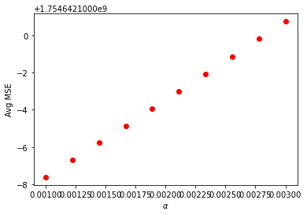
    


```python
plt.plot(las_a_range, las_te,'or')
plt.xlabel('$\\alpha$')
plt.ylabel('Avg $R^2$')
plt.show()
```


    
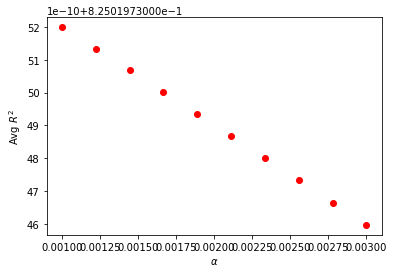
    


```python
las_a_range = np.linspace(0.001,0.003,10)

k = 20

las_tr=[]
las_te=[]
las_tr_mse=[]
las_te_mse=[]

for a in las_a_range:
    mdl = Lasso(alpha=a)
    train,test,train_mse,test_mse = DoKFold(mdl,X,y,k,standardize=True)
    
    las_tr.append(np.mean(train))
    las_te.append(np.mean(test))
    las_tr_mse.append(np.mean(train_mse))
    las_te_mse.append(np.mean(test_mse))
    
idx = np.argmax(las_te)
print('Optimal alpha value: ' + format(las_a_range[idx], '.5f'))
print('Training Score: ' + format(las_tr[idx], '.5f'))
print('Testing Score: ' + format(las_te[idx], '.5f'))
print('Training MSE for this value: ' + format(las_tr_mse[idx],'.5f'))
print('Testing MSE for this value: ' + format(las_te_mse[idx], '.5f'))
```

    /opt/conda/lib/python3.8/site-packages/sklearn/linear_model/_coordinate_descent.py:530: ConvergenceWarning: Objective did not converge. You might want to increase the number of iterations. Duality gap: 717620012681.7109, tolerance: 45555805537.81596
      model = cd_fast.enet_coordinate_descent(
    /opt/conda/lib/python3.8/site-packages/sklearn/linear_model/_coordinate_descent.py:530: ConvergenceWarning: Objective did not converge. You might want to increase the number of iterations. Duality gap: 702481323303.8672, tolerance: 45621375550.697655
      model = cd_fast.enet_coordinate_descent(
    /opt/conda/lib/python3.8/site-packages/sklearn/linear_model/_coordinate_descent.py:530: ConvergenceWarning: Objective did not converge. You might want to increase the number of iterations. Duality gap: 722865503960.4922, tolerance: 45734991350.56118
      model = cd_fast.enet_coordinate_descent(
    /opt/conda/lib/python3.8/site-packages/sklearn/linear_model/_coordinate_descent.py:530: ConvergenceWarning: Objective did not converge. You might want to increase the number of iterations. Duality gap: 717989948020.7969, tolerance: 45766502409.48462
      model = cd_fast.enet_coordinate_descent(
    /opt/conda/lib/python3.8/site-packages/sklearn/linear_model/_coordinate_descent.py:530: ConvergenceWarning: Objective did not converge. You might want to increase the number of iterations. Duality gap: 707493795722.0, tolerance: 45692341521.50093
      model = cd_fast.enet_coordinate_descent(
    /opt/conda/lib/python3.8/site-packages/sklearn/linear_model/_coordinate_descent.py:530: ConvergenceWarning: Objective did not converge. You might want to increase the number of iterations. Duality gap: 707124894664.8828, tolerance: 45675949302.555756
      model = cd_fast.enet_coordinate_descent(
    /opt/conda/lib/python3.8/site-packages/sklearn/linear_model/_coordinate_descent.py:530: ConvergenceWarning: Objective did not converge. You might want to increase the number of iterations. Duality gap: 707919337933.4453, tolerance: 45830727852.362236
      model = cd_fast.enet_coordinate_descent(
    /opt/conda/lib/python3.8/site-packages/sklearn/linear_model/_coordinate_descent.py:530: ConvergenceWarning: Objective did not converge. You might want to increase the number of iterations. Duality gap: 712470918007.3984, tolerance: 45944116568.45733
      model = cd_fast.enet_coordinate_descent(
    /opt/conda/lib/python3.8/site-packages/sklearn/linear_model/_coordinate_descent.py:530: ConvergenceWarning: Objective did not converge. You might want to increase the number of iterations. Duality gap: 711672243948.0781, tolerance: 45904937946.93008
      model = cd_fast.enet_coordinate_descent(
    /opt/conda/lib/python3.8/site-packages/sklearn/linear_model/_coordinate_descent.py:530: ConvergenceWarning: Objective did not converge. You might want to increase the number of iterations. Duality gap: 720965936996.0078, tolerance: 45676109342.14525
      model = cd_fast.enet_coordinate_descent(
    /opt/conda/lib/python3.8/site-packages/sklearn/linear_model/_coordinate_descent.py:530: ConvergenceWarning: Objective did not converge. You might want to increase the number of iterations. Duality gap: 1517806663802.0234, tolerance: 45704409856.010506
      model = cd_fast.enet_coordinate_descent(
    /opt/conda/lib/python3.8/site-packages/sklearn/linear_model/_coordinate_descent.py:530: ConvergenceWarning: Objective did not converge. You might want to increase the number of iterations. Duality gap: 713410904675.125, tolerance: 45731974376.07833
      model = cd_fast.enet_coordinate_descent(
    /opt/conda/lib/python3.8/site-packages/sklearn/linear_model/_coordinate_descent.py:530: ConvergenceWarning: Objective did not converge. You might want to increase the number of iterations. Duality gap: 703739562615.0156, tolerance: 45716685158.90544
      model = cd_fast.enet_coordinate_descent(
    /opt/conda/lib/python3.8/site-packages/sklearn/linear_model/_coordinate_descent.py:530: ConvergenceWarning: Objective did not converge. You might want to increase the number of iterations. Duality gap: 710383132747.7734, tolerance: 45642938641.02516
      model = cd_fast.enet_coordinate_descent(
    /opt/conda/lib/python3.8/site-packages/sklearn/linear_model/_coordinate_descent.py:530: ConvergenceWarning: Objective did not converge. You might want to increase the number of iterations. Duality gap: 705894712847.6094, tolerance: 45683500601.17986
      model = cd_fast.enet_coordinate_descent(
    /opt/conda/lib/python3.8/site-packages/sklearn/linear_model/_coordinate_descent.py:530: ConvergenceWarning: Objective did not converge. You might want to increase the number of iterations. Duality gap: 709133738555.7031, tolerance: 45703352697.91433
      model = cd_fast.enet_coordinate_descent(
    /opt/conda/lib/python3.8/site-packages/sklearn/linear_model/_coordinate_descent.py:530: ConvergenceWarning: Objective did not converge. You might want to increase the number of iterations. Duality gap: 710640121835.7422, tolerance: 45771166402.52732
      model = cd_fast.enet_coordinate_descent(
    /opt/conda/lib/python3.8/site-packages/sklearn/linear_model/_coordinate_descent.py:530: ConvergenceWarning: Objective did not converge. You might want to increase the number of iterations. Duality gap: 729949082153.3047, tolerance: 45655724582.9038
      model = cd_fast.enet_coordinate_descent(
    /opt/conda/lib/python3.8/site-packages/sklearn/linear_model/_coordinate_descent.py:530: ConvergenceWarning: Objective did not converge. You might want to increase the number of iterations. Duality gap: 717826122174.6406, tolerance: 45608175185.4906
      model = cd_fast.enet_coordinate_descent(
    /opt/conda/lib/python3.8/site-packages/sklearn/linear_model/_coordinate_descent.py:530: ConvergenceWarning: Objective did not converge. You might want to increase the number of iterations. Duality gap: 712022649166.3203, tolerance: 45773552292.46148
      model = cd_fast.enet_coordinate_descent(
    /opt/conda/lib/python3.8/site-packages/sklearn/linear_model/_coordinate_descent.py:530: ConvergenceWarning: Objective did not converge. You might want to increase the number of iterations. Duality gap: 717620987450.7344, tolerance: 45555805537.81596
      model = cd_fast.enet_coordinate_descent(
    /opt/conda/lib/python3.8/site-packages/sklearn/linear_model/_coordinate_descent.py:530: ConvergenceWarning: Objective did not converge. You might want to increase the number of iterations. Duality gap: 702482269479.8594, tolerance: 45621375550.697655
      model = cd_fast.enet_coordinate_descent(
    /opt/conda/lib/python3.8/site-packages/sklearn/linear_model/_coordinate_descent.py:530: ConvergenceWarning: Objective did not converge. You might want to increase the number of iterations. Duality gap: 722866432352.7578, tolerance: 45734991350.56118
      model = cd_fast.enet_coordinate_descent(
    /opt/conda/lib/python3.8/site-packages/sklearn/linear_model/_coordinate_descent.py:530: ConvergenceWarning: Objective did not converge. You might want to increase the number of iterations. Duality gap: 717990894814.7109, tolerance: 45766502409.48462
      model = cd_fast.enet_coordinate_descent(
    /opt/conda/lib/python3.8/site-packages/sklearn/linear_model/_coordinate_descent.py:530: ConvergenceWarning: Objective did not converge. You might want to increase the number of iterations. Duality gap: 707494730301.8984, tolerance: 45692341521.50093
      model = cd_fast.enet_coordinate_descent(
    /opt/conda/lib/python3.8/site-packages/sklearn/linear_model/_coordinate_descent.py:530: ConvergenceWarning: Objective did not converge. You might want to increase the number of iterations. Duality gap: 707125849534.8984, tolerance: 45675949302.555756
      model = cd_fast.enet_coordinate_descent(
    /opt/conda/lib/python3.8/site-packages/sklearn/linear_model/_coordinate_descent.py:530: ConvergenceWarning: Objective did not converge. You might want to increase the number of iterations. Duality gap: 707920276770.1719, tolerance: 45830727852.362236
      model = cd_fast.enet_coordinate_descent(
    /opt/conda/lib/python3.8/site-packages/sklearn/linear_model/_coordinate_descent.py:530: ConvergenceWarning: Objective did not converge. You might want to increase the number of iterations. Duality gap: 712471855222.5625, tolerance: 45944116568.45733
      model = cd_fast.enet_coordinate_descent(
    /opt/conda/lib/python3.8/site-packages/sklearn/linear_model/_coordinate_descent.py:530: ConvergenceWarning: Objective did not converge. You might want to increase the number of iterations. Duality gap: 711673179580.375, tolerance: 45904937946.93008
      model = cd_fast.enet_coordinate_descent(
    /opt/conda/lib/python3.8/site-packages/sklearn/linear_model/_coordinate_descent.py:530: ConvergenceWarning: Objective did not converge. You might want to increase the number of iterations. Duality gap: 720966899016.7578, tolerance: 45676109342.14525
      model = cd_fast.enet_coordinate_descent(
    /opt/conda/lib/python3.8/site-packages/sklearn/linear_model/_coordinate_descent.py:530: ConvergenceWarning: Objective did not converge. You might want to increase the number of iterations. Duality gap: 1517807728829.6562, tolerance: 45704409856.010506
      model = cd_fast.enet_coordinate_descent(
    /opt/conda/lib/python3.8/site-packages/sklearn/linear_model/_coordinate_descent.py:530: ConvergenceWarning: Objective did not converge. You might want to increase the number of iterations. Duality gap: 713411842563.4453, tolerance: 45731974376.07833
      model = cd_fast.enet_coordinate_descent(
    /opt/conda/lib/python3.8/site-packages/sklearn/linear_model/_coordinate_descent.py:530: ConvergenceWarning: Objective did not converge. You might want to increase the number of iterations. Duality gap: 703740496101.1562, tolerance: 45716685158.90544
      model = cd_fast.enet_coordinate_descent(
    /opt/conda/lib/python3.8/site-packages/sklearn/linear_model/_coordinate_descent.py:530: ConvergenceWarning: Objective did not converge. You might want to increase the number of iterations. Duality gap: 710384079126.0781, tolerance: 45642938641.02516
      model = cd_fast.enet_coordinate_descent(
    /opt/conda/lib/python3.8/site-packages/sklearn/linear_model/_coordinate_descent.py:530: ConvergenceWarning: Objective did not converge. You might want to increase the number of iterations. Duality gap: 705895663412.7656, tolerance: 45683500601.17986
      model = cd_fast.enet_coordinate_descent(
    /opt/conda/lib/python3.8/site-packages/sklearn/linear_model/_coordinate_descent.py:530: ConvergenceWarning: Objective did not converge. You might want to increase the number of iterations. Duality gap: 709134650481.0, tolerance: 45703352697.91433
      model = cd_fast.enet_coordinate_descent(
    /opt/conda/lib/python3.8/site-packages/sklearn/linear_model/_coordinate_descent.py:530: ConvergenceWarning: Objective did not converge. You might want to increase the number of iterations. Duality gap: 710641034960.4531, tolerance: 45771166402.52732
      model = cd_fast.enet_coordinate_descent(
    /opt/conda/lib/python3.8/site-packages/sklearn/linear_model/_coordinate_descent.py:530: ConvergenceWarning: Objective did not converge. You might want to increase the number of iterations. Duality gap: 729950019929.625, tolerance: 45655724582.9038
      model = cd_fast.enet_coordinate_descent(
    /opt/conda/lib/python3.8/site-packages/sklearn/linear_model/_coordinate_descent.py:530: ConvergenceWarning: Objective did not converge. You might want to increase the number of iterations. Duality gap: 717827067736.6484, tolerance: 45608175185.4906
      model = cd_fast.enet_coordinate_descent(
    /opt/conda/lib/python3.8/site-packages/sklearn/linear_model/_coordinate_descent.py:530: ConvergenceWarning: Objective did not converge. You might want to increase the number of iterations. Duality gap: 712023588747.0625, tolerance: 45773552292.46148
      model = cd_fast.enet_coordinate_descent(
    /opt/conda/lib/python3.8/site-packages/sklearn/linear_model/_coordinate_descent.py:530: ConvergenceWarning: Objective did not converge. You might want to increase the number of iterations. Duality gap: 717621912002.5938, tolerance: 45555805537.81596
      model = cd_fast.enet_coordinate_descent(
    /opt/conda/lib/python3.8/site-packages/sklearn/linear_model/_coordinate_descent.py:530: ConvergenceWarning: Objective did not converge. You might want to increase the number of iterations. Duality gap: 702483209375.1484, tolerance: 45621375550.697655
      model = cd_fast.enet_coordinate_descent(
    /opt/conda/lib/python3.8/site-packages/sklearn/linear_model/_coordinate_descent.py:530: ConvergenceWarning: Objective did not converge. You might want to increase the number of iterations. Duality gap: 722867405086.6484, tolerance: 45734991350.56118
      model = cd_fast.enet_coordinate_descent(
    /opt/conda/lib/python3.8/site-packages/sklearn/linear_model/_coordinate_descent.py:530: ConvergenceWarning: Objective did not converge. You might want to increase the number of iterations. Duality gap: 717991836295.3281, tolerance: 45766502409.48462
      model = cd_fast.enet_coordinate_descent(
    /opt/conda/lib/python3.8/site-packages/sklearn/linear_model/_coordinate_descent.py:530: ConvergenceWarning: Objective did not converge. You might want to increase the number of iterations. Duality gap: 707495677713.5234, tolerance: 45692341521.50093
      model = cd_fast.enet_coordinate_descent(
    /opt/conda/lib/python3.8/site-packages/sklearn/linear_model/_coordinate_descent.py:530: ConvergenceWarning: Objective did not converge. You might want to increase the number of iterations. Duality gap: 707126781410.2812, tolerance: 45675949302.555756
      model = cd_fast.enet_coordinate_descent(
    /opt/conda/lib/python3.8/site-packages/sklearn/linear_model/_coordinate_descent.py:530: ConvergenceWarning: Objective did not converge. You might want to increase the number of iterations. Duality gap: 707921232527.2891, tolerance: 45830727852.362236
      model = cd_fast.enet_coordinate_descent(
    /opt/conda/lib/python3.8/site-packages/sklearn/linear_model/_coordinate_descent.py:530: ConvergenceWarning: Objective did not converge. You might want to increase the number of iterations. Duality gap: 712472799953.75, tolerance: 45944116568.45733
      model = cd_fast.enet_coordinate_descent(
    /opt/conda/lib/python3.8/site-packages/sklearn/linear_model/_coordinate_descent.py:530: ConvergenceWarning: Objective did not converge. You might want to increase the number of iterations. Duality gap: 711674127263.7656, tolerance: 45904937946.93008
      model = cd_fast.enet_coordinate_descent(
    /opt/conda/lib/python3.8/site-packages/sklearn/linear_model/_coordinate_descent.py:530: ConvergenceWarning: Objective did not converge. You might want to increase the number of iterations. Duality gap: 720967837305.2031, tolerance: 45676109342.14525
      model = cd_fast.enet_coordinate_descent(
    /opt/conda/lib/python3.8/site-packages/sklearn/linear_model/_coordinate_descent.py:530: ConvergenceWarning: Objective did not converge. You might want to increase the number of iterations. Duality gap: 1517808795440.7969, tolerance: 45704409856.010506
      model = cd_fast.enet_coordinate_descent(
    /opt/conda/lib/python3.8/site-packages/sklearn/linear_model/_coordinate_descent.py:530: ConvergenceWarning: Objective did not converge. You might want to increase the number of iterations. Duality gap: 713412792928.2812, tolerance: 45731974376.07833
      model = cd_fast.enet_coordinate_descent(
    /opt/conda/lib/python3.8/site-packages/sklearn/linear_model/_coordinate_descent.py:530: ConvergenceWarning: Objective did not converge. You might want to increase the number of iterations. Duality gap: 703741450615.0078, tolerance: 45716685158.90544
      model = cd_fast.enet_coordinate_descent(
    /opt/conda/lib/python3.8/site-packages/sklearn/linear_model/_coordinate_descent.py:530: ConvergenceWarning: Objective did not converge. You might want to increase the number of iterations. Duality gap: 710385018694.2422, tolerance: 45642938641.02516
      model = cd_fast.enet_coordinate_descent(
    /opt/conda/lib/python3.8/site-packages/sklearn/linear_model/_coordinate_descent.py:530: ConvergenceWarning: Objective did not converge. You might want to increase the number of iterations. Duality gap: 705896597418.2891, tolerance: 45683500601.17986
      model = cd_fast.enet_coordinate_descent(
    /opt/conda/lib/python3.8/site-packages/sklearn/linear_model/_coordinate_descent.py:530: ConvergenceWarning: Objective did not converge. You might want to increase the number of iterations. Duality gap: 709135601895.8438, tolerance: 45703352697.91433
      model = cd_fast.enet_coordinate_descent(
    /opt/conda/lib/python3.8/site-packages/sklearn/linear_model/_coordinate_descent.py:530: ConvergenceWarning: Objective did not converge. You might want to increase the number of iterations. Duality gap: 710641974802.7188, tolerance: 45771166402.52732
      model = cd_fast.enet_coordinate_descent(
    /opt/conda/lib/python3.8/site-packages/sklearn/linear_model/_coordinate_descent.py:530: ConvergenceWarning: Objective did not converge. You might want to increase the number of iterations. Duality gap: 729950979116.5156, tolerance: 45655724582.9038
      model = cd_fast.enet_coordinate_descent(
    /opt/conda/lib/python3.8/site-packages/sklearn/linear_model/_coordinate_descent.py:530: ConvergenceWarning: Objective did not converge. You might want to increase the number of iterations. Duality gap: 717828024779.8906, tolerance: 45608175185.4906
      model = cd_fast.enet_coordinate_descent(
    /opt/conda/lib/python3.8/site-packages/sklearn/linear_model/_coordinate_descent.py:530: ConvergenceWarning: Objective did not converge. You might want to increase the number of iterations. Duality gap: 712024527865.9609, tolerance: 45773552292.46148
      model = cd_fast.enet_coordinate_descent(
    /opt/conda/lib/python3.8/site-packages/sklearn/linear_model/_coordinate_descent.py:530: ConvergenceWarning: Objective did not converge. You might want to increase the number of iterations. Duality gap: 717622854151.7422, tolerance: 45555805537.81596
      model = cd_fast.enet_coordinate_descent(
    /opt/conda/lib/python3.8/site-packages/sklearn/linear_model/_coordinate_descent.py:530: ConvergenceWarning: Objective did not converge. You might want to increase the number of iterations. Duality gap: 702484134220.7188, tolerance: 45621375550.697655
      model = cd_fast.enet_coordinate_descent(
    /opt/conda/lib/python3.8/site-packages/sklearn/linear_model/_coordinate_descent.py:530: ConvergenceWarning: Objective did not converge. You might want to increase the number of iterations. Duality gap: 722868347604.7891, tolerance: 45734991350.56118
      model = cd_fast.enet_coordinate_descent(
    /opt/conda/lib/python3.8/site-packages/sklearn/linear_model/_coordinate_descent.py:530: ConvergenceWarning: Objective did not converge. You might want to increase the number of iterations. Duality gap: 717992781861.4453, tolerance: 45766502409.48462
      model = cd_fast.enet_coordinate_descent(
    /opt/conda/lib/python3.8/site-packages/sklearn/linear_model/_coordinate_descent.py:530: ConvergenceWarning: Objective did not converge. You might want to increase the number of iterations. Duality gap: 707496616433.1172, tolerance: 45692341521.50093
      model = cd_fast.enet_coordinate_descent(
    /opt/conda/lib/python3.8/site-packages/sklearn/linear_model/_coordinate_descent.py:530: ConvergenceWarning: Objective did not converge. You might want to increase the number of iterations. Duality gap: 707127727990.3906, tolerance: 45675949302.555756
      model = cd_fast.enet_coordinate_descent(
    /opt/conda/lib/python3.8/site-packages/sklearn/linear_model/_coordinate_descent.py:530: ConvergenceWarning: Objective did not converge. You might want to increase the number of iterations. Duality gap: 707922171891.4922, tolerance: 45830727852.362236
      model = cd_fast.enet_coordinate_descent(
    /opt/conda/lib/python3.8/site-packages/sklearn/linear_model/_coordinate_descent.py:530: ConvergenceWarning: Objective did not converge. You might want to increase the number of iterations. Duality gap: 712473748497.3828, tolerance: 45944116568.45733
      model = cd_fast.enet_coordinate_descent(
    /opt/conda/lib/python3.8/site-packages/sklearn/linear_model/_coordinate_descent.py:530: ConvergenceWarning: Objective did not converge. You might want to increase the number of iterations. Duality gap: 711675067103.1016, tolerance: 45904937946.93008
      model = cd_fast.enet_coordinate_descent(
    /opt/conda/lib/python3.8/site-packages/sklearn/linear_model/_coordinate_descent.py:530: ConvergenceWarning: Objective did not converge. You might want to increase the number of iterations. Duality gap: 720968782823.9531, tolerance: 45676109342.14525
      model = cd_fast.enet_coordinate_descent(
    /opt/conda/lib/python3.8/site-packages/sklearn/linear_model/_coordinate_descent.py:530: ConvergenceWarning: Objective did not converge. You might want to increase the number of iterations. Duality gap: 1517809854731.5938, tolerance: 45704409856.010506
      model = cd_fast.enet_coordinate_descent(
    /opt/conda/lib/python3.8/site-packages/sklearn/linear_model/_coordinate_descent.py:530: ConvergenceWarning: Objective did not converge. You might want to increase the number of iterations. Duality gap: 713413746853.8281, tolerance: 45731974376.07833
      model = cd_fast.enet_coordinate_descent(
    /opt/conda/lib/python3.8/site-packages/sklearn/linear_model/_coordinate_descent.py:530: ConvergenceWarning: Objective did not converge. You might want to increase the number of iterations. Duality gap: 703742400938.3359, tolerance: 45716685158.90544
      model = cd_fast.enet_coordinate_descent(
    /opt/conda/lib/python3.8/site-packages/sklearn/linear_model/_coordinate_descent.py:530: ConvergenceWarning: Objective did not converge. You might want to increase the number of iterations. Duality gap: 710385977902.5, tolerance: 45642938641.02516
      model = cd_fast.enet_coordinate_descent(
    /opt/conda/lib/python3.8/site-packages/sklearn/linear_model/_coordinate_descent.py:530: ConvergenceWarning: Objective did not converge. You might want to increase the number of iterations. Duality gap: 705897532819.7031, tolerance: 45683500601.17986
      model = cd_fast.enet_coordinate_descent(
    /opt/conda/lib/python3.8/site-packages/sklearn/linear_model/_coordinate_descent.py:530: ConvergenceWarning: Objective did not converge. You might want to increase the number of iterations. Duality gap: 709136545146.4531, tolerance: 45703352697.91433
      model = cd_fast.enet_coordinate_descent(
    /opt/conda/lib/python3.8/site-packages/sklearn/linear_model/_coordinate_descent.py:530: ConvergenceWarning: Objective did not converge. You might want to increase the number of iterations. Duality gap: 710642930008.1875, tolerance: 45771166402.52732
      model = cd_fast.enet_coordinate_descent(
    /opt/conda/lib/python3.8/site-packages/sklearn/linear_model/_coordinate_descent.py:530: ConvergenceWarning: Objective did not converge. You might want to increase the number of iterations. Duality gap: 729951926754.1172, tolerance: 45655724582.9038
      model = cd_fast.enet_coordinate_descent(
    /opt/conda/lib/python3.8/site-packages/sklearn/linear_model/_coordinate_descent.py:530: ConvergenceWarning: Objective did not converge. You might want to increase the number of iterations. Duality gap: 717828966776.9531, tolerance: 45608175185.4906
      model = cd_fast.enet_coordinate_descent(
    /opt/conda/lib/python3.8/site-packages/sklearn/linear_model/_coordinate_descent.py:530: ConvergenceWarning: Objective did not converge. You might want to increase the number of iterations. Duality gap: 712025475539.8516, tolerance: 45773552292.46148
      model = cd_fast.enet_coordinate_descent(
    /opt/conda/lib/python3.8/site-packages/sklearn/linear_model/_coordinate_descent.py:530: ConvergenceWarning: Objective did not converge. You might want to increase the number of iterations. Duality gap: 717623806461.5312, tolerance: 45555805537.81596
      model = cd_fast.enet_coordinate_descent(
    /opt/conda/lib/python3.8/site-packages/sklearn/linear_model/_coordinate_descent.py:530: ConvergenceWarning: Objective did not converge. You might want to increase the number of iterations. Duality gap: 702485102005.1406, tolerance: 45621375550.697655
      model = cd_fast.enet_coordinate_descent(
    /opt/conda/lib/python3.8/site-packages/sklearn/linear_model/_coordinate_descent.py:530: ConvergenceWarning: Objective did not converge. You might want to increase the number of iterations. Duality gap: 722869302467.7422, tolerance: 45734991350.56118
      model = cd_fast.enet_coordinate_descent(
    /opt/conda/lib/python3.8/site-packages/sklearn/linear_model/_coordinate_descent.py:530: ConvergenceWarning: Objective did not converge. You might want to increase the number of iterations. Duality gap: 717993726672.7266, tolerance: 45766502409.48462
      model = cd_fast.enet_coordinate_descent(
    /opt/conda/lib/python3.8/site-packages/sklearn/linear_model/_coordinate_descent.py:530: ConvergenceWarning: Objective did not converge. You might want to increase the number of iterations. Duality gap: 707497553498.6875, tolerance: 45692341521.50093
      model = cd_fast.enet_coordinate_descent(
    /opt/conda/lib/python3.8/site-packages/sklearn/linear_model/_coordinate_descent.py:530: ConvergenceWarning: Objective did not converge. You might want to increase the number of iterations. Duality gap: 707128664775.4922, tolerance: 45675949302.555756
      model = cd_fast.enet_coordinate_descent(
    /opt/conda/lib/python3.8/site-packages/sklearn/linear_model/_coordinate_descent.py:530: ConvergenceWarning: Objective did not converge. You might want to increase the number of iterations. Duality gap: 707923120507.2266, tolerance: 45830727852.362236
      model = cd_fast.enet_coordinate_descent(
    /opt/conda/lib/python3.8/site-packages/sklearn/linear_model/_coordinate_descent.py:530: ConvergenceWarning: Objective did not converge. You might want to increase the number of iterations. Duality gap: 712474705814.125, tolerance: 45944116568.45733
      model = cd_fast.enet_coordinate_descent(
    /opt/conda/lib/python3.8/site-packages/sklearn/linear_model/_coordinate_descent.py:530: ConvergenceWarning: Objective did not converge. You might want to increase the number of iterations. Duality gap: 711676012204.2812, tolerance: 45904937946.93008
      model = cd_fast.enet_coordinate_descent(
    /opt/conda/lib/python3.8/site-packages/sklearn/linear_model/_coordinate_descent.py:530: ConvergenceWarning: Objective did not converge. You might want to increase the number of iterations. Duality gap: 720969743704.6797, tolerance: 45676109342.14525
      model = cd_fast.enet_coordinate_descent(
    /opt/conda/lib/python3.8/site-packages/sklearn/linear_model/_coordinate_descent.py:530: ConvergenceWarning: Objective did not converge. You might want to increase the number of iterations. Duality gap: 1517810909383.9062, tolerance: 45704409856.010506
      model = cd_fast.enet_coordinate_descent(
    /opt/conda/lib/python3.8/site-packages/sklearn/linear_model/_coordinate_descent.py:530: ConvergenceWarning: Objective did not converge. You might want to increase the number of iterations. Duality gap: 713414696599.8125, tolerance: 45731974376.07833
      model = cd_fast.enet_coordinate_descent(
    /opt/conda/lib/python3.8/site-packages/sklearn/linear_model/_coordinate_descent.py:530: ConvergenceWarning: Objective did not converge. You might want to increase the number of iterations. Duality gap: 703743330828.4609, tolerance: 45716685158.90544
      model = cd_fast.enet_coordinate_descent(
    /opt/conda/lib/python3.8/site-packages/sklearn/linear_model/_coordinate_descent.py:530: ConvergenceWarning: Objective did not converge. You might want to increase the number of iterations. Duality gap: 710386919264.5312, tolerance: 45642938641.02516
      model = cd_fast.enet_coordinate_descent(
    /opt/conda/lib/python3.8/site-packages/sklearn/linear_model/_coordinate_descent.py:530: ConvergenceWarning: Objective did not converge. You might want to increase the number of iterations. Duality gap: 705898481351.9766, tolerance: 45683500601.17986
      model = cd_fast.enet_coordinate_descent(
    /opt/conda/lib/python3.8/site-packages/sklearn/linear_model/_coordinate_descent.py:530: ConvergenceWarning: Objective did not converge. You might want to increase the number of iterations. Duality gap: 709137470301.8984, tolerance: 45703352697.91433
      model = cd_fast.enet_coordinate_descent(
    /opt/conda/lib/python3.8/site-packages/sklearn/linear_model/_coordinate_descent.py:530: ConvergenceWarning: Objective did not converge. You might want to increase the number of iterations. Duality gap: 710643880321.6953, tolerance: 45771166402.52732
      model = cd_fast.enet_coordinate_descent(
    /opt/conda/lib/python3.8/site-packages/sklearn/linear_model/_coordinate_descent.py:530: ConvergenceWarning: Objective did not converge. You might want to increase the number of iterations. Duality gap: 729952874497.5547, tolerance: 45655724582.9038
      model = cd_fast.enet_coordinate_descent(
    /opt/conda/lib/python3.8/site-packages/sklearn/linear_model/_coordinate_descent.py:530: ConvergenceWarning: Objective did not converge. You might want to increase the number of iterations. Duality gap: 717829914007.3359, tolerance: 45608175185.4906
      model = cd_fast.enet_coordinate_descent(
    /opt/conda/lib/python3.8/site-packages/sklearn/linear_model/_coordinate_descent.py:530: ConvergenceWarning: Objective did not converge. You might want to increase the number of iterations. Duality gap: 712026417117.1016, tolerance: 45773552292.46148
      model = cd_fast.enet_coordinate_descent(
    /opt/conda/lib/python3.8/site-packages/sklearn/linear_model/_coordinate_descent.py:530: ConvergenceWarning: Objective did not converge. You might want to increase the number of iterations. Duality gap: 717624752349.1328, tolerance: 45555805537.81596
      model = cd_fast.enet_coordinate_descent(
    /opt/conda/lib/python3.8/site-packages/sklearn/linear_model/_coordinate_descent.py:530: ConvergenceWarning: Objective did not converge. You might want to increase the number of iterations. Duality gap: 702486041119.5156, tolerance: 45621375550.697655
      model = cd_fast.enet_coordinate_descent(
    /opt/conda/lib/python3.8/site-packages/sklearn/linear_model/_coordinate_descent.py:530: ConvergenceWarning: Objective did not converge. You might want to increase the number of iterations. Duality gap: 722870236674.4453, tolerance: 45734991350.56118
      model = cd_fast.enet_coordinate_descent(
    /opt/conda/lib/python3.8/site-packages/sklearn/linear_model/_coordinate_descent.py:530: ConvergenceWarning: Objective did not converge. You might want to increase the number of iterations. Duality gap: 717994669793.8047, tolerance: 45766502409.48462
      model = cd_fast.enet_coordinate_descent(
    /opt/conda/lib/python3.8/site-packages/sklearn/linear_model/_coordinate_descent.py:530: ConvergenceWarning: Objective did not converge. You might want to increase the number of iterations. Duality gap: 707498503169.1641, tolerance: 45692341521.50093
      model = cd_fast.enet_coordinate_descent(
    /opt/conda/lib/python3.8/site-packages/sklearn/linear_model/_coordinate_descent.py:530: ConvergenceWarning: Objective did not converge. You might want to increase the number of iterations. Duality gap: 707129614777.8906, tolerance: 45675949302.555756
      model = cd_fast.enet_coordinate_descent(
    /opt/conda/lib/python3.8/site-packages/sklearn/linear_model/_coordinate_descent.py:530: ConvergenceWarning: Objective did not converge. You might want to increase the number of iterations. Duality gap: 707924065010.3438, tolerance: 45830727852.362236
      model = cd_fast.enet_coordinate_descent(
    /opt/conda/lib/python3.8/site-packages/sklearn/linear_model/_coordinate_descent.py:530: ConvergenceWarning: Objective did not converge. You might want to increase the number of iterations. Duality gap: 712475653989.0938, tolerance: 45944116568.45733
      model = cd_fast.enet_coordinate_descent(
    /opt/conda/lib/python3.8/site-packages/sklearn/linear_model/_coordinate_descent.py:530: ConvergenceWarning: Objective did not converge. You might want to increase the number of iterations. Duality gap: 711676945480.6641, tolerance: 45904937946.93008
      model = cd_fast.enet_coordinate_descent(
    /opt/conda/lib/python3.8/site-packages/sklearn/linear_model/_coordinate_descent.py:530: ConvergenceWarning: Objective did not converge. You might want to increase the number of iterations. Duality gap: 720970664600.2422, tolerance: 45676109342.14525
      model = cd_fast.enet_coordinate_descent(
    /opt/conda/lib/python3.8/site-packages/sklearn/linear_model/_coordinate_descent.py:530: ConvergenceWarning: Objective did not converge. You might want to increase the number of iterations. Duality gap: 1517811980265.961, tolerance: 45704409856.010506
      model = cd_fast.enet_coordinate_descent(
    /opt/conda/lib/python3.8/site-packages/sklearn/linear_model/_coordinate_descent.py:530: ConvergenceWarning: Objective did not converge. You might want to increase the number of iterations. Duality gap: 713415637656.5234, tolerance: 45731974376.07833
      model = cd_fast.enet_coordinate_descent(
    /opt/conda/lib/python3.8/site-packages/sklearn/linear_model/_coordinate_descent.py:530: ConvergenceWarning: Objective did not converge. You might want to increase the number of iterations. Duality gap: 703744279076.8125, tolerance: 45716685158.90544
      model = cd_fast.enet_coordinate_descent(
    /opt/conda/lib/python3.8/site-packages/sklearn/linear_model/_coordinate_descent.py:530: ConvergenceWarning: Objective did not converge. You might want to increase the number of iterations. Duality gap: 710387866856.2578, tolerance: 45642938641.02516
      model = cd_fast.enet_coordinate_descent(
    /opt/conda/lib/python3.8/site-packages/sklearn/linear_model/_coordinate_descent.py:530: ConvergenceWarning: Objective did not converge. You might want to increase the number of iterations. Duality gap: 705899420197.8203, tolerance: 45683500601.17986
      model = cd_fast.enet_coordinate_descent(
    /opt/conda/lib/python3.8/site-packages/sklearn/linear_model/_coordinate_descent.py:530: ConvergenceWarning: Objective did not converge. You might want to increase the number of iterations. Duality gap: 709138415192.7109, tolerance: 45703352697.91433
      model = cd_fast.enet_coordinate_descent(
    /opt/conda/lib/python3.8/site-packages/sklearn/linear_model/_coordinate_descent.py:530: ConvergenceWarning: Objective did not converge. You might want to increase the number of iterations. Duality gap: 710644813835.7812, tolerance: 45771166402.52732
      model = cd_fast.enet_coordinate_descent(
    /opt/conda/lib/python3.8/site-packages/sklearn/linear_model/_coordinate_descent.py:530: ConvergenceWarning: Objective did not converge. You might want to increase the number of iterations. Duality gap: 729953818047.4219, tolerance: 45655724582.9038
      model = cd_fast.enet_coordinate_descent(
    /opt/conda/lib/python3.8/site-packages/sklearn/linear_model/_coordinate_descent.py:530: ConvergenceWarning: Objective did not converge. You might want to increase the number of iterations. Duality gap: 717830860849.1172, tolerance: 45608175185.4906
      model = cd_fast.enet_coordinate_descent(
    /opt/conda/lib/python3.8/site-packages/sklearn/linear_model/_coordinate_descent.py:530: ConvergenceWarning: Objective did not converge. You might want to increase the number of iterations. Duality gap: 712027381819.3438, tolerance: 45773552292.46148
      model = cd_fast.enet_coordinate_descent(
    /opt/conda/lib/python3.8/site-packages/sklearn/linear_model/_coordinate_descent.py:530: ConvergenceWarning: Objective did not converge. You might want to increase the number of iterations. Duality gap: 717625703131.7266, tolerance: 45555805537.81596
      model = cd_fast.enet_coordinate_descent(
    /opt/conda/lib/python3.8/site-packages/sklearn/linear_model/_coordinate_descent.py:530: ConvergenceWarning: Objective did not converge. You might want to increase the number of iterations. Duality gap: 702486982397.3984, tolerance: 45621375550.697655
      model = cd_fast.enet_coordinate_descent(
    /opt/conda/lib/python3.8/site-packages/sklearn/linear_model/_coordinate_descent.py:530: ConvergenceWarning: Objective did not converge. You might want to increase the number of iterations. Duality gap: 722871174396.1641, tolerance: 45734991350.56118
      model = cd_fast.enet_coordinate_descent(
    /opt/conda/lib/python3.8/site-packages/sklearn/linear_model/_coordinate_descent.py:530: ConvergenceWarning: Objective did not converge. You might want to increase the number of iterations. Duality gap: 717995625973.1953, tolerance: 45766502409.48462
      model = cd_fast.enet_coordinate_descent(
    /opt/conda/lib/python3.8/site-packages/sklearn/linear_model/_coordinate_descent.py:530: ConvergenceWarning: Objective did not converge. You might want to increase the number of iterations. Duality gap: 707499451290.3672, tolerance: 45692341521.50093
      model = cd_fast.enet_coordinate_descent(
    /opt/conda/lib/python3.8/site-packages/sklearn/linear_model/_coordinate_descent.py:530: ConvergenceWarning: Objective did not converge. You might want to increase the number of iterations. Duality gap: 707130546696.6641, tolerance: 45675949302.555756
      model = cd_fast.enet_coordinate_descent(
    /opt/conda/lib/python3.8/site-packages/sklearn/linear_model/_coordinate_descent.py:530: ConvergenceWarning: Objective did not converge. You might want to increase the number of iterations. Duality gap: 707925004468.6484, tolerance: 45830727852.362236
      model = cd_fast.enet_coordinate_descent(
    /opt/conda/lib/python3.8/site-packages/sklearn/linear_model/_coordinate_descent.py:530: ConvergenceWarning: Objective did not converge. You might want to increase the number of iterations. Duality gap: 712476588306.7188, tolerance: 45944116568.45733
      model = cd_fast.enet_coordinate_descent(
    /opt/conda/lib/python3.8/site-packages/sklearn/linear_model/_coordinate_descent.py:530: ConvergenceWarning: Objective did not converge. You might want to increase the number of iterations. Duality gap: 711677897461.2812, tolerance: 45904937946.93008
      model = cd_fast.enet_coordinate_descent(
    /opt/conda/lib/python3.8/site-packages/sklearn/linear_model/_coordinate_descent.py:530: ConvergenceWarning: Objective did not converge. You might want to increase the number of iterations. Duality gap: 720971615063.4453, tolerance: 45676109342.14525
      model = cd_fast.enet_coordinate_descent(
    /opt/conda/lib/python3.8/site-packages/sklearn/linear_model/_coordinate_descent.py:530: ConvergenceWarning: Objective did not converge. You might want to increase the number of iterations. Duality gap: 1517813047951.336, tolerance: 45704409856.010506
      model = cd_fast.enet_coordinate_descent(
    /opt/conda/lib/python3.8/site-packages/sklearn/linear_model/_coordinate_descent.py:530: ConvergenceWarning: Objective did not converge. You might want to increase the number of iterations. Duality gap: 713416586467.0625, tolerance: 45731974376.07833
      model = cd_fast.enet_coordinate_descent(
    /opt/conda/lib/python3.8/site-packages/sklearn/linear_model/_coordinate_descent.py:530: ConvergenceWarning: Objective did not converge. You might want to increase the number of iterations. Duality gap: 703745225097.7891, tolerance: 45716685158.90544
      model = cd_fast.enet_coordinate_descent(
    /opt/conda/lib/python3.8/site-packages/sklearn/linear_model/_coordinate_descent.py:530: ConvergenceWarning: Objective did not converge. You might want to increase the number of iterations. Duality gap: 710388814003.0469, tolerance: 45642938641.02516
      model = cd_fast.enet_coordinate_descent(
    /opt/conda/lib/python3.8/site-packages/sklearn/linear_model/_coordinate_descent.py:530: ConvergenceWarning: Objective did not converge. You might want to increase the number of iterations. Duality gap: 705900374929.2891, tolerance: 45683500601.17986
      model = cd_fast.enet_coordinate_descent(
    /opt/conda/lib/python3.8/site-packages/sklearn/linear_model/_coordinate_descent.py:530: ConvergenceWarning: Objective did not converge. You might want to increase the number of iterations. Duality gap: 709139354439.0391, tolerance: 45703352697.91433
      model = cd_fast.enet_coordinate_descent(
    /opt/conda/lib/python3.8/site-packages/sklearn/linear_model/_coordinate_descent.py:530: ConvergenceWarning: Objective did not converge. You might want to increase the number of iterations. Duality gap: 710645757127.125, tolerance: 45771166402.52732
      model = cd_fast.enet_coordinate_descent(
    /opt/conda/lib/python3.8/site-packages/sklearn/linear_model/_coordinate_descent.py:530: ConvergenceWarning: Objective did not converge. You might want to increase the number of iterations. Duality gap: 729954768324.0078, tolerance: 45655724582.9038
      model = cd_fast.enet_coordinate_descent(
    /opt/conda/lib/python3.8/site-packages/sklearn/linear_model/_coordinate_descent.py:530: ConvergenceWarning: Objective did not converge. You might want to increase the number of iterations. Duality gap: 717831813466.0156, tolerance: 45608175185.4906
      model = cd_fast.enet_coordinate_descent(
    /opt/conda/lib/python3.8/site-packages/sklearn/linear_model/_coordinate_descent.py:530: ConvergenceWarning: Objective did not converge. You might want to increase the number of iterations. Duality gap: 712028309320.1484, tolerance: 45773552292.46148
      model = cd_fast.enet_coordinate_descent(
    /opt/conda/lib/python3.8/site-packages/sklearn/linear_model/_coordinate_descent.py:530: ConvergenceWarning: Objective did not converge. You might want to increase the number of iterations. Duality gap: 717626637111.5078, tolerance: 45555805537.81596
      model = cd_fast.enet_coordinate_descent(
    /opt/conda/lib/python3.8/site-packages/sklearn/linear_model/_coordinate_descent.py:530: ConvergenceWarning: Objective did not converge. You might want to increase the number of iterations. Duality gap: 702487916135.2891, tolerance: 45621375550.697655
      model = cd_fast.enet_coordinate_descent(
    /opt/conda/lib/python3.8/site-packages/sklearn/linear_model/_coordinate_descent.py:530: ConvergenceWarning: Objective did not converge. You might want to increase the number of iterations. Duality gap: 722872121828.0156, tolerance: 45734991350.56118
      model = cd_fast.enet_coordinate_descent(
    /opt/conda/lib/python3.8/site-packages/sklearn/linear_model/_coordinate_descent.py:530: ConvergenceWarning: Objective did not converge. You might want to increase the number of iterations. Duality gap: 717996568298.2891, tolerance: 45766502409.48462
      model = cd_fast.enet_coordinate_descent(
    /opt/conda/lib/python3.8/site-packages/sklearn/linear_model/_coordinate_descent.py:530: ConvergenceWarning: Objective did not converge. You might want to increase the number of iterations. Duality gap: 707500382203.3438, tolerance: 45692341521.50093
      model = cd_fast.enet_coordinate_descent(
    /opt/conda/lib/python3.8/site-packages/sklearn/linear_model/_coordinate_descent.py:530: ConvergenceWarning: Objective did not converge. You might want to increase the number of iterations. Duality gap: 707131491925.3359, tolerance: 45675949302.555756
      model = cd_fast.enet_coordinate_descent(
    /opt/conda/lib/python3.8/site-packages/sklearn/linear_model/_coordinate_descent.py:530: ConvergenceWarning: Objective did not converge. You might want to increase the number of iterations. Duality gap: 707925959219.9609, tolerance: 45830727852.362236
      model = cd_fast.enet_coordinate_descent(
    /opt/conda/lib/python3.8/site-packages/sklearn/linear_model/_coordinate_descent.py:530: ConvergenceWarning: Objective did not converge. You might want to increase the number of iterations. Duality gap: 712477537284.3203, tolerance: 45944116568.45733
      model = cd_fast.enet_coordinate_descent(
    /opt/conda/lib/python3.8/site-packages/sklearn/linear_model/_coordinate_descent.py:530: ConvergenceWarning: Objective did not converge. You might want to increase the number of iterations. Duality gap: 711678841438.4453, tolerance: 45904937946.93008
      model = cd_fast.enet_coordinate_descent(
    /opt/conda/lib/python3.8/site-packages/sklearn/linear_model/_coordinate_descent.py:530: ConvergenceWarning: Objective did not converge. You might want to increase the number of iterations. Duality gap: 720972562568.3672, tolerance: 45676109342.14525
      model = cd_fast.enet_coordinate_descent(
    /opt/conda/lib/python3.8/site-packages/sklearn/linear_model/_coordinate_descent.py:530: ConvergenceWarning: Objective did not converge. You might want to increase the number of iterations. Duality gap: 1517814111893.625, tolerance: 45704409856.010506
      model = cd_fast.enet_coordinate_descent(
    /opt/conda/lib/python3.8/site-packages/sklearn/linear_model/_coordinate_descent.py:530: ConvergenceWarning: Objective did not converge. You might want to increase the number of iterations. Duality gap: 713417527597.8047, tolerance: 45731974376.07833
      model = cd_fast.enet_coordinate_descent(
    /opt/conda/lib/python3.8/site-packages/sklearn/linear_model/_coordinate_descent.py:530: ConvergenceWarning: Objective did not converge. You might want to increase the number of iterations. Duality gap: 703746162659.5078, tolerance: 45716685158.90544
      model = cd_fast.enet_coordinate_descent(
    /opt/conda/lib/python3.8/site-packages/sklearn/linear_model/_coordinate_descent.py:530: ConvergenceWarning: Objective did not converge. You might want to increase the number of iterations. Duality gap: 710389754383.9375, tolerance: 45642938641.02516
      model = cd_fast.enet_coordinate_descent(
    /opt/conda/lib/python3.8/site-packages/sklearn/linear_model/_coordinate_descent.py:530: ConvergenceWarning: Objective did not converge. You might want to increase the number of iterations. Duality gap: 705901312009.3828, tolerance: 45683500601.17986
      model = cd_fast.enet_coordinate_descent(
    /opt/conda/lib/python3.8/site-packages/sklearn/linear_model/_coordinate_descent.py:530: ConvergenceWarning: Objective did not converge. You might want to increase the number of iterations. Duality gap: 709140297904.5469, tolerance: 45703352697.91433
      model = cd_fast.enet_coordinate_descent(
    /opt/conda/lib/python3.8/site-packages/sklearn/linear_model/_coordinate_descent.py:530: ConvergenceWarning: Objective did not converge. You might want to increase the number of iterations. Duality gap: 710646702571.1875, tolerance: 45771166402.52732
      model = cd_fast.enet_coordinate_descent(
    /opt/conda/lib/python3.8/site-packages/sklearn/linear_model/_coordinate_descent.py:530: ConvergenceWarning: Objective did not converge. You might want to increase the number of iterations. Duality gap: 729955705349.3906, tolerance: 45655724582.9038
      model = cd_fast.enet_coordinate_descent(
    /opt/conda/lib/python3.8/site-packages/sklearn/linear_model/_coordinate_descent.py:530: ConvergenceWarning: Objective did not converge. You might want to increase the number of iterations. Duality gap: 717832752313.375, tolerance: 45608175185.4906
      model = cd_fast.enet_coordinate_descent(
    /opt/conda/lib/python3.8/site-packages/sklearn/linear_model/_coordinate_descent.py:530: ConvergenceWarning: Objective did not converge. You might want to increase the number of iterations. Duality gap: 712029261761.0312, tolerance: 45773552292.46148
      model = cd_fast.enet_coordinate_descent(
    /opt/conda/lib/python3.8/site-packages/sklearn/linear_model/_coordinate_descent.py:530: ConvergenceWarning: Objective did not converge. You might want to increase the number of iterations. Duality gap: 717627589260.9062, tolerance: 45555805537.81596
      model = cd_fast.enet_coordinate_descent(
    /opt/conda/lib/python3.8/site-packages/sklearn/linear_model/_coordinate_descent.py:530: ConvergenceWarning: Objective did not converge. You might want to increase the number of iterations. Duality gap: 702488856341.6328, tolerance: 45621375550.697655
      model = cd_fast.enet_coordinate_descent(
    /opt/conda/lib/python3.8/site-packages/sklearn/linear_model/_coordinate_descent.py:530: ConvergenceWarning: Objective did not converge. You might want to increase the number of iterations. Duality gap: 722873078500.6406, tolerance: 45734991350.56118
      model = cd_fast.enet_coordinate_descent(
    /opt/conda/lib/python3.8/site-packages/sklearn/linear_model/_coordinate_descent.py:530: ConvergenceWarning: Objective did not converge. You might want to increase the number of iterations. Duality gap: 717997506998.5938, tolerance: 45766502409.48462
      model = cd_fast.enet_coordinate_descent(
    /opt/conda/lib/python3.8/site-packages/sklearn/linear_model/_coordinate_descent.py:530: ConvergenceWarning: Objective did not converge. You might want to increase the number of iterations. Duality gap: 707501333340.2266, tolerance: 45692341521.50093
      model = cd_fast.enet_coordinate_descent(
    /opt/conda/lib/python3.8/site-packages/sklearn/linear_model/_coordinate_descent.py:530: ConvergenceWarning: Objective did not converge. You might want to increase the number of iterations. Duality gap: 707132445358.8906, tolerance: 45675949302.555756
      model = cd_fast.enet_coordinate_descent(
    /opt/conda/lib/python3.8/site-packages/sklearn/linear_model/_coordinate_descent.py:530: ConvergenceWarning: Objective did not converge. You might want to increase the number of iterations. Duality gap: 707926891043.2734, tolerance: 45830727852.362236
      model = cd_fast.enet_coordinate_descent(
    /opt/conda/lib/python3.8/site-packages/sklearn/linear_model/_coordinate_descent.py:530: ConvergenceWarning: Objective did not converge. You might want to increase the number of iterations. Duality gap: 712478489100.0703, tolerance: 45944116568.45733
      model = cd_fast.enet_coordinate_descent(
    /opt/conda/lib/python3.8/site-packages/sklearn/linear_model/_coordinate_descent.py:530: ConvergenceWarning: Objective did not converge. You might want to increase the number of iterations. Duality gap: 711679780709.1016, tolerance: 45904937946.93008
      model = cd_fast.enet_coordinate_descent(
    /opt/conda/lib/python3.8/site-packages/sklearn/linear_model/_coordinate_descent.py:530: ConvergenceWarning: Objective did not converge. You might want to increase the number of iterations. Duality gap: 720973507492.4375, tolerance: 45676109342.14525
      model = cd_fast.enet_coordinate_descent(
    /opt/conda/lib/python3.8/site-packages/sklearn/linear_model/_coordinate_descent.py:530: ConvergenceWarning: Objective did not converge. You might want to increase the number of iterations. Duality gap: 1517815166991.0703, tolerance: 45704409856.010506
      model = cd_fast.enet_coordinate_descent(
    /opt/conda/lib/python3.8/site-packages/sklearn/linear_model/_coordinate_descent.py:530: ConvergenceWarning: Objective did not converge. You might want to increase the number of iterations. Duality gap: 713418484150.9141, tolerance: 45731974376.07833
      model = cd_fast.enet_coordinate_descent(
    /opt/conda/lib/python3.8/site-packages/sklearn/linear_model/_coordinate_descent.py:530: ConvergenceWarning: Objective did not converge. You might want to increase the number of iterations. Duality gap: 703747103034.9766, tolerance: 45716685158.90544
      model = cd_fast.enet_coordinate_descent(
    /opt/conda/lib/python3.8/site-packages/sklearn/linear_model/_coordinate_descent.py:530: ConvergenceWarning: Objective did not converge. You might want to increase the number of iterations. Duality gap: 710390696470.7266, tolerance: 45642938641.02516
      model = cd_fast.enet_coordinate_descent(
    /opt/conda/lib/python3.8/site-packages/sklearn/linear_model/_coordinate_descent.py:530: ConvergenceWarning: Objective did not converge. You might want to increase the number of iterations. Duality gap: 705902253786.7031, tolerance: 45683500601.17986
      model = cd_fast.enet_coordinate_descent(
    /opt/conda/lib/python3.8/site-packages/sklearn/linear_model/_coordinate_descent.py:530: ConvergenceWarning: Objective did not converge. You might want to increase the number of iterations. Duality gap: 709141243973.8125, tolerance: 45703352697.91433
      model = cd_fast.enet_coordinate_descent(
    /opt/conda/lib/python3.8/site-packages/sklearn/linear_model/_coordinate_descent.py:530: ConvergenceWarning: Objective did not converge. You might want to increase the number of iterations. Duality gap: 710647652953.6562, tolerance: 45771166402.52732
      model = cd_fast.enet_coordinate_descent(
    /opt/conda/lib/python3.8/site-packages/sklearn/linear_model/_coordinate_descent.py:530: ConvergenceWarning: Objective did not converge. You might want to increase the number of iterations. Duality gap: 729956659633.0078, tolerance: 45655724582.9038
      model = cd_fast.enet_coordinate_descent(
    /opt/conda/lib/python3.8/site-packages/sklearn/linear_model/_coordinate_descent.py:530: ConvergenceWarning: Objective did not converge. You might want to increase the number of iterations. Duality gap: 717833703010.7031, tolerance: 45608175185.4906
      model = cd_fast.enet_coordinate_descent(
    /opt/conda/lib/python3.8/site-packages/sklearn/linear_model/_coordinate_descent.py:530: ConvergenceWarning: Objective did not converge. You might want to increase the number of iterations. Duality gap: 712030202353.8125, tolerance: 45773552292.46148
      model = cd_fast.enet_coordinate_descent(
    /opt/conda/lib/python3.8/site-packages/sklearn/linear_model/_coordinate_descent.py:530: ConvergenceWarning: Objective did not converge. You might want to increase the number of iterations. Duality gap: 717628528030.2656, tolerance: 45555805537.81596
      model = cd_fast.enet_coordinate_descent(
    /opt/conda/lib/python3.8/site-packages/sklearn/linear_model/_coordinate_descent.py:530: ConvergenceWarning: Objective did not converge. You might want to increase the number of iterations. Duality gap: 702489805096.3203, tolerance: 45621375550.697655
      model = cd_fast.enet_coordinate_descent(
    /opt/conda/lib/python3.8/site-packages/sklearn/linear_model/_coordinate_descent.py:530: ConvergenceWarning: Objective did not converge. You might want to increase the number of iterations. Duality gap: 722874017571.875, tolerance: 45734991350.56118
      model = cd_fast.enet_coordinate_descent(
    /opt/conda/lib/python3.8/site-packages/sklearn/linear_model/_coordinate_descent.py:530: ConvergenceWarning: Objective did not converge. You might want to increase the number of iterations. Duality gap: 717998447740.0078, tolerance: 45766502409.48462
      model = cd_fast.enet_coordinate_descent(
    /opt/conda/lib/python3.8/site-packages/sklearn/linear_model/_coordinate_descent.py:530: ConvergenceWarning: Objective did not converge. You might want to increase the number of iterations. Duality gap: 707502262655.8359, tolerance: 45692341521.50093
      model = cd_fast.enet_coordinate_descent(
    /opt/conda/lib/python3.8/site-packages/sklearn/linear_model/_coordinate_descent.py:530: ConvergenceWarning: Objective did not converge. You might want to increase the number of iterations. Duality gap: 707133373811.2344, tolerance: 45675949302.555756
      model = cd_fast.enet_coordinate_descent(
    /opt/conda/lib/python3.8/site-packages/sklearn/linear_model/_coordinate_descent.py:530: ConvergenceWarning: Objective did not converge. You might want to increase the number of iterations. Duality gap: 707927843377.375, tolerance: 45830727852.362236
      model = cd_fast.enet_coordinate_descent(
    /opt/conda/lib/python3.8/site-packages/sklearn/linear_model/_coordinate_descent.py:530: ConvergenceWarning: Objective did not converge. You might want to increase the number of iterations. Duality gap: 712479430260.8516, tolerance: 45944116568.45733
      model = cd_fast.enet_coordinate_descent(
    /opt/conda/lib/python3.8/site-packages/sklearn/linear_model/_coordinate_descent.py:530: ConvergenceWarning: Objective did not converge. You might want to increase the number of iterations. Duality gap: 711680725035.1719, tolerance: 45904937946.93008
      model = cd_fast.enet_coordinate_descent(
    /opt/conda/lib/python3.8/site-packages/sklearn/linear_model/_coordinate_descent.py:530: ConvergenceWarning: Objective did not converge. You might want to increase the number of iterations. Duality gap: 720974447693.2031, tolerance: 45676109342.14525
      model = cd_fast.enet_coordinate_descent(
    /opt/conda/lib/python3.8/site-packages/sklearn/linear_model/_coordinate_descent.py:530: ConvergenceWarning: Objective did not converge. You might want to increase the number of iterations. Duality gap: 1517816232109.6172, tolerance: 45704409856.010506
      model = cd_fast.enet_coordinate_descent(
    /opt/conda/lib/python3.8/site-packages/sklearn/linear_model/_coordinate_descent.py:530: ConvergenceWarning: Objective did not converge. You might want to increase the number of iterations. Duality gap: 713419426976.0312, tolerance: 45731974376.07833
      model = cd_fast.enet_coordinate_descent(
    /opt/conda/lib/python3.8/site-packages/sklearn/linear_model/_coordinate_descent.py:530: ConvergenceWarning: Objective did not converge. You might want to increase the number of iterations. Duality gap: 703748047796.1797, tolerance: 45716685158.90544
      model = cd_fast.enet_coordinate_descent(
    /opt/conda/lib/python3.8/site-packages/sklearn/linear_model/_coordinate_descent.py:530: ConvergenceWarning: Objective did not converge. You might want to increase the number of iterations. Duality gap: 710391639937.8125, tolerance: 45642938641.02516
      model = cd_fast.enet_coordinate_descent(
    /opt/conda/lib/python3.8/site-packages/sklearn/linear_model/_coordinate_descent.py:530: ConvergenceWarning: Objective did not converge. You might want to increase the number of iterations. Duality gap: 705903198822.8984, tolerance: 45683500601.17986
      model = cd_fast.enet_coordinate_descent(
    /opt/conda/lib/python3.8/site-packages/sklearn/linear_model/_coordinate_descent.py:530: ConvergenceWarning: Objective did not converge. You might want to increase the number of iterations. Duality gap: 709142183519.8984, tolerance: 45703352697.91433
      model = cd_fast.enet_coordinate_descent(
    /opt/conda/lib/python3.8/site-packages/sklearn/linear_model/_coordinate_descent.py:530: ConvergenceWarning: Objective did not converge. You might want to increase the number of iterations. Duality gap: 710648592005.9141, tolerance: 45771166402.52732
      model = cd_fast.enet_coordinate_descent(
    /opt/conda/lib/python3.8/site-packages/sklearn/linear_model/_coordinate_descent.py:530: ConvergenceWarning: Objective did not converge. You might want to increase the number of iterations. Duality gap: 729957609013.2891, tolerance: 45655724582.9038
      model = cd_fast.enet_coordinate_descent(
    /opt/conda/lib/python3.8/site-packages/sklearn/linear_model/_coordinate_descent.py:530: ConvergenceWarning: Objective did not converge. You might want to increase the number of iterations. Duality gap: 717834643492.6719, tolerance: 45608175185.4906
      model = cd_fast.enet_coordinate_descent(


    Optimal alpha value: 0.00300
    Training Score: 0.82584
    Testing Score: 0.82502
    Training MSE for this value: 1750165639.79028
    Testing MSE for this value: 1754642087.59684


    /opt/conda/lib/python3.8/site-packages/sklearn/linear_model/_coordinate_descent.py:530: ConvergenceWarning: Objective did not converge. You might want to increase the number of iterations. Duality gap: 712031154227.2969, tolerance: 45773552292.46148
      model = cd_fast.enet_coordinate_descent(


```python
plt.plot(las_a_range, las_te_mse,'or')
plt.xlabel('$\\alpha$')
plt.ylabel('Avg MSE')
plt.show()
```


    

    


```python
plt.plot(las_a_range, las_te,'or')
plt.xlabel('$\\alpha$')
plt.ylabel('Avg $R^2$')
plt.show()
```


    
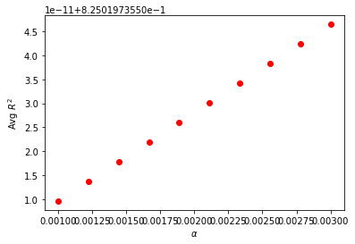
    


```python

```
